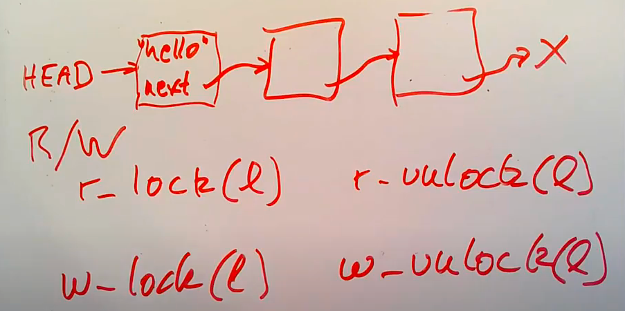
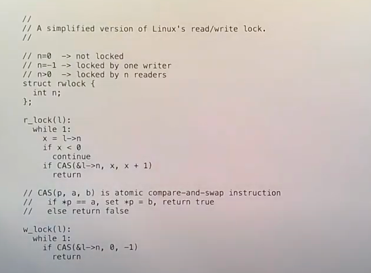

# RCU(Read-Copy Update)，
    是 Linux 中比较重要的一种同步机制。顾名思义就是“读，拷贝更新”，
    再直白点是“随意读，但更新数据的时候，需要先复制一份副本，在副本上完成修改，再一次性地替换旧数据”。
    这是 Linux 内核实现的一种针对“读多写少”的共享数据的同步机制。
    
# 讨论背景：多核系统，读多写少
# 没有RCU怎么搞
多线程

## spinlock
很安全，但是降低性能，阻断并行，特别是读多写少的场景就会很浪费。
## 读写锁（R/W lock）
读写锁相对会好一些，读写锁的api如上图，一个线程写，其他线程无法读写，多个线程可以同时读，但是不能有写。
linux读写锁实现的简单版本

存在的问题：如果多个线程同时调用r_lock()，性能也会很低
假定有N个读，没有写。所有的N个core调用r_lock()，缓存了l->n。只有一个core会CAS成功，并且将l->n设为x+1，同时需要将其他的N-1个core的cache清除。其他的N-1个core会继续重试和CAS，一直循环。总的复杂度为O(N^2)
如果读取缓存的数据可能只需要数十个时钟周期，但是使用了r_lock()可能需要一百甚至一千的时钟周期

产生这个问题的本质原因是r_lock()：it does expensive *writes*.
对于共享的读写数据，我们有可能有pure read-only read吗？
如果读不加锁，没有写肯定没有任何问题，对于list的写有三种情况，同时读写肯定有问题。

# RCU
Fast reads: no locks (and no writes)
Slower writes: writers need to lock, and do more work
Helps many situations with read-heavy shared data, but not all
Used extensively in Linux, a big part of its multi-core performance
## Idea 1：don't modity data in place; prepare a new copy

列表：Head  ->  E1  ->  E2  ->  E3  ->  nil，假设要修改E2的内容
1. Lock
2. e = alloc()
3. e->next = E2->next
4. e->x = "..."
5. E1->next = e
6. Unlock
假设在修改的过程中有读操作，不论在步骤5之前或之后读到E1->next，都不会读到错误内容，不会看到中间态
可以将步骤五看作一个“committing write”，在此之前什么都没变，在此之后所有的更新都可见
RCU只适合single pointer write commits，比如单链表，树，不适合双链表等。
## Idea2：readers and writers must use memory barriers to enforce order
Reorder会带来问题，比如在上面的步骤中，5出现在3或4之前。

所以在步骤5之前我们需要barrier

E2的释放：
1. 引用计数
2. 垃圾回收语言
## Idea3：  
1. Reader isn't allowed to hold pointer to RCU data across context switch.
     Similar to rule that spin-lock can't be held across context switch.
2. Writer defers free until all CPUs have context-switched.（最简单的方式：writer把自己在每个CPU上调度一次，非常耗时，但是我们讨论的场景就是写少读多）

Linux RCU接口
Rcu_read_lock/unlock do almost nothing：disable timer interrupts to prevent pre-emption.
Synchronize_rcu() can take a long time, and can yield the CPU.
Readers use rcu_dereference to signal their intent to read a pointer in a RCU critical section. Updaters use rcu_assign_pointer to mutate these pointers. These two primitives contain architecture-specific memorybarrier instructions and compiler directives to enforce correct ordering

使用linux RCU接口实现list遍历，更改list的第一个元素

