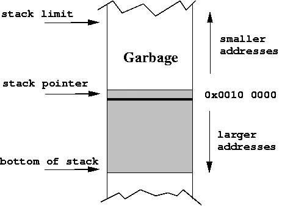
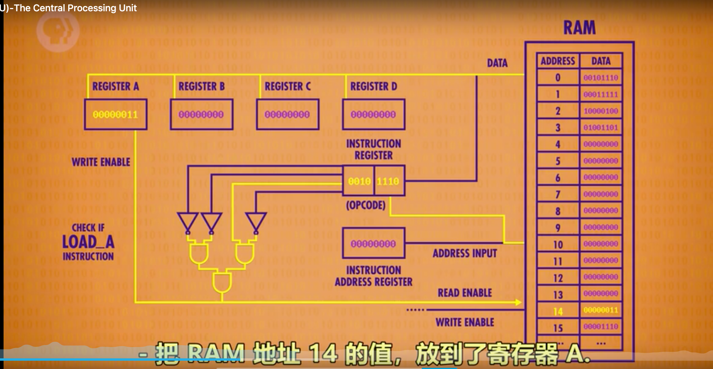

<!-- ToC start -->
# Table of Contents

1. [When to happened  trap[user -> kernel transition]](#when-to-happened--trapuser-->-kernel-transition)
1. [introduce trap infos](#introduce-trap-infos)
   1. [一.trap陷入内核态涉及到寄存器[improtant]](#一trap陷入内核态涉及到寄存器improtant)
   1. [二.前置概念对齐](#二前置概念对齐)
   1. [三: Isolation 隔离](#三:-isolation-隔离)
1. [How to trap [流程概述]](#how-to-trap-流程概述)
   1. [一. 用户态调用](#一-用户态调用)
   1. [二. 陷入 trap 内核态[上下文切换]](#二-陷入-trap-内核态上下文切换)
   1. [三:  返回用户态](#三:--返回用户态)
1. [流程详述](#流程详述)
   1. [1:Ecall 之前发生了什么[啥都没发生 看下快照]](#1:ecall-之前发生了什么啥都没发生-看下快照)
   1. [2:Ecall 之后发生了什么[存用户指令-数据快照 陷入trap]](#2:ecall-之后发生了什么存用户指令-数据快照-陷入trap)
   1. [3:uservec函数:trampoline page的起始 [开始陷入内核态 为执行系统调用做预准备]](#3:uservec函数:trampoline-page的起始-开始陷入内核态-为执行系统调用做预准备)
   1. [uservec:    ](#uservec:----)
   1. [4:usertrap 函数 [执行系统调用]](#4:usertrap-函数-执行系统调用)
   1. [5:  usertrapret函数 [返回到用户空间之前内核要做的工作]](#5:--usertrapret函数-返回到用户空间之前内核要做的工作)
   1. [6: userret函数，返回到用户空间](#6:-userret函数，返回到用户空间)
1. [总结如下:](#总结如下:)
   1. [1. 用户态调用 ](#1-用户态调用-)
   1. [2. 陷入内核态[上下文切换]](#2-陷入内核态上下文切换)
   1. [3. 内核态执行](#3-内核态执行)
<!-- ToC end -->


Isolation & system call entry/exit [隔离/系统调用]

# When to happened  trap[user -> kernel transition]
1. system calls
2. faults[类似除以0], 
3. interrupts[中断::wq
:i]

# introduce trap infos
## 一.trap陷入内核态涉及到寄存器[improtant]
1. SP(stack register)堆栈寄存器 [汇编也叫做 stack pointer 下图左一] 

3. SATP-指向page table的虚拟内存地址 （Supervisor Address Table page）寄存器
4. STVEC-trap的指令的起始地址。（Supervisor Trap Vector Base Address Register）寄存器: 
5. SEPC-在trap的过程中用户PC的值。（Supervisor Exception Program Counter）寄存器，
6. SSRATCH  temp 可擦除寄存器（Supervisor Scratch Register）寄存器: 可擦除寄存器 可以理解为
2. PC(Program Counter Register)程序计数器 也叫指令地址寄存器 下图右一
  - 是一个中央处理器中的寄存器，用于指示计算机在其程序序列中的位置。在Intel x86和Itanium微处理器中，它叫做指令指针（instruction pointer，IP），有时又称为指令地址寄存器（instruction address register，IAR）[1]、指令计数器[2]或只是指令序列器的一部分[3]。
7. Mode flag control 表明当前mode的标志位，这个标志位表明了当前是supervisor mode还是user mode


- 整体的思想就直说
   ```
    a = 1; b = 2;
    temp = a;
    a = b;
    b = a;
   ```


## 二.前置概念对齐
- 因为要user-》kernel-》user  在trap到kernel时候,需要保存user进程的32寄存器,但是kernel trap也会用到,需要保存到别处
- PC程序计数器[保存 用户当前正在执行的程序指针] 需要另存别处[SEPC]
- 需要 user model-》supervisor mode转换
- SATP寄存器（Supervisor Address Translation and Protection） user page table-》kernel page table 的转换
- 堆栈寄存器指向位于内核的一个地址，为调用内核的C函数准备一个堆栈

## 三: Isolation 隔离
- trap中涉及到的不能依赖任何来自用户空间东西[硬件和内核机制],例如用户态的32位寄存器,不使用只做cache
- Mode flag control   
  - supervisor mode可以做 user mode不可以的
    - 读写控制寄存器[SATP STVEC SEPC SSCRATCH]  
    - 读写 PTE_U标志位为0的PTE。当PTE_U=1 user mode can use  PTE_U=0 only supervisor mode user  can use
    - 也只是能读虚拟地址 而非物理地址 保证不会崩
# How to trap [流程概述]
## 一. 用户态调用
1. https://github.com/ZedHao/Code/blob/main/xv6-labs-2020/user/sh.c#L136
用户态发起system call 调用write
2. https://github.com/ZedHao/Code/blob/main/xv6-labs-2020/user/sh.asm#L1913
  - 进入sh.asm执行汇编：
    1. https://github.com/ZedHao/Code/blob/main/xv6-labs-2020/kernel/syscall.h#L17 看到 write 的system call number 是 16
  - 将对应的系统调用号（system call number）置于寄存器a7中
  - 执行ecall指令
    - 切换到 supervisor mode
    - 保存用户态的指令PC到SEPC[保存用户指令现场]
    - 把STVEC的指令[trap开始的地址]写到指令PC[加载trap指令]
```
    write:
     li a7, SYS_write
     ecall
     ret
    .global close
```
## 二. 陷入 trap 内核态[上下文切换]
- 中断处理在kernel/trampoline.S中
1. 首先调用汇编 uservec 函数 [函数的入口地址固定写在STVEC]
    1. user进程在寄存器中的数据save到内存中（保护用户内存数据现场）
2. 跳到 kernel/trap.c[内核执行参数] usertrap 里
    1. 打开中断
    2. 执行了 syscall()函数 
        1. kernel/syscall.c 里有 系统调用号对应的kernel 函数
        2. sys_write会将要显示数据输出到console上，当它完成了之后，它会返回给syscall函数。
        3. 执行完syscall函数中，会接着执行usertrapret
## 三:  返回用户态
1. usertrapret kernel/trap.c 
    1. 返回到用户空间的工作做好前置工作
    2. 打开中断
    3. 保存cpuID
2. kernel/trampoline.S trampoline.s  汇编 userret
    1. 把之前缓存的用户态数据 restore到寄存器(恢复数据现场)
    2. $SEPC 存到$PC(恢复用户指令)
    3. trap指令PC恢复到STVEC(恢复trap指令)


# 流程详述
下面就看看 ecall和ret之间 ,用户态和内核态详细是怎么玩三个盖子四个碗保证Isolation的
## 1:Ecall 之前发生了什么[啥都没发生 看下快照]
    write:
     li a7, SYS_write
         de2:  48c1                   li a7,16
     ecall
         de6:  00000073           ecall
     ret
         de8:  8082                   ret

1. $PC[指令地址寄存器] 刚好是 0xde6  write 指令 还在用户态 usercmdversion1[write指令]
2. 32堆栈寄存器 存放的内容  userdataversion1
  1. 堆栈寄存器 a0，a1，a2是Shell传递给write系统调用的参数。所以a0是文件描述符2；a1是Shell想要写入字符串的指针；a2是想要写入的字符数。
3. 查看$SATP寄存器  包含了指向page table的物理内存地址] userpageversion1
  1. Attr 第四列代表是否能被 user访问 第3 5 6 不可以   rwxu-ad [read-write-x[operation]-user-?-Accessed-Dirty] ad辅助物理内存吃紧时,释放内存到硬盘 [lru]
  2. trapframe page和trampoline page。你可以看到，它们都没有设置u标志，所以用户代码不能访问这两条PTE。一旦我们进入到了supervisor mode，我们就可以访问这两条PTE了。


## 2:Ecall 之后发生了什么[存用户指令-数据快照 陷入trap]
```
write:
 li a7, SYS_write
     de2:  48c1                   li a7,16
 ecall
     de4:  00000073           ecall
 ret
     de8:  8082                   ret
```
1. 执行ecall 
2. 查看$pc  将要执行的 大地址 在 page table 最后一页 trampoline page的最开始
3. 查看寄存器并无变化 userdataversion1
4. STVEC（Supervisor Trap Vector Base Address Register）寄存器: trap的指令的起始地址。 这就是trampoline page的起始位置 trap 机制很安全
5. Ecall 三件事
    1. ecall user mode-》supervisor mode。
    2. [UserPC->SEPC]ecall将用户态的程序计数器的值[write 指令]保存在了SEPC寄存器[在trap的过程中保存程序计数器的值。]
        - 程序计数器存的是 STVEC寄存器拷贝过来的值[trap的指令起始值] 「。在进入到用户空间之前，内核会将trampoline page[trap]的地址存在STVEC寄存器中。所以ecall的下一条指令的位置是STVEC指向的地址，也就是trampoline page的起始地址trap。」
    3. [STVEC->UserPC]ecall会跳转到PC里STVEC寄存器指向的指令。[即trap开始]
## 3:uservec函数:trampoline page的起始 [开始陷入内核态 为执行系统调用做预准备]
1. 保存用户寄存器的内容+用户指令内容-》frame里面  trapframe page [很特殊的一个映射设计] 里面 地址很固定 temp
2. 将SATP寄存器[指向page table的物理内存地址]指向kernel page table 完成page table切换
3. 保存CPUID
4. 加载进userTrap 跳进内核C
```
// kernel proc.h  映射32为寄存器 到一个frame上
struct trapframe {
  /*   0 */ uint64 kernel_satp;   // kernel page table
  /*   8 */ uint64 kernel_sp;     // top of process's kernel stack
  /*  16 */ uint64 kernel_trap;   // usertrap()
  /*  24 */ uint64 epc;           // saved user program counter
  /*  32 */ uint64 kernel_hartid; // saved kernel tp
  /*  40 */ uint64 ra;
  /*  48 */ uint64 sp;
  /*  56 */ uint64 gp;
  /* 112 */ uint64 a0; 
}
## uservec:    
   #
        # trap.c sets stvec to point here, so
        # traps from user space start here,
        # in supervisor mode, but with a
        # user page table.
        #
        # sscratch points to where the process's p->trapframe is
        # mapped into user space, at TRAPFRAME.
        #
        
   # swap a0 and sscratch
        # so that a0 is TRAPFRAME sscratch =  0x3fffffe000 [指向trapframe]
        # a0 0x2[要write的值]  [交换了a0 和 sscratch]
        csrrw a0, sscratch, a0

        # save the user registers in TRAPFRAME 保护32用户寄存器现场 到a0 就是
trapframe
        sd ra, 40(a0)
        sd sp, 48(a0)
        sd gp, 56(a0)
        sd tp, 64(a0)
        sd t0, 72(a0)
        sd t1, 80(a0)
        sd t2, 88(a0)
        sd s0, 96(a0)
        sd s1, 104(a0)
        sd a1, 120(a0)
        sd a2, 128(a0)
        sd a3, 136(a0)
        sd a4, 144(a0)
        sd a5, 152(a0)
        sd a6, 160(a0)
        sd a7, 168(a0)
        sd s2, 176(a0)
        sd s3, 184(a0)
        sd s4, 192(a0)
        sd s5, 200(a0)
        sd s6, 208(a0)
        sd s7, 216(a0)
        sd s8, 224(a0)
        sd s9, 232(a0)
        sd s10, 240(a0)
        sd s11, 248(a0)
        sd t3, 256(a0)
        sd t4, 264(a0)
        sd t5, 272(a0)
        sd t6, 280(a0)

        # save the user a0 in p->trapframe->a0 sscratch 存在不是要写的2 么 存到frame的 112 映射a0 
        csrr t0, sscratch
        sd t0, 112(a0)

        # restore kernel stack pointer from p->trapframe->kernel_sp[恢复内核堆栈 准备跑内核c]
        ld sp, 8(a0)        
        # make tp hold the current hartid, from p->trapframe->kernel_hartid 存CPUID
        ld tp, 32(a0)   

        
        # load the address of usertrap(), p->trapframe->kernel_trap
        ld t0, 16(a0) # 加载进 usertrap的地址
        # restore kernel page table from p->trapframe->kernel_satp  // user page 到 kernel page 了  0(a0) 是kernel page的地址
        ld t1, 0(a0) 
        csrw satp, t1 # 执行完成之后 user page table切换到kernel page table 进入内核的C代码
        # jump to usertrap(), which does not return
        jr t0
```
## 4:usertrap 函数 [执行系统调用]
```
void
usertrap(void)
{
  int which_dev = 0;
  // SSTATUS_SPP 判断mode Previous mode, 1=Supervisor, 0=User
  // 判断是否操作过?r_sstatus csrr r_sstatus()  asm volatile("csrr %0, sstatus" : "=r" (x) );
  if((r_sstatus() & SSTATUS_SPP) != 0) 
    panic("usertrap: not from user mode");

  // send interrupts and exceptions to kerneltrap(),
  // since we're now in the kernel. 更改STVEC寄存器 [ trap的指令的起始地址。]
  w_stvec((uint64)kernelvec);

 #一个根据当前CPU核的编号索引的数组，CPU核hartid，之前在uservec函数中将它存在了tp寄存器。咋找出当前进程 
  struct proc *p = myproc();
  
  // save user program counter. sepc 在trap的过程中保存程序计数器的值。保存用户指令快照
  p->trapframe->epc = r_sepc();
  // 是不是因为系统调用走到了这里
  if(r_scause() == 8){
    // system call

    if(p->killed)
      exit(-1);

    // sepc points to the ecall instruction, ecall 的下一条指令 我们刚刚执行的不是ecall 么 +4 之后要执行的就是 ret
    // but we want to return to the next instruction.
    p->trapframe->epc += 4;

    // an interrupt will change sstatus &c registers,
    // so don't enable until done with those registers. 显式的打开中断
    intr_on();
    // kernel system call 里 调用 a7 寄存器的 系统调用码 sys_write函数
    syscall();
  } else if((which_dev = devintr()) != 0){
    // ok
  } else {
    printf("usertrap(): unexpected scause %p pid=%d\n", r_scause(), p->pid);
    printf("            sepc=%p stval=%p\n", r_sepc(), r_stval());
    p->killed = 1;
  }
   // 不能回复一个被杀掉的进程    
  if(p->killed)
    exit(-1);

  // give up the CPU if this is a timer interrupt. 退出中断
  if(which_dev == 2)
    yield();

  usertrapret();
}
```
```
syscall(void)
{
  int num;
  struct proc *p = myproc();
  // 这里就是我们之前塞进的系统调用号 16
  num = p->trapframe->a7;
  if(num > 0 && num < NELEM(syscalls) && syscalls[num]) {
     # a0 存 系统调用的返回值   
     p->trapframe->a0 = syscalls[num]();
  } else {
    printf("%d %s: unknown sys call %d\n",
            p->pid, p->name, num);
    p->trapframe->a0 = -1;
  }
}
```
## 5:  usertrapret函数 [返回到用户空间之前内核要做的工作]
1. 关闭中断
2. 恢复 STVEC
3. 找出暂存frame->epc[ret指令] 加载到 SEPC
4. SATP 完成pageTable 切换
5. 带回用户态

```
void
usertrapret(void)
{
  struct proc *p = myproc();

  // we're about to switch the destination of traps from
  // kerneltrap() to usertrap(), so turn off interrupts until
  // we're back in user space, where usertrap() is correct.
  // 关闭中断
  intr_off();

  // send syscalls, interrupts, and exceptions to trampoline.S
 // 重新把 trap开始的地方 写到STVEC
  w_stvec(TRAMPOLINE + (uservec - trampoline));

  // set up trapframe values that uservec will need when
  // the process next re-enters the kernel. 
//存储了kernel page table的指针
//存储了当前用户进程的kernel stack
//存储了usertrap函数的指针，这样trampoline代码才能跳转到这个函数
// 从tp寄存器中读取当前的CPU核编号，并存储在trapframe中
  p->trapframe->kernel_satp = r_satp();         // kernel page table
  p->trapframe->kernel_sp = p->kstack + PGSIZE; // process's kernel stack
  p->trapframe->kernel_trap = (uint64)usertrap;
  p->trapframe->kernel_hartid = r_tp();         // hartid for cpuid()

  // set up the registers that trampoline.S's sret will use
  // to get to user space.
  
  // set S Previous Privilege mode to User.
// SSTATUS控制寄存器 SPP位控制sret行为, 0代表下次执行sret 希望是 user mode而不是supervisor mode。
//SPIE bit位控制了，在执行完sret之后，是否打开中断 1 是打开
  unsigned long x = r_sstatus();
  x &= ~SSTATUS_SPP; // clear SPP to 0 for user mode
  x |= SSTATUS_SPIE; // enable interrupts in user mode
  w_sstatus(x);

  // set S Exception Program Counter to the saved user pc. 把之前userTrap之前保存在epc的 下一条程序指令 保存在 sepc 及是ret
  w_sepc(p->trapframe->epc);

  // tell trampoline.S the user page table to switch to. user page table地址生成相应的SATP值  在trampoline中代码完成page 切换
  uint64 satp = MAKE_SATP(p->pagetable);

  // jump to trampoline.S at the top of memory, which 
  // switches to the user page table, restores user registers,
  // and switches to user mode with sret.  tampoline中的userret函数，这个函数包含了所有能将我们带回到用户空间  satp 和 trapframe 的值  
  uint64 fn = TRAMPOLINE + (userret - trampoline);
  ((void (*)(uint64,uint64))fn)(TRAPFRAME, satp);
}
```
## 6: userret函数，返回到用户空间
1. 原先的 用户态write 2 切换到 satp
2. 从frame-page里恢复 用户的32寄存器
3. SSCRATCH现在的值是系统调用的返回值2，a0寄存器是trapframe的地址 交换之后
4. 程序会切换回user mode
5. SEPC寄存器的数值会被拷贝到PC寄存器（程序计数器）
```
.globl userret
userret:
        # userret(TRAPFRAME, pagetable)
        # switch from kernel to user.
        # usertrapret() calls here.
        # a0: TRAPFRAME, in user page table.
        # a1: user page table, for satp.

        # switch to the user page table.
        csrw satp, a1 // satp[page table]的物理内存地址 切换kernel page -userpage
        sfence.vma zero, zero

        # put the saved user a0 in sscratch, so we
        # can swap it with our a0 (TRAPFRAME) in the last step.
        ld t0, 112(a0)
        csrw sscratch, t0 //  从a0部分数据[系统调用返回值]加载到t0 然后交换t0和sscratch

        # restore all but a0 from TRAPFRAME 从frame 恢复所有的用户态寄存
        ld ra, 40(a0)
        ld sp, 48(a0)
        ld gp, 56(a0)
        ld tp, 64(a0)
        ld t0, 72(a0)
        ld t1, 80(a0)
        ld t2, 88(a0)
        ld s0, 96(a0)
        ld s1, 104(a0)
        ld a1, 120(a0)
        ld a2, 128(a0)
        ld a3, 136(a0)
        ld a4, 144(a0)
        ld a5, 152(a0)
        ld a6, 160(a0)
        ld a7, 168(a0)
        ld s2, 176(a0)
        ld s3, 184(a0)
        ld s4, 192(a0)
        ld s5, 200(a0)
        ld s6, 208(a0)
        ld s7, 216(a0)
        ld s8, 224(a0)
        ld s9, 232(a0)
        ld s10, 240(a0)
        ld s11, 248(a0)
        ld t3, 256(a0)
        ld t4, 264(a0)
        ld t5, 272(a0)
        ld t6, 280(a0)

   # restore user a0, and save TRAPFRAME in sscratch SSCRATCH现在的值是系统调用的返回值2，a0寄存器是trapframe的地址 交换之后  
        csrrw a0, sscratch, a0
        
        # return to user mode and user pc.
        # usertrapret() set up sstatus and sepc.
        sret
    // 程序会切换回user mode
   // SEPC寄存器的数值会被拷贝到PC寄存器（程序计数器）
```
# 总结如下:

## 1. 用户态调用 
- user/user.h 写了系统调用声明【system call】
- 进入usys.S执行汇编指令：将对应的系统调用号（system call number）置于寄存器a7中，
- 并执行ecall指令进行系统调用，其中函数参数存在a0~a5这6个寄存器中。
- Ecall 做了啥:
  - ecall user mode-》supervisor mode。
  - ecall将用户态的PC程序计数器[指令地址寄存器]的值[write 指令]保存在了SEPC寄存器[在trap的过程中保存程序计数器的值。]
  - PC程序计数器[指令地址寄存器]程序计数器存的是 STVEC寄存器拷贝过来的值[trap的指令起始值] 
  - ecall会跳转到STVEC寄存器指向的指令。[即trap陷入内核态]
```
write:
    li a7, SYS_write
        de2:  48c1                   li a7,16
    ecall
        de4:  00000073           ecall
    ret
        de8:  8082                   ret
```        
## 2. 陷入内核态[上下文切换]

- 中断处理在kernel/trampoline.S中，首先进行上下文的切换，将user进程在寄存器A0中的数据save到内存中（保护现场），
- 并restore（恢复）kernel的寄存器A0数据。内核中会维护一个进程数组（最多容纳64个进程），存储每个进程的状态信息，proc结构体定义在proc.h
- 用户程序的寄存器数据将被暂时保存到proc->trapframe结构中。

## 3. 内核态执行

- 完成进程切换后，调用trap.c/usertrap()，接着进入syscall.c/syscall()，在该方法中根据system call number拿到数组中的函数指针，执行系统调用函数。
- 函数参数从用户进程的trapframe结构中获取(a0~a5)，函数执行的结果则存储于trapframe的a0字段中。
- 完成调用后同样需要进程切换，先save内核寄存器到trapframe->kernel_*，再将trapframe中暂存的user进程数据restore到寄存器，重新回到用户空间，cpu从中断处继续执行，从寄存器a0中拿到函数返回值。

至此，系统调用完成，共经历了两次进程上下文切换：用户进程 -> 内核进程 -> 用户进程，同时伴随着两次CPU工作状态的切换：用户态 -> 内核态 -> 用户态
