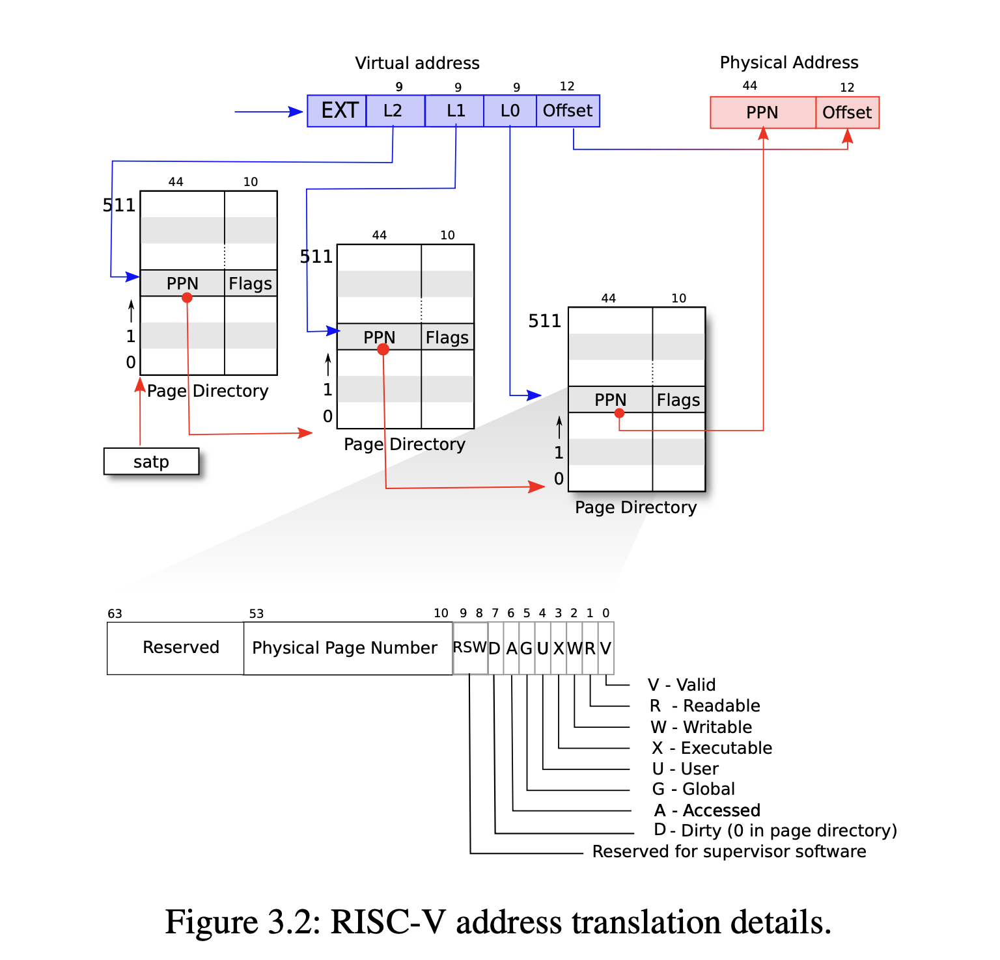
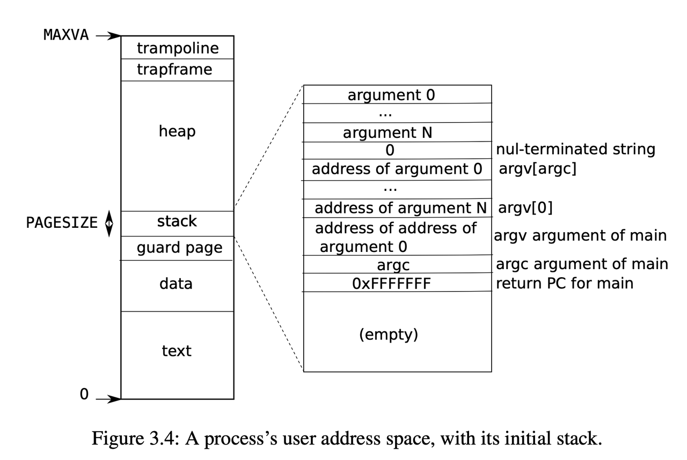
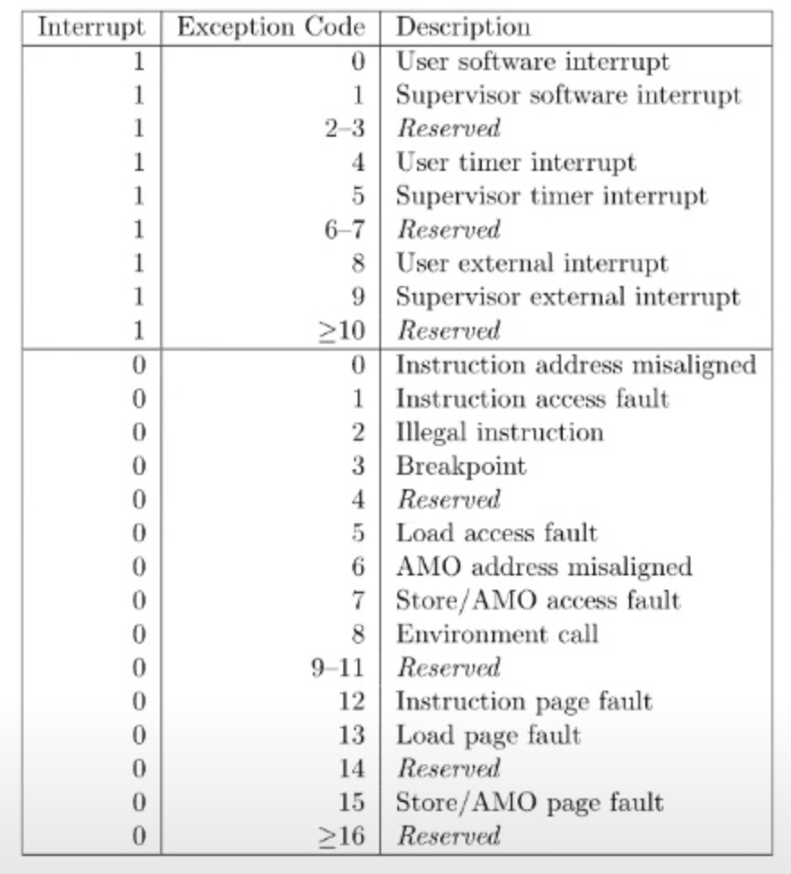
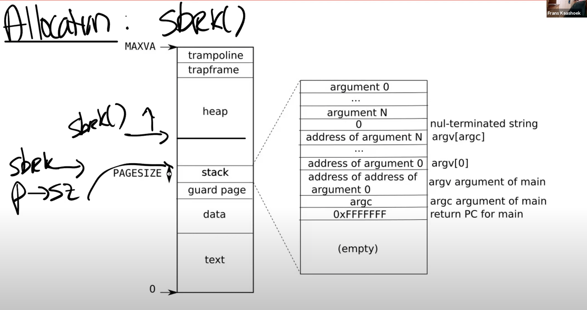
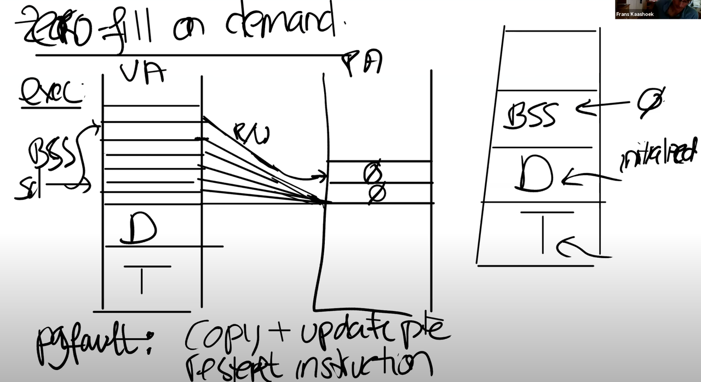
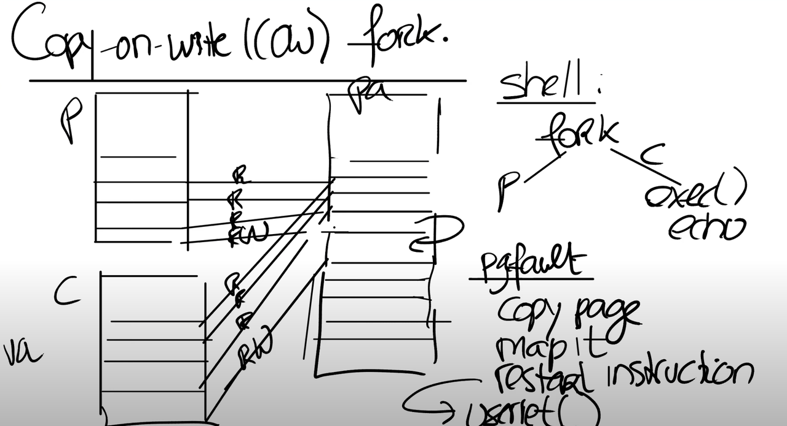
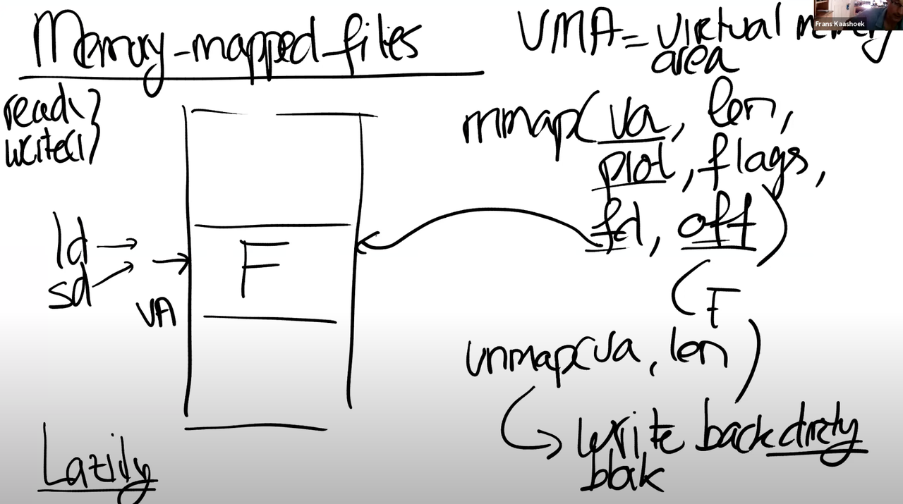

学习小组分享：Page Fault

# 一、简单回顾一下

## 页表

 

图1.1 页表（va->pa的映射关系）

xv6使用RISC-V Sv39内存管理方案

va 64位（PTE），只用了低39位：

index：其中高27位用于查找三级页表（9*9*9）

offset：page中的偏移量（一个page 4kb，所以offset长度是12位）

pa 56位（硬件设计者决定）

ppn：高44位，physical page number

offset：page中的便宜量

stap寄存器：保存root page table的pa

翻译的时候将va的27位index翻译成pa的ppn，offset直接拷贝过来即可

va->pa的翻译很慢，使用TLB（缓存，可以是硬件）

## Trap

用户态和内核态的切换

执行system call

Page falut

硬件中断

涉及到的寄存器（只有内核态能访问）

stvec：trap handler的地址

spec：trap时保存pc的值

scause：trap的原因

sscratch：

sstatus：一些控制位。如SIE，是否可以响应中断；SPP，trap来自用户态还是内核态

## 进程内存布局

 

图1-2 进程的内存布局

# 二、Page Fault

通过page fault，内核可以更新页表，提供巨大的灵活性

Page fault时需要保存的信息：

page fault的目标地址（stval寄存器）

触发page fault的原因（scause寄存器）

触发page fault的指令地址（sepc寄存器）-> page fault handler中修复，重新执行指令

Page fault相关的scause有三种：

13: load page fault 

When a load instruction cannot translate its virtual address

15: store page fault

when a store instruction cannot translate its virtual address

12: instruction page fault

when the address in the program counter doesn't translate

 

利用page falut可以做一些有趣的事：

Lazy page allocation

sbrk系统调用，扩大堆的空间（xv6中的堆向上增长）

xv6默认实现是eager allocation（缺点：浪费内存）

进程刚创建的时候，进程数据结构中的sz（size of process memory）指向堆的最底端、栈的最顶端，sbrk修改p->sz，分配物理内存，扩大堆的空间

## 如何lazy allocation？

提升p->sz，实际上并不分配物理内存，等后面应用程序用到了那块内存的时候，再通过触发page falut，分配内存

 

在trap handler中判断：如果va>stack && va<p->sz，那么应该分配一块物理内存，重新执行指令

##  Zero filled on demand

进程layout：text段、data段、bss段（未被初始化的全局变量）...

实际上我们并不需要为bss段分配物理内存，只需要分配1个page，将va中bss段的page都映射到这个物理内存就可以了

这些pte都是read only的，当应用程序试图修改的时候，触发page fault，这时才新申请一个物理内存，修改映射关系（rw），重新执行指令

 

##  Copy on write fork

fork会创建一个父进程的拷贝，但是fork以后做的第一件事往往是exec，执行一些其他的应用程序，丢弃这个空间，有些浪费

fork的时候，父子进程共享同一个物理空间，这里需要将父子进程的pte设置为read only，当后续发生修改的时候，触发page fault，分配一个新的物理页，修改mapping，改为rw

 

## Demand paging

对于exec，为什么要以eager的方式将应用程序加载到内存呢？可以参考lazy allocation

应用程序从va的地址0开始执行，由于pte未分配，触发page fault，...

实际上应用程序可能不会用到text和data的全部内容，这样做可以节省内存

 

Lazy allocation的时候，oom了怎么办（pa的换页策略）

Least recently used（LRU策略）-- pte的access bit，内核会定时清除，用于统计访问频率

Dirty page 和 non-dirty page中优先驱逐non-dirty page（节省一次写操作）

## Memory mapped file

mmap系统调用，在va中分配一段空间，将文件映射到内存。

完成操作之后，需要调用unmap系统调用，将被修改的页（dirty bit=1）写回文件

 

相比read/write系统调用，不需要经过内核的数据缓存（磁盘->内核态buffer->用户态buffer），效率更高

