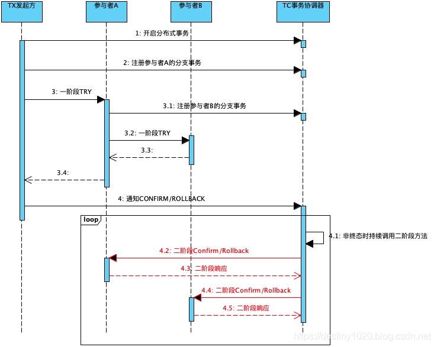

# 分布式事务TCC
- try
- confirm
- cancel
## 核心思想是
    1。 引入冷动态 支付中 
    2。全局唯一的分布式key 事务状态控制表来
    3。 重复的rpc调用保持幂等 避免资源故障
## 主要  
我们可以通过增加一张事务状态控制表来实现，这个表的关键字段有以下几个：
主事务ID
分支事务ID
分支事务状态
其中1和2构成表的联合主键来唯一标识一笔分布式事务中的一条分支事务。3用来标识该分支事务的状态，一共有3种状态：、
INIT(I) - 初始化
CONFIRMED© - 已提交
ROLLBACKED® - 已回滚 
### 空回滚
cancal 比try 先到  
### 资源悬挂
try 超时 回滚 try 到了，资源悬挂 
FAQ：
    1。try超时失败重试
    2。confirm 部分成功怎么办，一直重试/告警  务必成功
    3。confirm 需要ack么 不需要
    4。 cancel 失败怎么办 【收到一个cancel 全回滚】
    5。 cancel/confirm 超时 自动回滚
    
