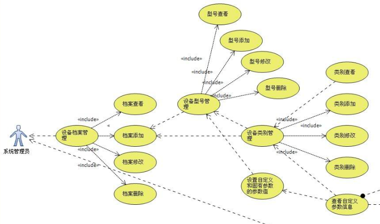
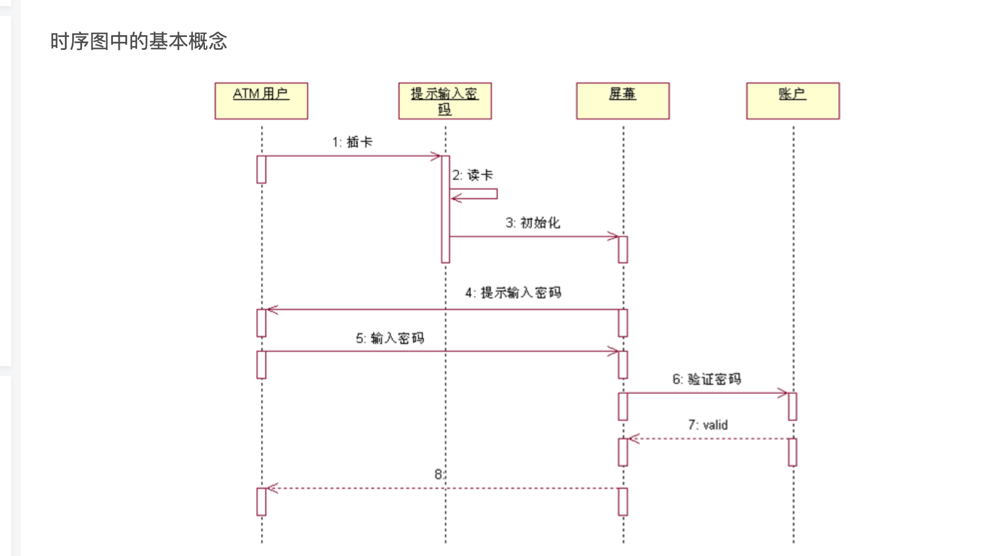
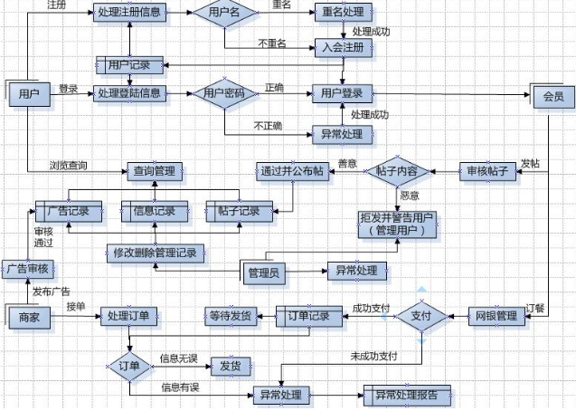
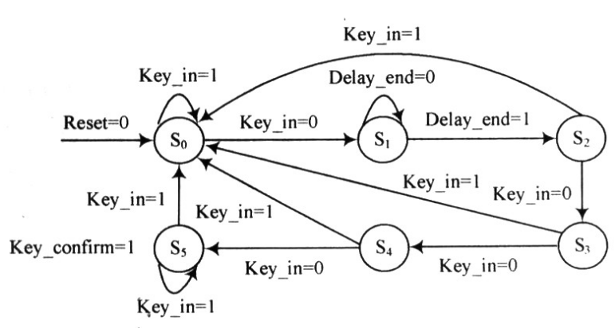
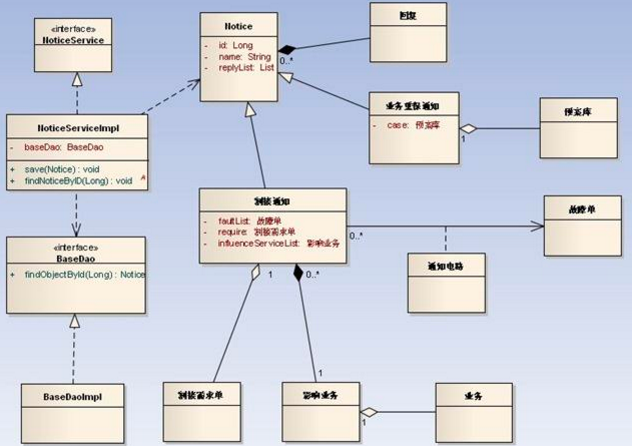
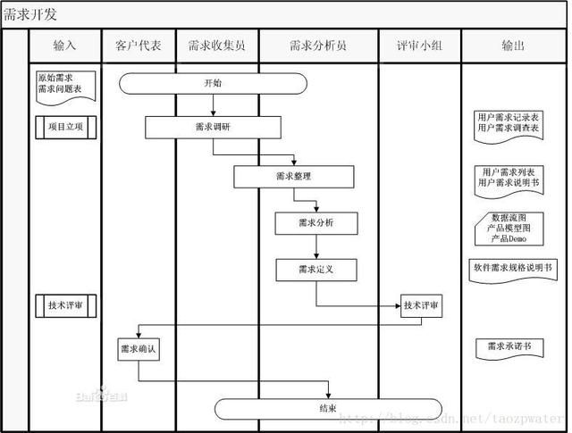

[TOC]

# 心得
1. 一定要详略的得当
2. 图一般包括时序图/表的实体图/流程图
 
# 技术评审用到的图种类
## er图

## 时序图 Sequence Diagram

## 流程图

## 状态图 Statechart Diagram

## 类图

## 泳道图

##
##
https://juejin.cn/post/6844903962043236365
# 写文档的时候不要希望第一次就做的特别牛逼

