# 进程 线程 协程
# 反射
1. 反射编程是指在程序运行期间，可以访问，检测和修改它本身状态或者行为的一种能力．用比喻来说，反射就是程序运行的时候能够＂观察＂并且修改自己的行为的一种能力．
## 适用场景
1. 不能预先知道函数参数类型，或者参数类型有很多种，无法用同一个类型来表示
2. 函数需要根据入参来动态的执行不同的行为 
## 反射的优点
1. 可以在一定程序上避免硬编码，提供灵活性和通用性
2. 可以作为一个第一个类对象发现并修改源代码的结构（如代码块，类，方法，协议等）
## 反射的缺点
1. 由于将部分类型检查工作从编译期推迟到了运行时，使得一些隐藏的问题无法通过编译期发现，提高了代码出现bug的几率，搞不好就会panic
2. 反射出变量的类型需要额外的开销，降低了代码的运行效率
3. 反射的概念和语法比较抽象，过多的使用反射，使得代码难以被其他人读懂，不利于合作与交流
4. 在Golang obj转成interface这个过程中, 分2种类型 
   1. 包含方法的interface, 由runtime.iface实现 
   2. 不包含方法的interface, 由runtime.eface实现 
   3. 这2个类型都是包含2个指针, 一个是类型指针, 一个是数据指针, 这2个指针是完成反射的基础. 
   4. 实质上, 通过上述转换后得到的2种interface, 已经可以实现反射的能力了. 但作为语言本身, 标准库将这个工作封装好了, 就是 reflect.Type与reflect.Value , 方便我们使用反射.
   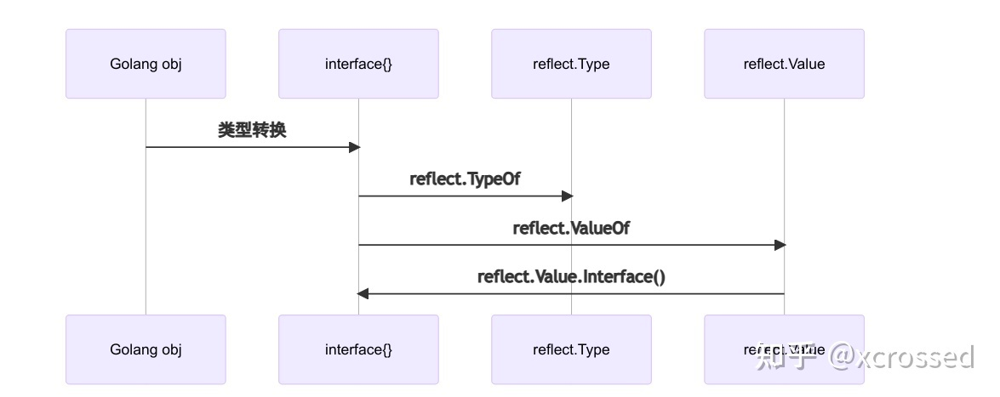
   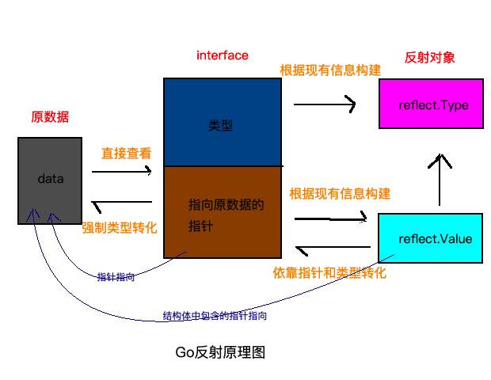
## go 反射三定律
1. Golang对象可以转换成反射对象
2. 反射对象可以转换成Golang对象
3. 可寻址的reflect对象可以更新值
## unsafe
unsafe的操作因为它是不安全的，它绕过了golang的内存安全原则，容易使你的程序出现莫名其妙的问题，不利于程序的扩展与维护。但是在很多地方却是很实用。在一些go底层的包中unsafe包被很频繁的使用。
https://segmentfault.com/a/1190000021625500

# GMP 调度
https://learnku.com/articles/41728
https://go.cyub.vip/gmp/gmp-model.html
## 单进程 多进程 线程 goroutine 演进之路
1. 最早没有操作系统和虚拟内存映射的时候 一个时间段内只能执行一个进程 进程全享用CPU和内存 串行
2. 后来OS后，每个进程拥有自己的虚拟内存和CPU时间片加寄存器 多进程成为可能
3. 进程的虚拟内容和时间片有些没有依赖的线程可以并发 进程拥有太多的资源，进程的创建、切换、销毁，都会占用很长的时间 CPU都用来调度了 多线程开发设计会变得更加复杂，要考虑很多同步竞争等问题，如锁、竞争冲突等。
4. goroutine 不用系统调用 所以轻量级
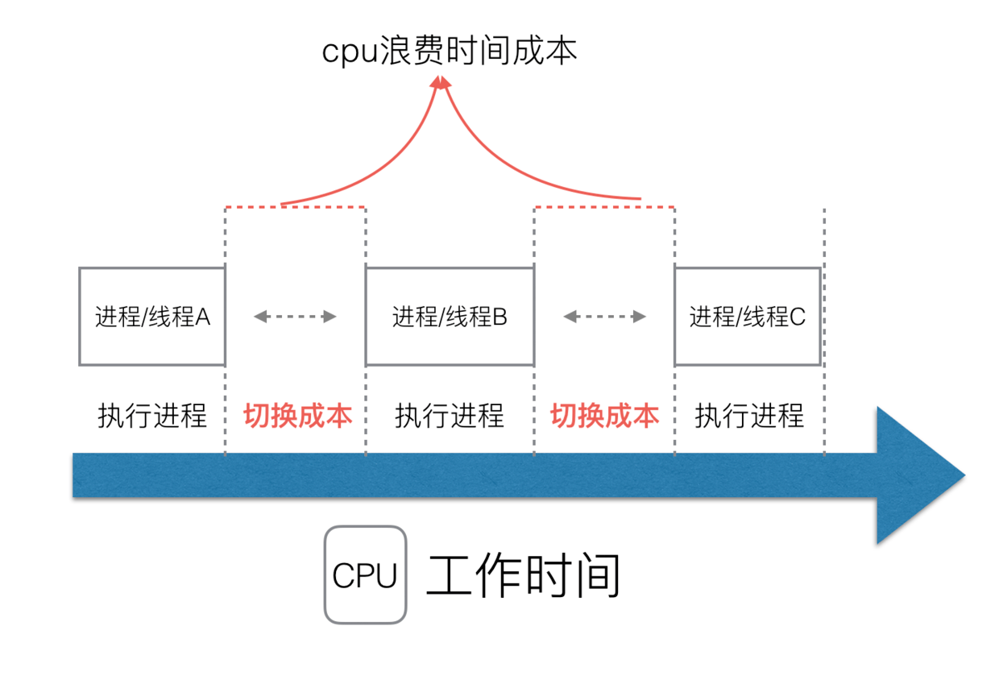
5. 多进程和线程 高内存占用
   调度的高消耗 CPU
6. 对linux来说 线程和进程一样
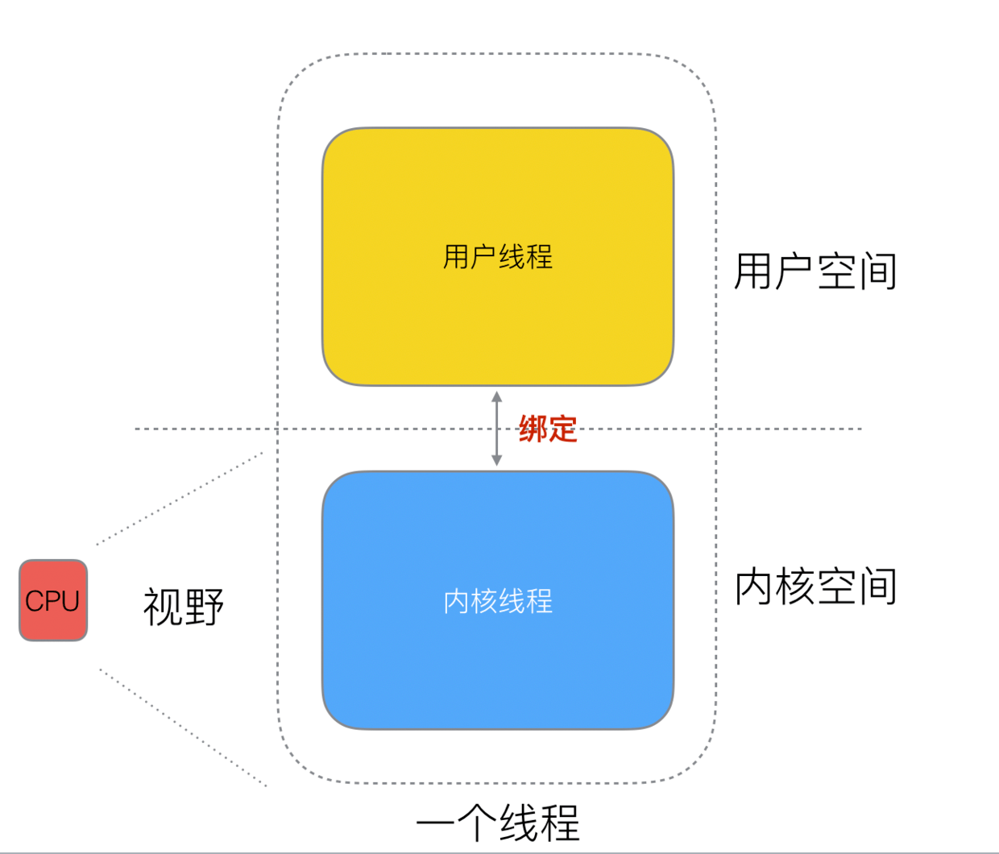
## 思路
1. “用户态线程” 必须要绑定一个 “内核态线程”，但是 CPU 并不知道有 “用户态线程” 的存在，它只知道它运行的是一个 “内核态线程”(Linux 的 PCB 进程控制块)。
2. ，内核线程依然叫 “线程 (thread)”，用户线程叫 “协程 (co-routine)”.
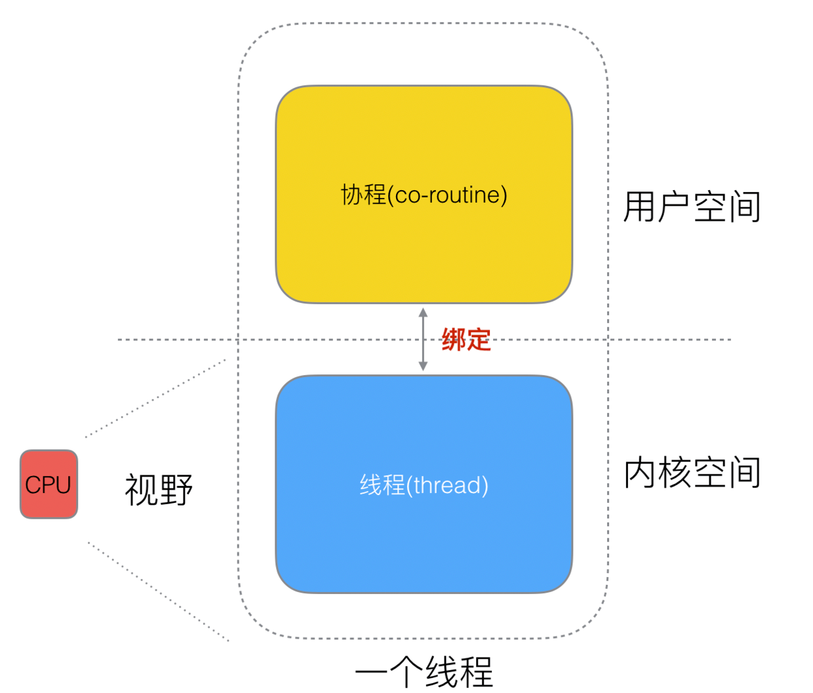

## 为啥内核线程thread和用户线程coroutine 是M：N
1. 假设 一个thread：N个goroutine
   1. 缺点： 协程在用户态线程即完成切换，不会陷入到内核态，这种切换非常的轻量快速
   2. 某个程序用不了硬件的多核加速能力
   3. 如果coroutine阻塞了 其他线程也执行不了
      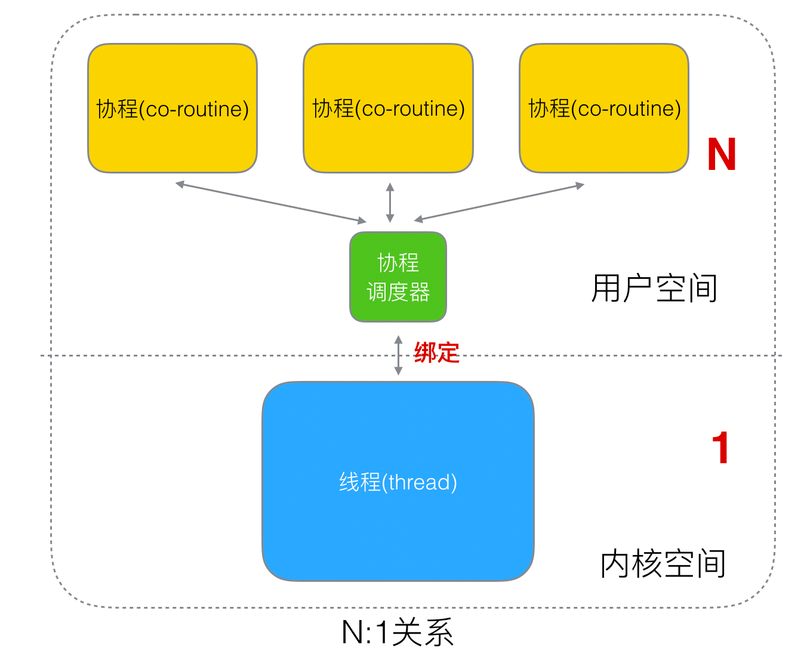
2. 假设 一个thread：1个goroutine
   1. 没用 跟只用thread没区别
   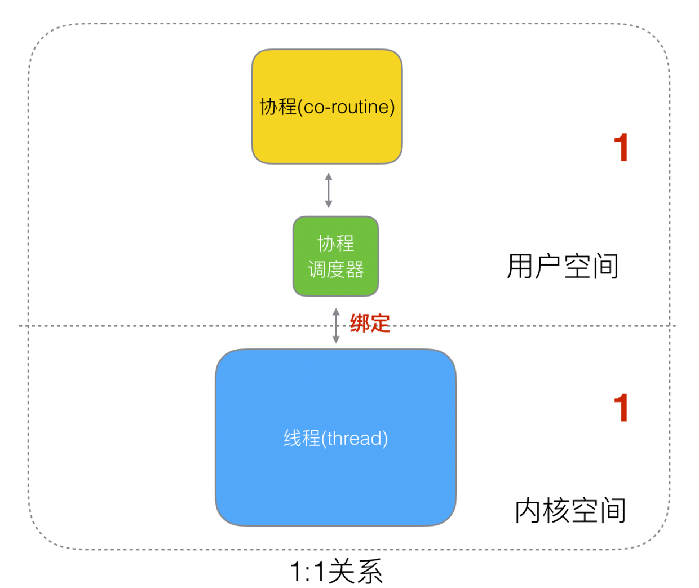
3. 采用 N个thread：M个goroutine
   1. 线程由 CPU 调度是抢占式的，协程由用户态调度是协作式的，一个协程让出 CPU 后，才执行下一个协程。
   2. Go 为了提供更容易使用的并发方法，使用了 goroutine 和 channe
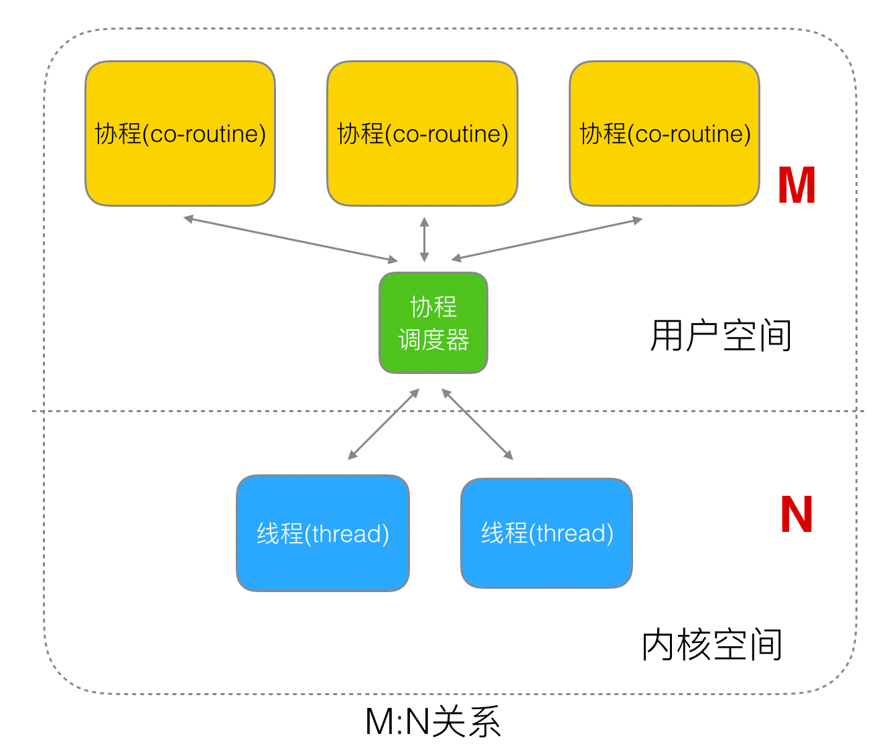
## 历史上被废弃的goroutine调度器 
1. M是thread从g中 遍历拿和放回 goroutine
2. 这样做的缺点
   1. M去创建销毁调度G 多线程访问同一资源 就有锁竞争
   2. 局部性差
   3. 系统调用 (CPU 在 M 之间的切换) 导致频繁的线程阻塞和取消阻塞操作增加了系统开销。

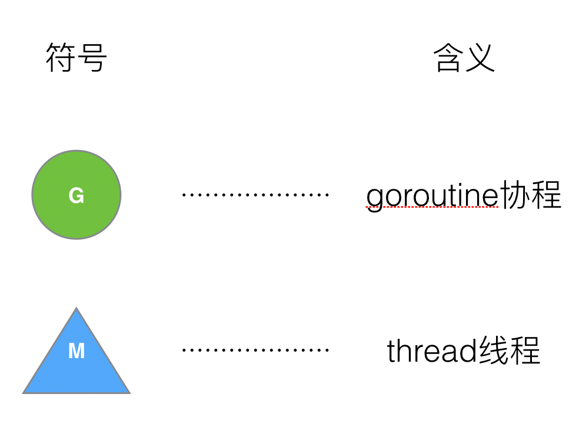   
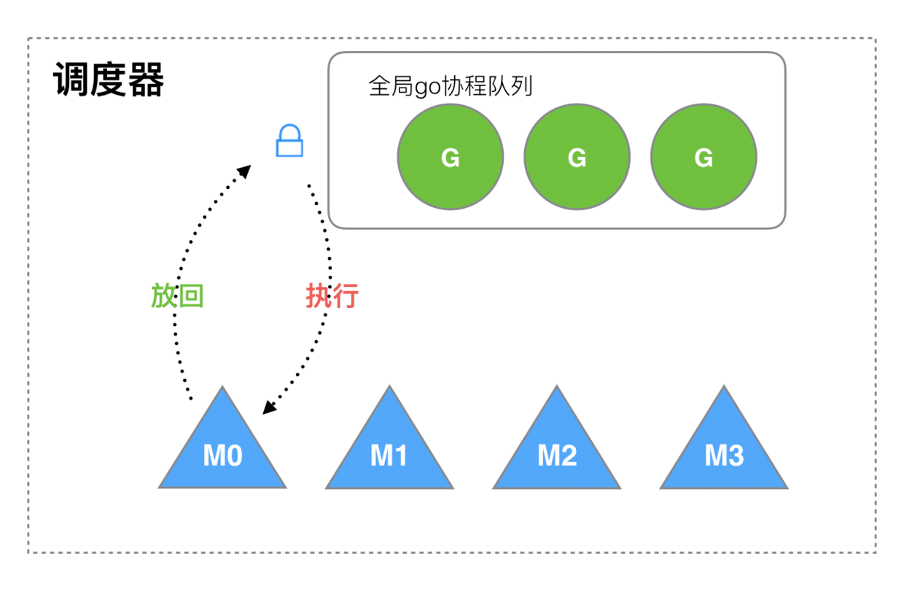
## 正版的GPM  G和M中引入了P processor
1. G想运行M 必须获得P
2. 当P内没有G的话 会偷其他的P中的一半G过来
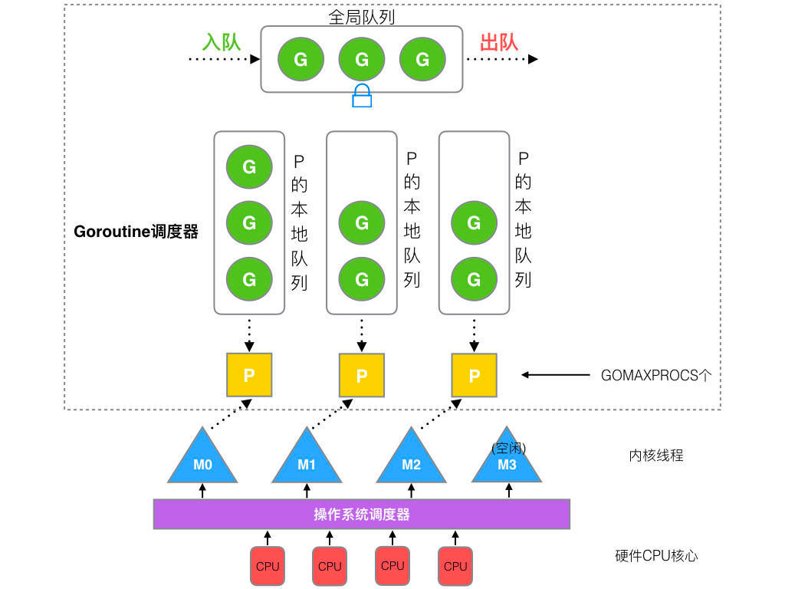
