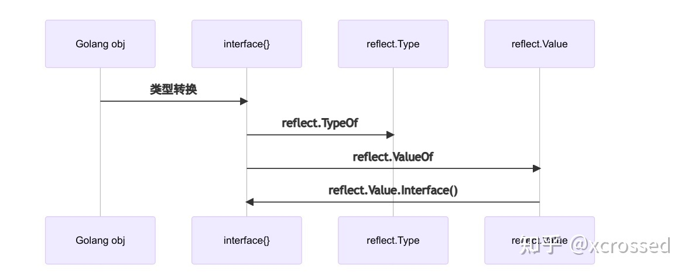

# 进程 线程 协程
# 反射
1. 反射编程是指在程序运行期间，可以访问，检测和修改它本身状态或者行为的一种能力．用比喻来说，反射就是程序运行的时候能够＂观察＂并且修改自己的行为的一种能力．
## 适用场景
1. 不能预先知道函数参数类型，或者参数类型有很多种，无法用同一个类型来表示
2. 函数需要根据入参来动态的执行不同的行为 
## 反射的优点
1. 可以在一定程序上避免硬编码，提供灵活性和通用性
2. 可以作为一个第一个类对象发现并修改源代码的结构（如代码块，类，方法，协议等）
## 反射的缺点
1. 由于将部分类型检查工作从编译期推迟到了运行时，使得一些隐藏的问题无法通过编译期发现，提高了代码出现bug的几率，搞不好就会panic
2. 反射出变量的类型需要额外的开销，降低了代码的运行效率
3. 反射的概念和语法比较抽象，过多的使用反射，使得代码难以被其他人读懂，不利于合作与交流
4. 在Golang obj转成interface这个过程中, 分2种类型 
   1. 包含方法的interface, 由runtime.iface实现 
   2. 不包含方法的interface, 由runtime.eface实现 
   3. 这2个类型都是包含2个指针, 一个是类型指针, 一个是数据指针, 这2个指针是完成反射的基础. 
   4. 实质上, 通过上述转换后得到的2种interface, 已经可以实现反射的能力了. 但作为语言本身, 标准库将这个工作封装好了, 就是 reflect.Type与reflect.Value , 方便我们使用反射.
   
   
## go 反射三定律
1. Golang对象可以转换成反射对象
2. 反射对象可以转换成Golang对象
3. 可寻址的reflect对象可以更新值
## unsafe
unsafe的操作因为它是不安全的，它绕过了golang的内存安全原则，容易使你的程序出现莫名其妙的问题，不利于程序的扩展与维护。但是在很多地方却是很实用。在一些go底层的包中unsafe包被很频繁的使用。
https://segmentfault.com/a/1190000021625500

