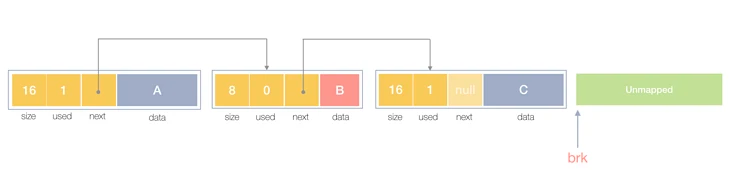
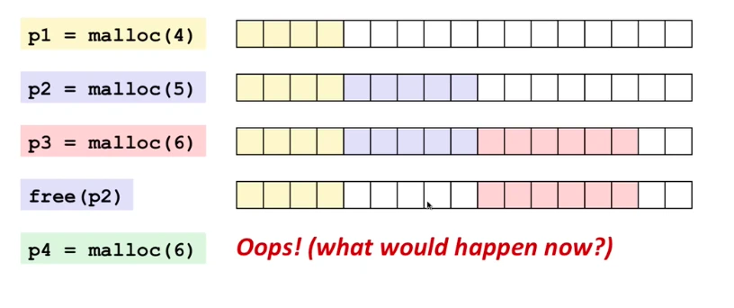
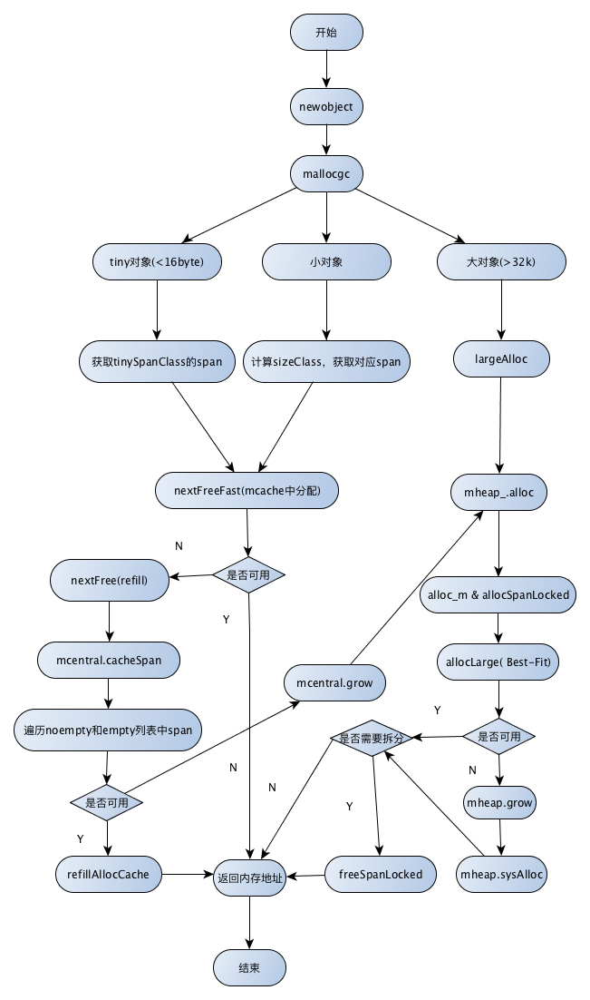
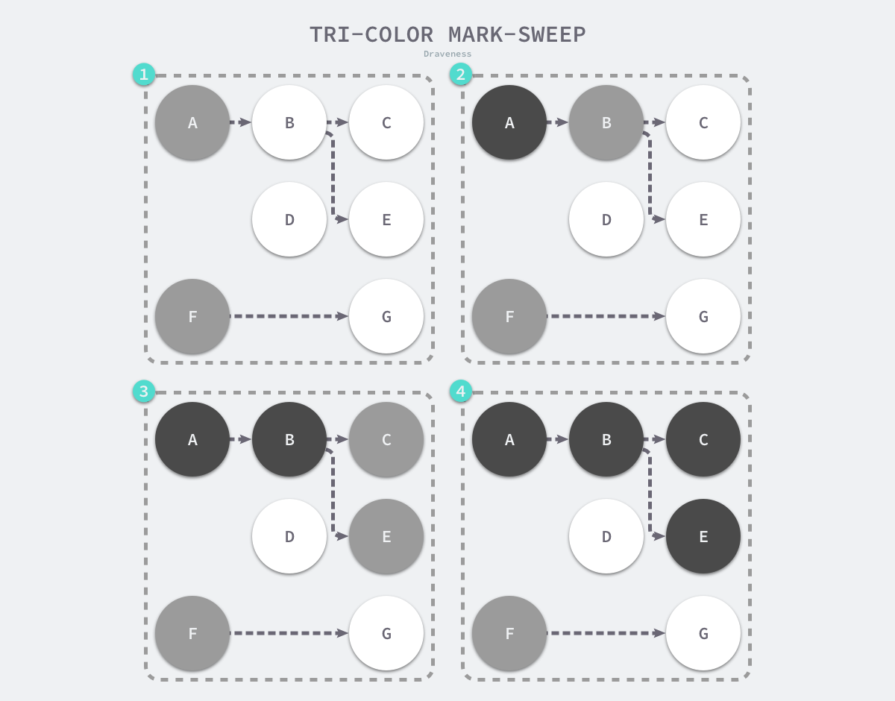
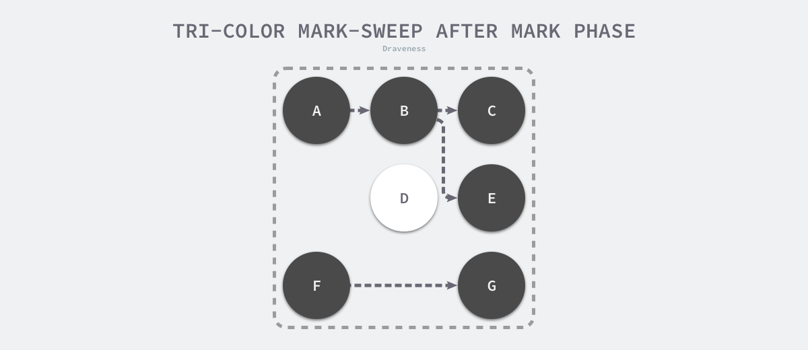
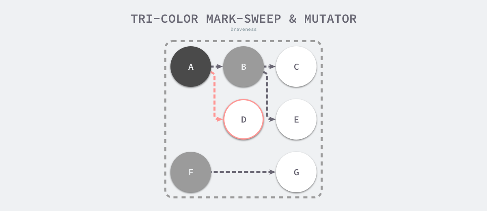
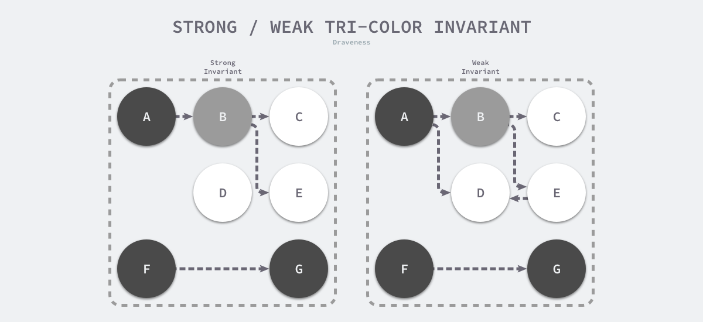
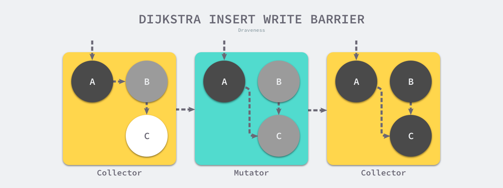
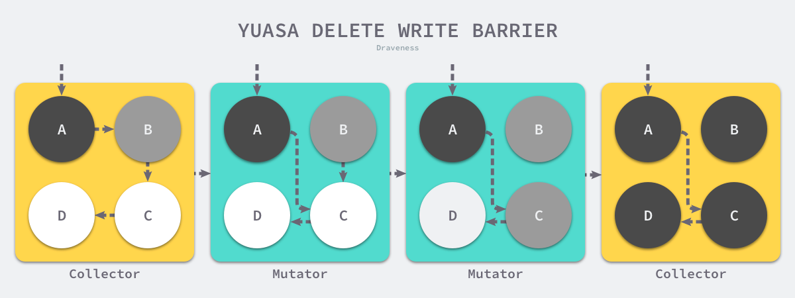

https://juejin.cn/post/6844903795739082760#heading-5
https://segmentfault.com/a/1190000020338427
https://www.infoq.cn/article/IEhRLwmmIM7-11RYaLHR
# heap 堆和 stack 栈 的差别
1. heap 自下向上 越来越大 stack 自下向上 越来越小
2. heap是OS自动分配 但是因为链表容易产生碎片 释放要花cpu stack c++ 需要程序员自己free del

# TMalloc
Golang运行时的内存分配算法主要源自 Google 为 C 语言开发的TCMalloc算法，全称Thread-Caching Malloc。核心思想就是把内存分为多级管理，从而降低锁的粒度。它将可用的堆内存采用二级分配的方式进行管理：每个线程都会自行维护一个独立的内存池，进行内存分配时优先从该内存池中分配，当内存池不足时才会向全局内存池申请，以避免不同线程对全局内存池的频繁竞争。

# 快速分配内存的三个层次
1. 引入虚拟内存后，让内存的并发访问问题的粒度从多进程级别，降低到多线程级别。
2. 为线程预分配缓存需要进行1次系统调用，后续线程申请小内存时，从缓存分配，都是在用户态执行，没有系统调用，缩短了内存总体的分配和释放时间，这是快速分配内存的第二个层次。
3. 多个线程同时申请小内存时，从各自的缓存分配，访问的是不同的地址空间，无需加锁，把内存并发访问的粒度进一步降低了，这是快速分配内存的第三个层次。

# go 的内存管理 说的其实是虚拟内存
1. OS的线程切换需要上下文切换 CPU 比较耗时
2. golang的goroutine 是语言层面 切换耗时短
3. 参考了 TCMalloc【Thread Cache Malloc】 Thread Process Center
4. 分配内存块，回收内存块和组织内存块。

# gc 垃圾回收
## 垃圾回收的基本原理和非累
1. 推算出某个对象在未来的程序运行中将不再会被访问。
2. 将这些对象占用的内存回收。
3. 基本方法：
   1. 引用计数收集器 存在无法回收循环引用的存储对象的缺陷。
   2. 跟踪收集器 标记清除法
4. 回收策略
   1. 引用-清除
   2. 标记－清除 会进入 stop the world STW 从根内容遍历   
      1. 适合相对较低的销毁率+不高频访问的情况 
   3. 标记－压缩 
      1. 和“标记－清除”相似，不同的是，回收期间会让存活对象紧靠， 可以让内存连续 高效 直接计算偏移即刻)
      2. 适合低销毁率+需要访问加速的情况
   4. 标记-复制
      1. 反其道而行之 全清除 只保留还用的 分新旧空间 分配只发生在旧空间 旧空间满了就触发内存回收 然后反转新旧
      2. 适合高销毁率的情况 比如一个函数结束后 内部变量的回收(因为基本全部不要了)
   5. 增量回收器
# go gc的三色标记
黑白灰：
1. 白色对象 — 潜在的垃圾，其内存可能会被垃圾收集器回收； 【初始化状态 会变成黑灰】
2. 黑色对象 — 活跃的对象，包括不存在任何引用外部指针的对象以及从根对象可达的对象； 【努力由灰变黑】
3. 灰色对象 — 活跃的对象，因为存在指向白色对象的外部指针，垃圾收集器会扫描这些对象的子对象；
一句话总结 最开始都是白的 根内容是灰的 要把根内容可达的都标记成黑的 最后干掉白的

# bad case
1.程序在标记过程中会修改对象指针 三色无法并发 需要stw， 新增a到d d被删了 a就是悬挂指针

2. fix bad case
   1. 屏障技术  CPU 或者编译器在执行内存相关操作时遵循特定的约束，在内存屏障前执行的操作一定会先于内存屏障后执行的操作6。
3. 强三色不变性 — 黑色对象不会指向白色对象，只会指向灰色对象或者黑色对象；[黑不能指向白 只能灰黑]
4. 弱三色不变性 — 黑色对象指向的白色对象必须包含一条从灰色对象经由多个白色对象的可达路径 【黑如果真的想指向白， 必须有一个灰色经过多白可达】

   1. Go 语言中使用的两种写屏障技术，分别是 Dijkstra 提出的插入写屏障8和 Yuasa 提出的删除写屏障
# 插入写屏障 [改变指针的情况下要直接变色 先变色再改指针]
 
1. 垃圾收集器将根对象指向 A 对象标记成黑色并将 A 对象指向的对象 B 标记成灰色；
2. 用户程序修改 A 对象的指针，将原本指向 B 对象的指针指向 C 对象，这时触发写屏障将 C 对象标记成灰色；
3. 垃圾收集器依次遍历程序中的其他灰色对象，将它们分别标记成黑色；

# 删除写屏障 [删除指针的同时要把指针指向的颜色变成灰色 避免白色被删]
意思就是删除指针的同时要把指针指向的颜色变成灰色 避免白色被删

1. 垃圾收集器将根对象指向 A 对象标记成黑色并将 A 对象指向的对象 B 标记成灰色；
2. 用户程序将 A 对象原本指向 B 的指针指向 C，触发删除写屏障，但是因为 B 对象已经是灰色的，所以不做改变；
3. 用户程序将 B 对象原本指向 C 的指针删除，触发删除写屏障，白色的 C 对象被涂成灰色；
4. 垃圾收集器依次遍历程序中的其他灰色对象，将它们分别标记成黑色；
   1. 上述过程中的第三步触发了 Yuasa 删除写屏障的着色，因为用户程序删除了 B 指向 C 对象的指针，所以 C 和 D 两个对象会分别违反强三色不变性和弱三色不变性：
      1. 强三色不变性 — 黑色的 A 对象直接指向白色的 C 对象；
      2. 弱三色不变性 — 垃圾收集器无法从某个灰色对象出发，经过几个连续的白色对象访问白色的 C 和 D 两个对象；
# 增量和并发 #
1. 传统的垃圾收集算法会在垃圾收集的执行期间暂停应用程序，一旦触发垃圾收集，垃圾收集器会抢占 CPU 的使用权占据大量的计算资源以完成标记和清除工作，然而很多追求实时的应用程序无法接受长时间的 STW。
2. 增量垃圾收集 — 增量地标记和清除垃圾，降低应用程序暂停的最长时间；
3. 并发垃圾收集 — 利用多核的计算资源，在用户程序执行时并发标记和清除垃圾；

