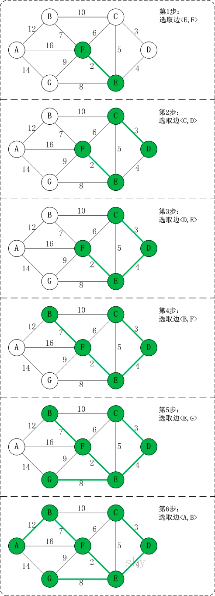

[TOC]
# 图的表示
# # 图的遍历
1. 深度优先搜索算法 （Depth-First-Search）
   1. 先尽量靠右向下搜索 
   2. 搜到无下一个节点返回上一步递归
2. 广度优先搜索（Breadth-First-Search） 
   1. 广度优先搜索是一种分层的查找过程，每向前走一步可能访问一批顶点
   2. 算法必须借助一个辅助队列，以记录正在访问的顶点的下一层顶点。
# 图变树
## 邻接矩阵
无向

有向

## 邻接表
无向

有向

无向
有向
## 十字链表 
## 有向无环图（DAG, Directed Acyclic Graph）
利用二维矩阵表示
# 图的算法
## 1. 连接图内所有点的最小支撑树
### 1-1. prim算法
1. 1）以某一个点开始，寻找当前该点可以访问的所有的边； 
2. 2）在已经寻找的边中发现最小边，这个边必须有一个点还没有访问过，将还没有访问的点加入我们的集合，记录添加的边； 
3. 3）寻找当前集合可以访问的所有边，重复2的过程，直到没有新的点可以加入； 
4. 4）此时由所有边构成的树即为最小生成树。
可在加权连通图里搜索最小生成树。意即由此算法搜索到的边子集所构成的树中，不但包括了连通图里的所有顶点（英语：Vertex (graph theory)），且其所有边的权值之和亦为最小。
Prim是最小生成树算法，即对于一个图，寻找一个能够包含所有顶点且边的权值和最小的树。
#### 反证法：假设prim生成的不是最小生成树
1. 1).设prim生成的树为G0
2. 2).假设存在Gmin使得cost(Gmin)<cost(G0)   则在Gmin中存在<u,v>不属于G0
3. 3).将<u,v>加入G0中可得一个环，且<u,v>不是该环的最长边(这是因为<u,v>∈Gmin)
4. 4).这与prim每次生成最短边矛盾
5. 5).故假设不成立，命题得证.

5. 修路问题
![image]![img_15.png]
6. Prim是最小生成树算法，即对于一个图，寻找一个能够包含所有顶点且边的权值和最小的树。

### 1-2. Kruskal算法【由小到大边把所有点都连上】
1. 我们假设一个图有m个节点，n条边。首先，我们需要把m个节点看成m个独立的生成树，并且把n条边按照从小到大的数据进行排列。
2. 在n条边中，我们依次取出其中的每一条边，如果发现边的两个节点分别位于两棵树上，那么把两棵树合并成为一颗树； 如果树的两个节点位于同一棵树上，那么忽略这条边，继续运行。
3. 等到所有的边都遍历结束之后，如果所有的生成树可以合并成一条生成树，那么它就是我们需要寻找的最小生成树，反之则没有最小生成树。

### Kruskal算法 vs  prim算法
1. Prim 算法从顶点的角度出发，每次选择距离当前节点最近的节点加入，直到所有节点都加入。
2. Kruskal 算法从边的角度出发，每次总是选择权重最小的边加入，直到加入n-1条边为止。（如果加入一条边后出现回路，skip这条边）。
3. 从代码实现的角度：Prim算法需要维持一个堆数据结构（实际实现中用priority_queue比较多） Kruskal算法需要union-find的数据结构
4. Kruskal 需要知道所有的边然后降序  Prim不需要

作者：严肃的质数
链接：https://www.zhihu.com/question/26806466/answer/35039864
来源：知乎
著作权归作者所有。商业转载请联系作者获得授权，非商业转载请注明出处。
## 2 图内两点距离最短算法
### 2-1. Dijkstra算法【贪心算法】

