[toc]
# 树 大全
# 各树的原因场景
1. 普通二叉树
   1. 一般无应用场景 四则运算 编译原理
2. 哈夫曼树
   1. 高频的编码 树深度 短 可以压缩传送大小 通信领域常见
   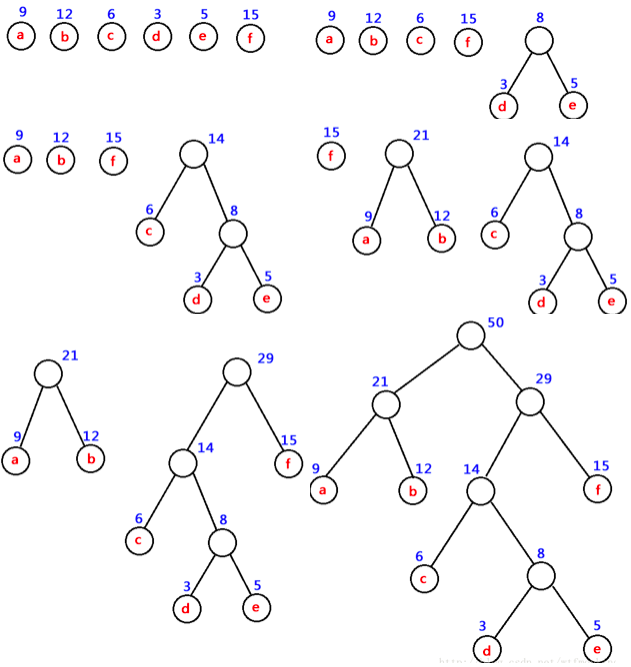#### 哈夫曼树的应用
3. BST树【Binary Search Tree】 二叉查找树
   1. 数据库索引常见 左边比根大 右边比根小 容易裂化成线性
4. AVL树 平衡二叉树 
   1. 概念： 左右子树高度差小于1
   2. 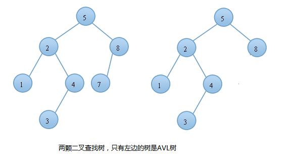
   3. 它的两个发明者G. M. Adelson-Velsky 和 Evgenii Landis 的缩写 
   4. BST如果划分不合理 左大右小 本来的log n 会变成线性遍历 即On 所以有AVL
   5. AVL树的旋转 
   6. windows对进程地址空间的管理用到了AVL树。维护高度平衡很花代价
   7. 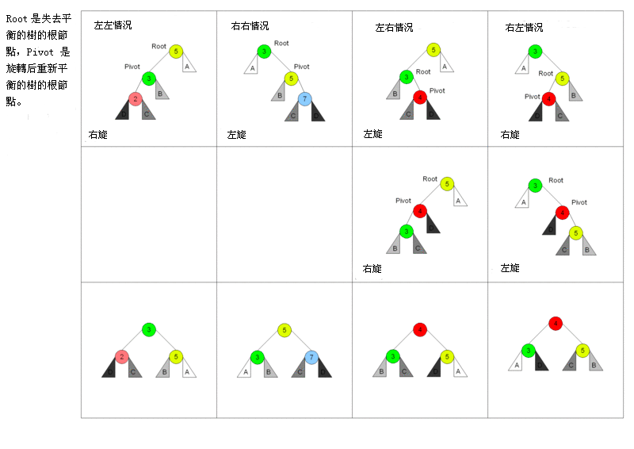
   8. 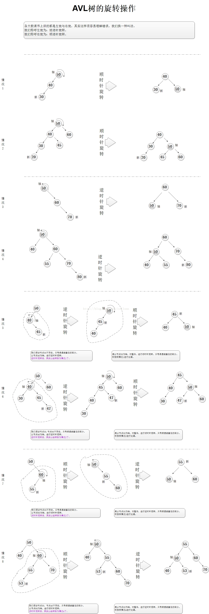
   9. 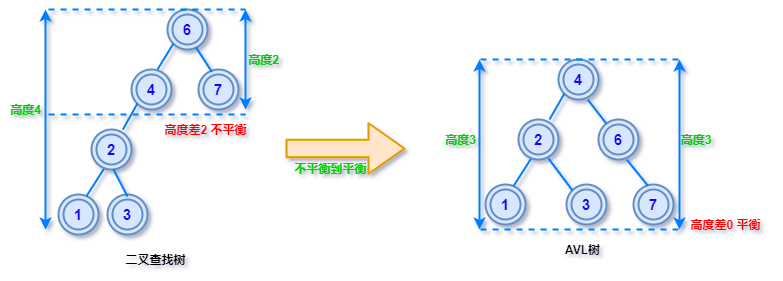
5. B B+树
   1. 概念：
      1. B 树
         1. 可以看作是对2-3查找树的一种扩展，即他允许每个节点有M-1个子节点。 
         2. 根节点至少有两个子节点 每个节点有M-1个key，并且以升序
         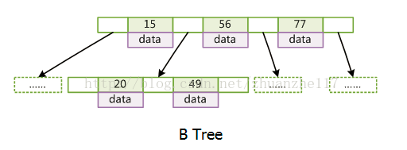
      2. B+树
         1. 有k个子结点的结点必然有k个关键码； 
         2. 非叶结点仅具有索引作用，跟记录有关的信息均存放在叶结点中。 
         3. 树的所有叶结点构成一个有序链表，可以按照关键码排序的次序遍历全部记录。
         4. 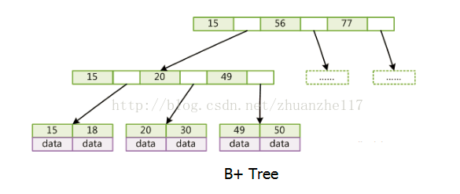
      3. 以空间换时间 则运用在file system database这类持续存储结构
6. 2-3树[B树特例]
7. TRIE树：字典树
   1. 搜索引擎提示
   2. 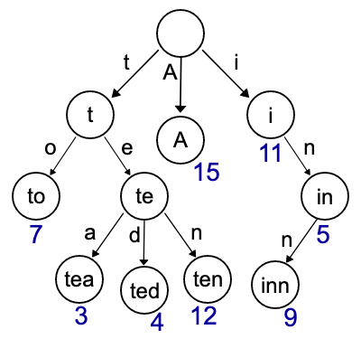
8. 红黑树
   1. 概念
      1. 每个节点非红即黑 
      2. 根节点是黑的; 
      3. 每个叶节点（叶节点即树尾端NULL指针或NULL节点）都是黑的;       
      4. 对于任意节点而言，其到叶子点树NULL指针的每条路径都包含相同数目的黑节点;
      5. 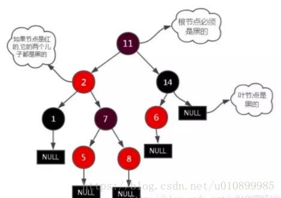
   2. AVL树旋转的次数太多，红黑树不追求绝对平衡，其只需保证最长路径不超过最短路径的2倍，相对而言，降低了插入和旋转的次数，所以在经常进行增删的结构中性能比AVL树更优
   3. 应用比较广泛：
      1. 广泛用在C++的STL中。map和set都是用红黑树实现的。
      2. 著名的linux进程调度Completely Fair Scheduler,用红黑树管理进程控制块。
      3. epoll在内核中的实现，用红黑树管理事件块
      4. nginx中，用红黑树管理timer等
      5. Java的TreeMap实现 
9. 基数树[radix树]
10. 伸展树
    1. 在伸展树上的一般操作都基于伸展操作：假设想要对一个二叉查找树执行一系列的查找操作，为了使整个查找时间更小，被查频率高的那些条目就应当经常处于靠近树根的位置。
    2. 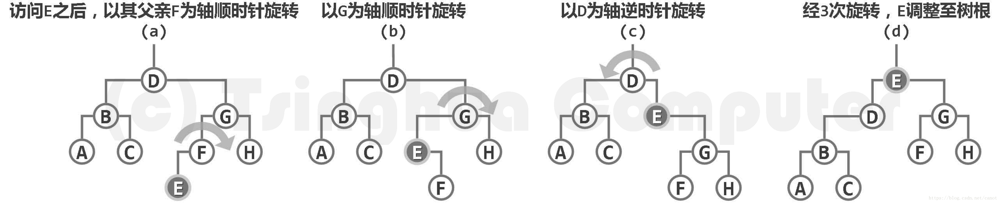
11. K叉树
12. k-d树（k-dimensional树的简称），是一种分割k维数据空间的数据结构。主要应用于多维空间关键数据的搜索（如：范围搜索和最近邻搜索）
13. PR 四分树【图像传输用到】
    1. 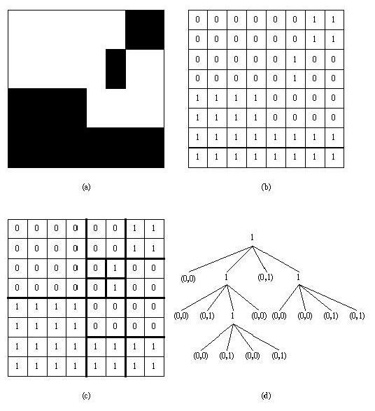
    2. 我们一般都将二进制图片存成图2(d)这样的四分树的形式，这棵树是通过图2(c)里面的划分得到的。图2(d)里面的每一个结点都代表图2(c)里面的矩阵，
    3. 而树的根结点代表整个大的矩阵。如果树中一个结点的值为1，则代表这个结点对应的矩阵需要划分成4个小矩阵。否则，这个结点将包含两个数。
    4. 第一个数为0，表示不用再划分，第二个数为0或者1，表示整个矩阵都是这个值。整棵树可以用它的宽度优先遍历得到的结果来表示，
    5. 如图2(d)中的树可以表示成(1)(0,0)(1)(0,1)(1)(0,0)(0,1)(1)(0,0)(0,0)(0,0)(0,1)(0,1)(0,0)(0,1)(0,0)(0,1)。
    6. 删掉括号和逗号，我们可以得到一个更简短的纯二进制编码100101100011000000010100010001来编码这张图片，它的16进制形式为258C0511。

# avl VS 红黑树
1. 红黑树的插入效率更高
   1. 红黑树为节点增加颜色，红黑是用非严格的平衡来换取增删节点时候旋转次数的降低，任何不平衡都会在三次旋转之内解决
   2. avl 严格平衡树，因此在增加或者删除节点的时候，根据不同情况，旋转的次数比红黑树要多 要计算高度
   3. 如果插入一个node引起了树的不平衡，AVL和RB-Tree都是最多只需要2次旋转操作，即两者都是O(1)；
   4. 但是在删除node引起树的不平衡时，最坏情况下，AVL需要维护从被删node到root这条路径上所有node的平衡性，因此需要旋转的量级O(logN)，而RB-Tree最多只需3次旋转，只需要O(1)的复杂度。
   5. 红黑树的 查询性能略微逊色于AVL树，因为他比avl树会稍微不平衡最多一层，也就是说红黑树的查询性能只比相同内容的avl树最多多一次比较，但是，红黑树在插入和删除上完爆avl树， avl树每次插入删除会进行大量的平衡度计算，而红黑树为了维持红黑性质所做的红黑变换和旋转的开销，相较于avl树为了维持平衡的 开销要小得多
2. 在有并发的情况下，红黑树锁的节点范围要小，而且可预测。avl可能会锁整半颗树。
# 多叉树转二叉树

