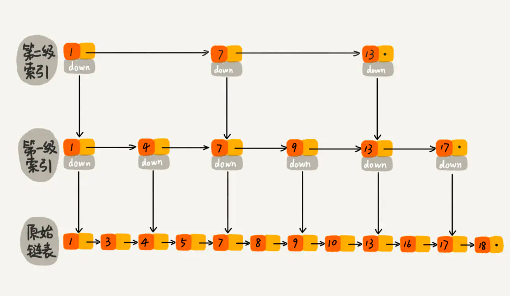
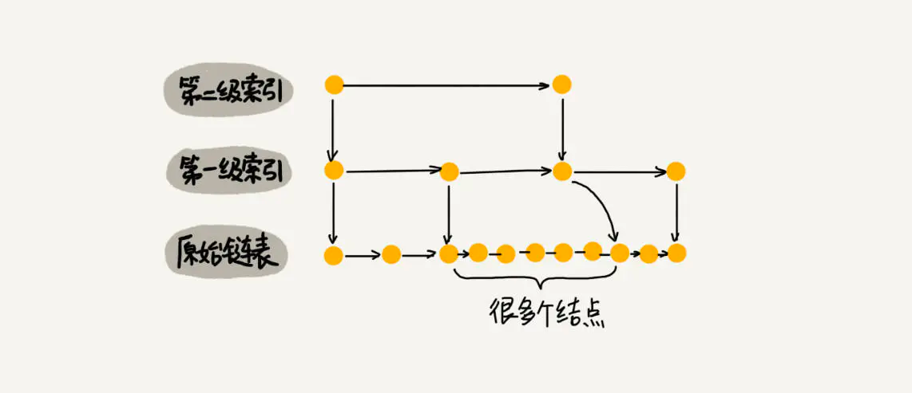

# 跳跃表
1. 跳表是可以实现二分查找的有序链表。 
   
2. 跳表插入数据 只插入不维护索引 会退化成线性表
   1. 解决办法： 随机选择一半的数据作为索引 样本够大的情况下 索引均匀
      1. 随机选 n/2 个元素做为一级索引、随机选 n/4 个元素做为二级索引、随机选 n/8 个元素做为三级索引，依次类推，一直到最顶层索引
      2. 当每次有数据要插入时，先通过概率算法告诉我们这个元素需要插入到几级索引中，

3. 时间复杂度跟跳表是一样的。红黑树的效率没有跳表高 按照范围区间查找元素（比如查找值在 [100, 356] 之间的数据）

# 广义表
# 矩阵表示方法
