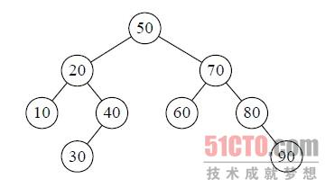

[TOC]
# 什么是内排什么是外排
内排：待排序列完全存放在内存中所进行的排序过程，适合不太大的元素序列。
外排：大文件的排序，即待排序的记录存储在外存储器上，待排序的文件无法一次装入内存，需要在内存和外部存储器之间进行多次数据交换，以达到排序整个文件的目的。
# 内部排序

## 1.冒泡排序（Bubble Sort）
好的，开始总结第一个排序算法，冒泡排序。我想对于它每个学过C语言的都会了解的吧，这可能是很多人接触的第一个排序算法。
(1)算法描述
冒泡排序是一种简单的排序算法。它重复地走访过要排序的数列，一次比较两个元素，如果它们的顺序错误就把它们交换过来。走访数列的工作是重复地进行直到没有再需要交换，也就是说该数列已经排序完成。这个算法的名字由来是因为越小的元素会经由交换慢慢“浮”到数列的顶端。

## 2.选择排序（Selection Sort）
表现最稳定的排序算法之一(这个稳定不是指算法层面上的稳定哈，相信聪明的你能明白我说的意思2333)，因为无论什么数据进去都是O(n²)的时 间复杂度.....所以用到它的时候，数据规模越小越好。唯一的好处可能就是不占用额外的内存空间了吧。理论上讲，选择排序可能也是平时排序一般人想到的 最多的排序方法了吧。
(1)算法简介
选择排序(Selection-sort)是一种简单直观的排序算法。它的工作原理：首先在未排序序列中找到最小（大）元素，存放到排序序列的起始位置，然后，再从剩余未排序元素中继续寻找最小（大）元素，然后放到已排序序列的末尾。以此类推，直到所有元素均排序完毕。

## 3.插入排序（Insertion Sort）
你说你打扑克牌摸牌的时候从来不按牌的大小整理牌，那估计这辈子你对插入排序的算法都不会产生任何兴趣了.....
(1)算法简介
插入排序（Insertion-Sort）的算法描述是一种简单直观的排序算法。它的工作原理是通过构==建有序序列，对于未排序数据，在已排序序列中从后向 前扫描==，找到相应位置并插入。插入排序在实现上，通常采用in-place排序（即只需用到O(1)的额外空间的排序），因而在从后向前扫描过程中，需要 反复把已排序元素逐步向后挪位，为最新元素提供插入空间。

## 4.希尔排序（Shell Sort）
1. 第一趟取increment的方法是：n/3向下取整+1=3（关于increment的取法之后会有介绍）。将整个数据列划分为间隔为3的3个子序列，然后对每一个子序列执行直接插入排序，相当于对整个序列执行了部分排序调整。图解如下：

2. 第二趟将间隔increment= increment/3向下取整+1=2，将整个元素序列划分为2个间隔为2的子序列，分别进行排序。图解如下

3. 第3趟把间隔缩小为increment= increment/3向下取整+1=1，当增量为1的时候，实际上就是把整个数列作为一个子序列进行插入排序，图解如下：

4. increment的取法有各种方案。最初shell提出取increment=n/2向下取整，increment=increment/2向下取整，直到increment=1。但由于直到最后一步，在奇数位置的元素才会与偶数位置的元素进行比较，这样使用这个序列的效率会很低。后来Knuth提出取increment=n/3向下取整+1.还有人提出都取奇数为好，也有人提出increment互质为好。应用不同的序列会使希尔排序算法的性能有很大的差异。
（6）希尔排序应该注意的问题 
从上面图解希尔排序的过程可以看到，相等的排序码25在排序前后的顺序发生了颠倒，所以希尔排序是一种不稳定的排序算法。

对希尔排序的时间复杂度分析很困难，在特定情况下可以准确的估算排序码的比较次数和元素移动的次数，但要想弄清楚排序码比较次数和元素移动次数与增量选择之间的依赖关系，并给出完整的数学分析，还没有人能够做到。 
## 5 快速排序
(1)算法简介
1．先从数列中取出一个数作为基准数[这个真的很随机]。
2．分区过程，将比这个数大的数全放到它的右边，小于或等于它的数全放到它的左边。
3．再对左右区间重复第二步，直到各区间只有一个数
4. 为啥不稳定 完全看 基准数的选择
   1. 最好的情况每次都选中1/2 复杂度就是nlogn 比二分法快 因为子片段越来越短 这也是比希尔排序好的地方
   2. 最坏的情况 每次取到最大值或者最小值 相当于n方 相当于一个纯链表的二叉树

- 举例
  int[] arr={4,2,8,0,5,7,1,3,9};

## 6 归并排序
也就是先分后合
1. 从下往上的归并排序：将待排序的数列分成若干个长度为1的子数列，然后将这些数列两两合并；得到若干个长度为2的有序数列，再将这些数列两两合并；得到若干个长度为4的有序数列，再将它们两两合并；直接合并成一个数列为止。这样就得到了我们想要的排序结果。(参考下面的图片)
2. 从上往下的归并排序：它与"从下往上"在排序上是反方向的。它基本包括3步：
① 分解 -- 将当前区间一分为二，即求分裂点 mid = (low + high)/2; 
② 求解 -- 递归地对两个子区间a[low...mid] 和 a[mid+1...high]进行归并排序。递归的终结条件是子区间长度为1。
③ 合并 -- 将已排序的两个子区间a[low...mid]和 a[mid+1...high]归并为一个有序的区间a[low...high]。

## 7 堆排序
1. 概念 
   1. 堆是具有以下性质的完全二叉树：每个结点的值都大于或等于其左右孩子结点的值，称为大顶堆；或者每个结点的值都小于或等于其左右孩子结点的值，称为小顶堆。如下图：
   2. 堆排序的基本思想是：将待排序序列构造成一个大顶堆，此时，整个序列的最大值就是堆顶的根节点。将其与末尾元素进行交换，此时末尾就为最大值。然后将剩余n-1个元素重新构造成一个堆，这样会得到n个元素的次小值。如此反复执行，便能得到一个有序序列了
   3. https://www.cnblogs.com/chengxiao/p/6129630.html

2. 总结思想:
   1. 将无需序列构建成一个堆，根据升序降序需求选择大顶堆或小顶堆;
   2. 将堆顶元素与末尾元素交换，将最大元素"沉"到数组末端;
   3. 重新调整结构，使其满足堆定义，然后继续交换堆顶元素与当前末尾元素，反复执行调整+交换步骤，直到整个序列有序。
3. 优势： 
   1. 优先队列通常用堆排序来实现 
   2. 堆排序比较和交换次数比快速排序多，所以平均而言比快速排序慢，也就是常数因子比快速排序大，如果你需要的是“排序”，那么绝大多数场合都应该用快速排序而不是其它的O(nlogn)算法。 
   3. 但有时候你要的不是“排序”，而是另外一些与排序相关的东西，比如最大/小的元素，topK之类，这时候堆排序的优势就出来了。用堆排序可以在N个元素中找到top K，时间复杂度是O(N log K)，空间复杂的是O(K)，而快速排序的空间复杂度是O(N)，也就是说，如果你要在很多元素中找很少几个top K的元素，或者在一个巨大的数据流里找到top K，快速排序是不合适的，堆排序更省地方。
  
## 8 分配排序
### 桶排序
思路
1. 设置固定空桶数
2. 将数据放到对应的空桶中
3. 将每个不为空的桶进行排序
4. 拼接不为空的桶中的数据，得到结果
5. 问题： 数分布必须均匀 如果分布不均匀然后大小差值巨大， 其他绝对值差小于0.9 那么就是nlogn2 达不到On
分步骤图示说明：设有数组 array = [63, 157, 189, 51, 101, 47, 141, 121, 157, 156, 194, 117, 98, 139, 67, 133, 181, 13, 28, 109]，对其进行桶排序：
现在需要按5个分桶，进行桶排序，实现步骤如下:
1 找到数组中的最大值194和最小值13，然后根据桶数为5，计算出每个桶中的数据范围为(194-13+1)/5=36.4
2 遍历原始数据，(以第一个数据63为例)先找到该数据对应的桶序列Math.floor(63 - 13) / 36.4) =1，然后将该数据放入序列为1的桶中(从0开始算)
3 当向同一个序列的桶中第二次插入数据时，判断桶中已存在的数字与新插入的数字的大小，按从左到右，从小打大的顺序插入。如第一个桶已经有了63，再插入51，67后，桶中的排序为(51,63,67) 一般通过链表来存放桶中数据，但js中可以使用数组来模拟

### 9 基数排序

### 10 计数排序
基础版算法步骤 
1. 找出原数组中元素值最大的，记为max。 
2. 创建一个新数组count，其长度是max加1，其元素默认值都为0。 
3. 遍历原数组中的元素，以原数组中的元素作为count数组的索引，以原数组中的元素出现次数作为count数组的元素值。 
4. 创建结果数组result，起始索引index。 
5. 遍历count数组，找出其中元素值大于0的元素，将其对应的索引作为元素值填充到result数组中去，每处理一次，count中的该元素值减1，直到该元素值不大于0，依次处理count中剩下的元素。 
6. 返回结果数组result。

# 外部排序
- 当待排序的文件比内存的可使用容量还大时，文件无法一次性放到内存中进行排序，需要借助于外部存储器（例如硬盘、U盘、光盘）
外部排序算法由两个阶段构成：
按照内存大小，将大文件分成若干长度为 l 的子文件（l 应小于内存的可使用容量），然后将各个子文件依次读入内存，使用适当的内部排序算法对其进行排序（排好序的子文件统称为“归并段”或者“顺段”），将排好序的归并段重新写入外存，为下一个子文件排序腾出内存空间；
对得到的顺段进行合并，直至得到整个有序的文件为止。
  https://www.modb.pro/db/433356
  
find . -name "*Fire*"
==对于外部排序算法来说，影响整体排序效率的因素主要取决于读写外存的次数，即访问外存的次数越多，算法花费的时间就越多，效率就越低。==
## 多路归并【 败者树 】

## 置换选择排序
置换—选择排序算法具体操作过程为：

1. 首先从初始文件中输入 6 个记录到内存工作区中；
1. 从内存工作区中选出关键字最小的记录，将其记为 MINIMAX 记录；
1. 然后将 MINIMAX 记录输出到归并段文件中；
1. 此时内存工作区中还剩余 5 个记录，若初始文件不为空，则从初始文件中输入下一个记录到内存工作区中；
1. 从内存工作区中的所有比 MINIMAX 值大的记录中选出值最小的关键字的记录，作为新的 MINIMAX 记录；
1. 重复过程 3—5，直至在内存工作区中选不出新的 MINIMAX 记录为止，由此就得到了一个初始归并段；
1. 重复 2—6，直至内存工作为空，由此就可以得到全部的初始归并段。

