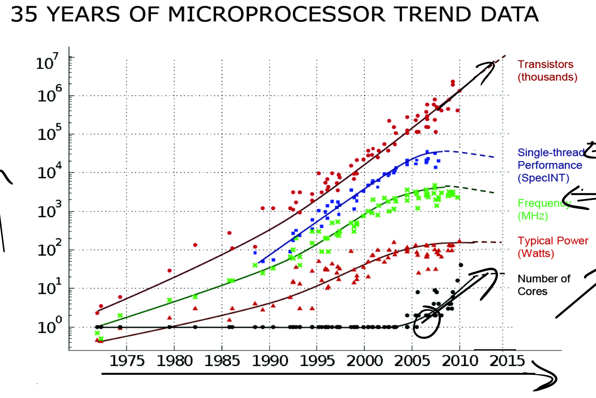
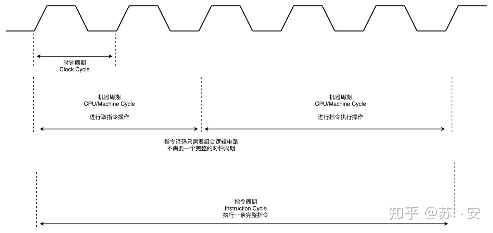

# 背景

- 上古时期 通过单位面积更多的管 + 提高时钟评频率提速 但是后面遇到了瓶颈
## 单位面积更多的管
- PN结中参入更多的杂质 纳米级别是操作难
- 发热问题无法解决
- 微观下 电子的波粒二象性 导致 电压低
- 击穿
## 时钟频率
- 极限 读写 受限与时钟信号 上限4GHZ
- 指令周期（Instruction Cycle）：取出并执行一条指令的时间。
## 指令周期 VS CPU周期 VS 时钟周期 VS
1. CPU周期：一条指令执行过程被划分为若干阶段，每一阶段完成所需时间。
2. 时钟周期（Clock Cycle）：又称震荡周期，是处理操作的最基本单位。
3. 对于一个指令周期来说，我们取出一条指令，然后执行它，至少需要两个 CPU 周期。
4. 取出指令至少需要一个 CPU 周期，执行至少也需要一个 CPU 周期，复杂的指令则需要更多的 CPU 周期。而一个CPU周期是若干时钟周期之和。

## 引入多核
- 渲染多核快
- 多核多线程面临共享内存读写 OS引入锁 为了并行快 的安全引入串行的锁
# 为什么要讨论 locking ？
- apps want to use multi-core processors for parallel speed-up  应用程序希望使用多核处理器进行并行加速
- so kernel must deal with parallel system calls  因此内核必须处理并行系统调用
- and thus parallel access to kernel data (buffer cache, processes, &c)  从而并行访问内核数据（缓冲区高速缓存，进程等）
- locks help with correct sharing of data  锁有助于正确共享数据
- locks can limit parallel speedup  锁可以限制并行加速

#  什么时候使用锁？
  - any time two threads use a memory location, and at least one is a write  任何时候两个线程使用一个内存位置，并且至少一个是写
  - don't touch shared data unless you hold the right lock!  除非您持有正确的锁，否则不要触摸共享数据！
# 自旋锁（spinlock）
- 自锁 是通过 死循环 判断lock = 0 当获得之后 将lock = 1 ，这一过程 通过硬件的寄存器实现 addr-》tmp,r1 r2
- 自旋锁是计算机科学用于多线程同步的一种锁，线程反复检查锁变量是否可用。由于线程在这一过程中保持执行，因此是一种忙等待。一旦获取了自旋锁，线程会一直保持该锁，直至显式释放自旋锁。
- 自旋锁避免了进程上下文的调度开销，因此对于线程只会阻塞很短时间的场合是有效的。因此操作系统的实现在很多地方往往用自旋锁。
- Windows操作系统提供的轻型读写锁（SRW Lock）内部就用了自旋锁。显然，单核CPU不适于使用自旋锁，这里的单核CPU指的是单核单线程的CPU，因为，在同一时间只有一个线程是处在运行状态，
假设运行线程A发现无法获取锁，只能等待解锁，但因为A自身不挂起，所以那个持有锁的线程B没有办法进入运行状态，只能等到操作系统分给A的时间片用完，才能有机会被调度。这种情况下使用自旋锁的代价很高。
- 获取、释放自旋锁，实际上是读写自旋锁的存储内存或寄存器【软件锁-硬件锁】。因此这种读写操作必须是原子的。通常用test-and-set等原子操作来实现。

## acquire  保证单个进程持有锁  
