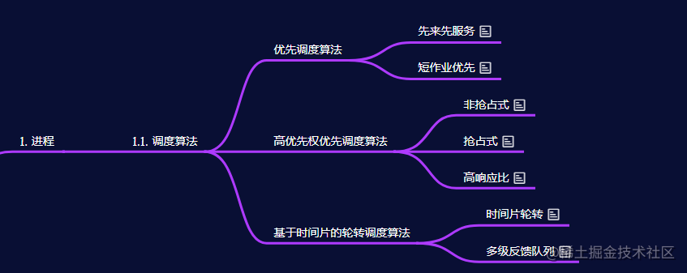

# why 多线程
## 多线程提速 而且程序接受变简单
# 多线程前置知识

## 时间片是多个时钟频率
我们的服务器大多是分时操作系统，这种操作系统将系统资源（特别是CPU）进行时间上的分割，每个时间段称为一个时间片，以时间片轮转的方式为多个
任务提供服务。一个CPU同一时间只能执行一个任务，但是由于时间片快速轮转，给用户的感觉好像是在同时执行多个任务。
## 多线程调度
1. 多任务或者多进程、多线程在操作系统上同时运行时，只有分配了时间片和其他资源的任务、进程/线程才能真正被执行，
其他的都处在排队等待状态。
2. OS一般将任务和进程/线程分别放在任务队列和进程/线程对列中，在发生调度时，使用一定的算法从就绪队列中选出将要执行的任务或者进程/线程，
为它分配资源（内存、CPU时间片等）。
## 发生调度的时机
发生调度的时机：
1. 正在运行的进程/线程运行完毕；
2. 运行中的进程/线程要求IO操作；
3. 某种操作（比如等待锁、线程的sleep操作等）使进程/线程阻塞；
4. 优先级更高的进程/线程进入就绪队列；
5. 分配给进程/线程的时间片用完；
6. 硬件中断。
## 上下文切换  当进行进程/线程调度时，将发生上下文切换。
上下文切换的过程：
1. 挂起正在运行的进程/线程，将当前进程/线程在CPU寄存器中的状态保存到PCB/TCB（进程控制块/线程控制块）中，然后放到一个task_struct的数据结构中保存；
2. 在task_struct中找到下一个要执行进程/线程的PCB/TCB并将它恢复到CPU寄存器中；
3. 执行引擎跳转到程序计数器指向的位置（上次程序执行中断的位置）并恢复该进程/线程。
上下文切换需要保存和恢复寄存器和内存页表以及更新内核相关数据结构，需要消耗CPU时间；如果是跨核心切换，则需要付出更高的代价。
时间片的大小一般是几十至几百毫秒，比如一个时间片是20ms，上下文切换需要开支5ms，就相当于一次CPU切换需要支付20%的性能损耗。
# 线程包含三部分
- 程序计数器（Program Counter），它表示当前线程执行指令的位置。
- 保存变量的寄存器。
- 程序的Stack（注，详见5.5）。通常来说每个线程都有属于自己的Stack
# 多线程并行的两个策略
- 在多核处理器上使用多个CPU 一个cpu对应一个thread 
- 一个cpu对应多个thread 多线程调度
## 多线程需要注意得点
- 多线程的锁
# xv6的多线程
- 内核线程共享内存
- 用户进程拥有独立空间，独立线程控制指令代码执行 用户线程不共享内存
# 线程系统的难点
## 实现线程切换
## 切换线程需要保存恢复线程状态 
## 运算密集型线程
- 密集型长时间计算结果不愿意出让CPU
 定时器中断/时钟 切换用户态到内核台 交给 线程调度器 
# 抢占式调度/非抢占式调度

抢占式内核允许进程在内核模式下运行时被抢占。
非抢占式内核不允许抢占以内核模式运行的进程。内核模式进程将一直运行，直到退出内核模式，阻塞或自愿放弃对CPU的控制为止。
## 抢占式调度 pre-emptive scheduling 
定时器中断将CPU控制权给到内核，内核再选定进程获取CPU
- 是循环(RR)，优先级，SRTF(最短的剩余时间优先)。
##  非抢占式调度 当前进程主动放弃处理机控制权
 可 能的情况有:
      进程运行完毕退出;
      运行受阻
      运行出错，非正常终止
      遇到不可挽回的故障

## OS 区分几类线程
    RUNNING，线程当前正在某个CPU上运行  PC【程序计数器】+寄存器在CPU
    RUNABLE，线程还没有在某个CPU上运行，但是一旦有空闲的CPU就可以运行  在内存上
    SLEEPING，这节课我们不会介绍，下节课会重点介绍    
### RUNNING转为RUNABLE： RUNING的 PC【程序计数器】+寄存器在CPU 拷贝到内存某位置     
### 准备运行RUNABLE 线程   RUNABLE转为RUNNING
将之前保存的PC和寄存器拷贝回CPU
# Thread 的切换
