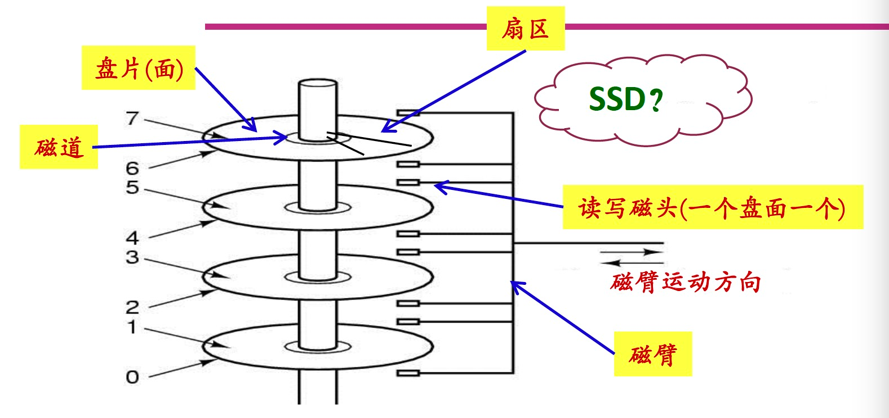

# 前言
file systems用处
1.   durability across restarts
2.   naming and organization
3.   sharing among programs and users
https://zhuanlan.zhihu.com/p/360870510
# 特色
1.   crash recovery 
  1. 应用程序级崩溃一致性协议（crash-consistency protocol)
2. File system->data struct。
  1. 例如目录和文件的排布方式
3.  performance
  1. SSD磁盘写数据-》毫秒级别,而毫秒级别对cpu和计算机算是长时间了
  2. 如何提高性能?
    1. buffer cache[block cache]
    2. 并发[多个process 查看进程]
4.   sharing
5.   security
# 磁盘结构

#  File system abstraction 概述
File System data struct 数据结构
Inode and File descriptor
1. 文件系统是基于Inode编号 而不是pathName
2.  File descriptor
  1. Link count [多少文件/文件夹link了文件node]
  2. openfd count [打开该inode文件]
    1. 当link count == 0 && openfd count ==0 才可以被删除(联想删除打开的文件/被link的文件)
  3. offset[即文件上次写入的位置,write函数默认不是覆盖写]
File System 系统结构
## 分层
1. Disk
  1. 持久化存储
2. Buff cache
  1. 避免频繁读写磁盘/提高速度
3. Logging[后面详细介绍]
4. Inode cache [后面详细介绍]
  1. synchronization[同步]
5. Inode
  1. read/write
6. name/fd[文件名 文件描述符]

1. Disk
  1. 分类
    1. SSD 0.1ms-1ms访问 [固态硬盘]
    2. HDD 10ms[机械硬盘]
  2. 概念
    1. Sectors 磁盘驱动可以读写的最小单元，它过去通常是512字节
    2.  blocks 通常是操作系统或者文件系统视角的数据  1Blocks = N Sectors
  3.  详细结构[和tcp的包 以及 语言的map结构 redis的数据结构思想相同]
    - block0 没用 or 作为boot sector来启动操作系统 [回想BIOS 操作系统加载过程]
    - block1[super block]，文件的系统描述 例如有多少个block。
    - 在XV6中，log从block2开始，到block32结束。[其他不净相同]
    - block32到block45之间，XV6存储了inode.多个inode会打包存在一个block中，一个inode是64字节。
    - 之后是bitmap block，只占据一个block 描述是否空闲
    - 之后是data block存数据
  - bitmap block，inode blocks和log blocks被统称为metadata block[存储文件的元数据]


2. inode
  1. 结构
    1. type  表明是文件还是目录
    2. nlink  多少文件名指向了这个inode
    3. size 文件字节
    4. direct block number
    5. indirect block number
      1. 最大可以存多少  (256+12)*1024

## 其他结构
- page table的树状结构
- B树
- 其他更复杂的树结构


# 实操
改造代码 输出block number
Echo "hi" > x
1. 第一阶段是创建文件
  1. 两次write: 33
    1. 第一次 把type由空闲改为文件
    2. 第二次写node 信息
  2. write:46 是 data block写数据  属于根目录
根目录增加了一个新的entry，其中包含了文件名x，以及我们刚刚分配的inode编号。
  3. write:32 回写
2. 第二阶段将“hi”写入文件
  1. write:45 更新bitmap 标志被使用的
  2. write:595 写入hi 字符
3. 第三阶段将“\n”换行符写入到文件
write 33是更新文件x对应的inode中的size字段

# 详细代码
完成的一次文件创建
1. syfile.c  sys_open()
2. create()
  1. create函数中首先会解析路径名并找到最后一个目录，之后会查看文件是否存在，如果存在的话会返回错误。之后就会调用ialloc（inode allocate），这个函数会为文件x分配inode。ialloc函数位于fs.c文件中。
3. ialloc
  1. 遍历所有可能的inode编号，找到inode所在的block，再看位于block中的inode数据的type字段。如果这是一个空闲的inode，那么将其type字段设置为文件，这会将inode标记为已被分配。函数中的log_write就是我们之前看到在console中有关写block的输出。这里的log_write是我们看到的整个输出的第一个。


并发
1. Bget
bread函数首先会调用bget函数，bget会为我们从buffer cache中找到block的缓存。

``` // Look through buffer cache for block on device dev.
// If not found, allocate a buffer.
// In either case, return locked buffer.
static struct buf*
bget(uint dev, uint blockno)
{
  struct buf *b;

  acquire(&bcache.lock);

  // Is the block already cached?
  //看一下block 33的cache是否存在，如果存在的话，将block对象的引用计数（refcnt）加1，之后再释放bcache锁，因为现在我们已经完成了对于cache的检查并找到了block cache。之后，代码会尝试获取block cache的锁。
  for(b = bcache.head.next; b != &bcache.head; b = b->next){
    if(b->dev == dev && b->blockno == blockno){
      b->refcnt++;
      release(&bcache.lock);
      acquiresleep(&b->lock);
      return b;
    }
  }

  // Not cached.
  // Recycle the least recently used (LRU) unused buffer.
  for(b = bcache.head.prev; b != &bcache.head; b = b->prev){
    if(b->refcnt == 0) {
      b->dev = dev;
      b->blockno = blockno;
      b->valid = 0;
      b->refcnt = 1;
      release(&bcache.lock);
      acquiresleep(&b->lock);
      return b;
    }
  }
  panic("bget: no buffers");
}

void
brelse(struct buf *b)
{
  if(!holdingsleep(&b->lock))
    panic("brelse");

  releasesleep(&b->lock);

  acquire(&bcache.lock);
  b->refcnt--;
  if (b->refcnt == 0) {
    // no one is waiting for it.
    b->next->prev = b->prev;
    b->prev->next = b->next;
    b->next = bcache.head.next;
    b->prev = &bcache.head;
    bcache.head.next->prev = b;
    bcache.head.next = b;
  }
  
  release(&bcache.lock);
}

void
acquiresleep(struct sleeplock *lk)
{
  acquire(&lk->lk);
  while (lk->locked) {
    sleep(lk, &lk->lk);
  }
  lk->locked = 1;
  lk->pid = myproc()->pid;
  relea～～e(&lk->lk);
} 
```
