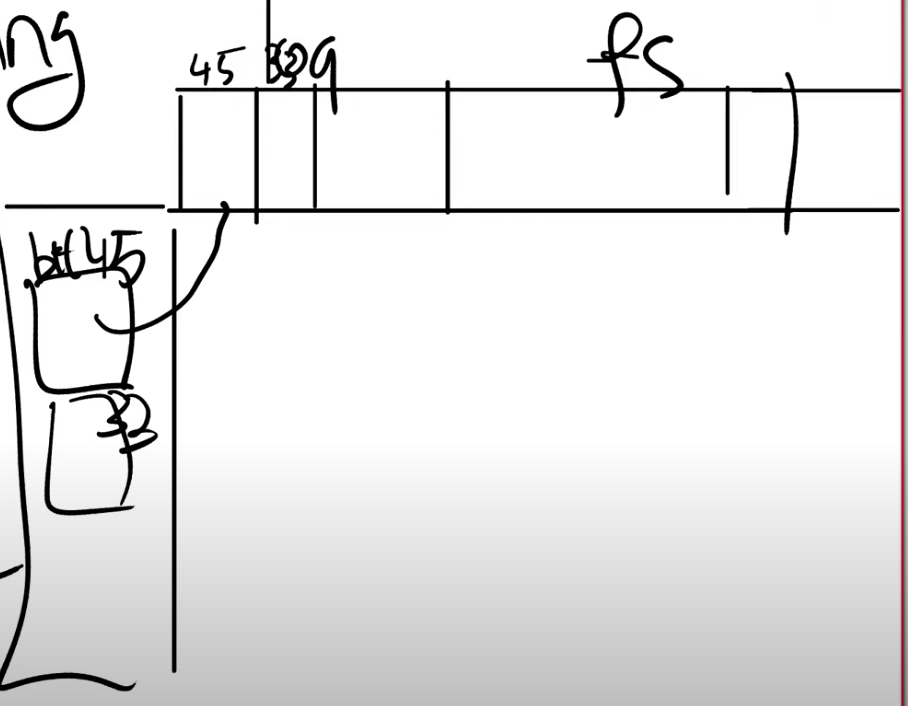

讲义：https://pdos.csail.mit.edu/6.S081/2020/lec/l-crash.txt
视频：https://www.youtube.com/watch?v=7Hk2dIorDkk

# 一、为什么需要故障恢复?
- fs系统调用一般会包含多个步骤，如果执行中系统crash了（断电等情况），会导致写入非预期的数据（或系统崩溃），因此需要crash recovery帮助我们在系统重启的时候恢复操作
- eg 1.分配inode，或者在磁盘上将inode标记为已分配
     2. 之后更新包含了新文件的目录的data block  类似事物
# 如何恢复 
## logging特点
    保证fs调用是原子性的
    支持快速恢复（Fast Recovery
    高效
## write ahead rule
    write ahead rule :任何时候如果一堆写操作需要具备原子性，系统需要先将所有的写操作记录在log中，之后才能将这些写操作应用到文件系统的实际位置。
    write ahead rule是logging能实现故障恢复的基础。write ahead rule使得一系列的更新在面对crash时具备了原子性。

## logging 步骤 transaction
    1. 任何一次写操作都是先写入到log，我们并不是直接写入到block所在的位置，而总是先将写操作写入到log中。 引入cache
    2. commit op
    3. install log [install log是幂等操作 idempotence]
    4. clean log
## xv6 log_write 函数
1. begin_op和end_op分别表示事物的开始和结束

## Chanllenges
即使是简单的实现，也会有一些复杂的情况需要考虑

    1. log区的大小有限，意味着一个fs call能写入的数据块也是有限的，大文件写入如何处理？
    solution：
    拆成多个小的事务执行（kernel/file.c -> filewrite())
    
    2. fs call并发执行，如果此时log区满了，会导致所有调用都无法commit，如何解决？
    solution：
    在执行一个新的fs call之前，判断当前log区的剩余大小是否可容纳该调用可写入的数据块大小
    - 如果不够，让这个系统调用sleep
    - 当fs call都commit以后，唤醒被sleep的调用
    
    3. fs call可能会对一个数据块进行多次写入，每次都要记log么，如何提高性能？
    solution：
    块吸收（write absorbtion）

