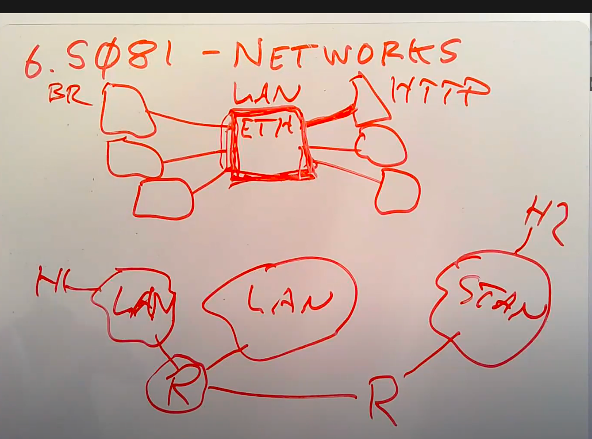
# 二层网络 --- Ethernet 以太网 (IEEE 802.3)
- 链路层协议
- IEEE 802
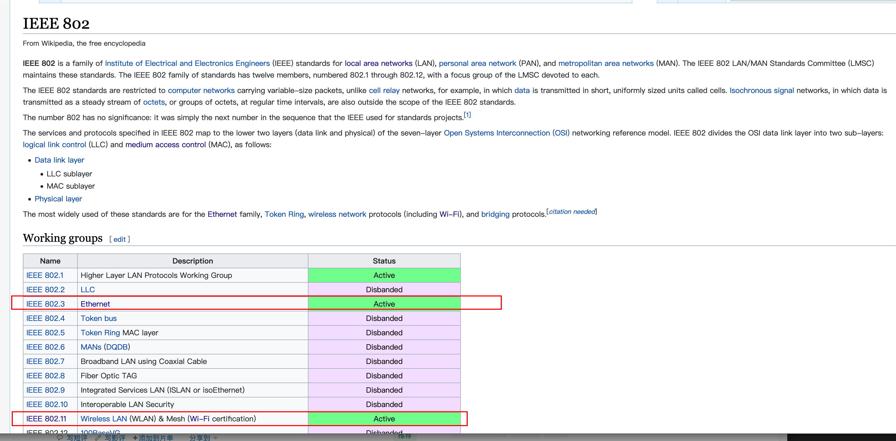

协议 packet（以太网中也叫frame）
https://en.wikipedia.org/wiki/Ethernet_frame
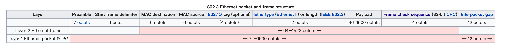
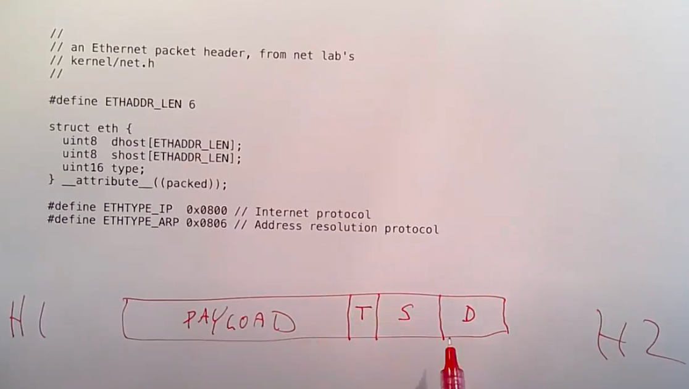
1. dhost => destination address (48 bit)
2. shost => source address (48 bit)
3. type => 具体协议是什么 (16 bit)
4. Payload => 正文，嵌套包含ip,tcp...协议
5. 两边有区分数据的段（Preamble + SFD）+ checksum(FCS)
  1. Preamble 7bit的10
  2. SFD 1bit， 10101011

48 bit，一般前24bit是厂商号，后24bit是厂商自己标注的设备号 
## 虽然MAC address在全网是唯一的，但是在网络上定位一台设备 还是需要ip地址，MAC地址只有在局域网内部广播的时候才可能找到设备

sudo tcpdump -nnSX port 443
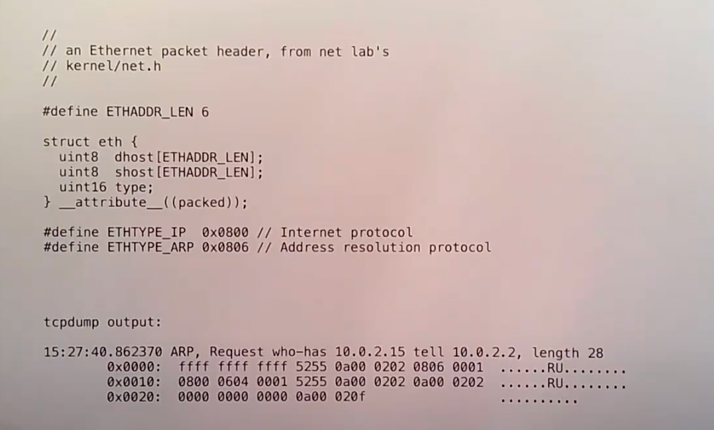

    - 15:27:40.862370 => 时间
    - ffff ffff ffff => destination，广播地址
    - 5355 0a00 0202 => QEMU 生成的虚拟设备地址
    - 0806 => ARP协议

# Dynamic address resolution protocol (ARP) => 二/三层地址转换

- 刚刚说过了，有48位MAC地址无法在网络中定位一台设备的位置，我们还需要IP
- IP有内部结构，从高到低的位，包含了 "package where to go" 的信息

- Type字段标记是ARP协议，则根据ARP开始解析
- 通过IP地址信息，找到对应的MAC设备的协议
- 在局域网中发广播
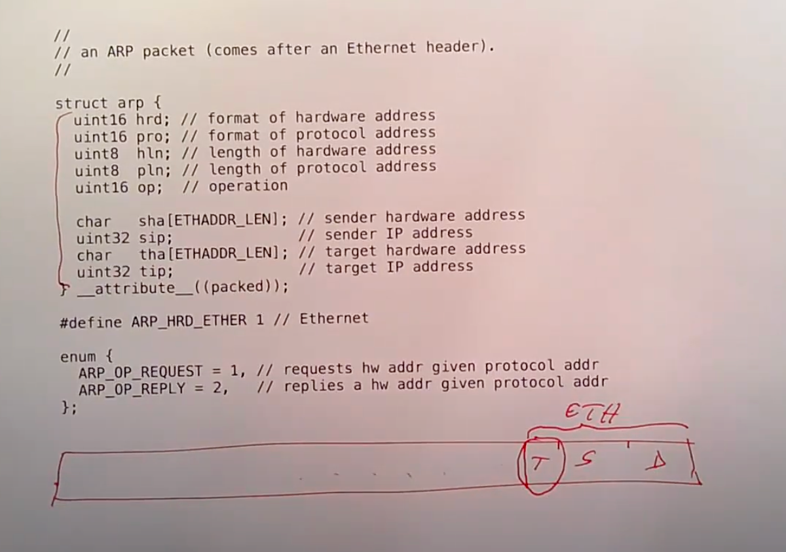

例子
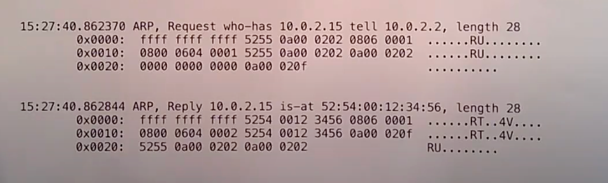
- 第一行是tcpdump生成的可读翻译
- Who-has xxx tell xxx
- Xxx is-at xxx

在上一级协议的尾部，会有包含下一级是什么的标识，比如type，或者protocol标记

# IP
- p是下一层协议
- ip_src, ip_dst
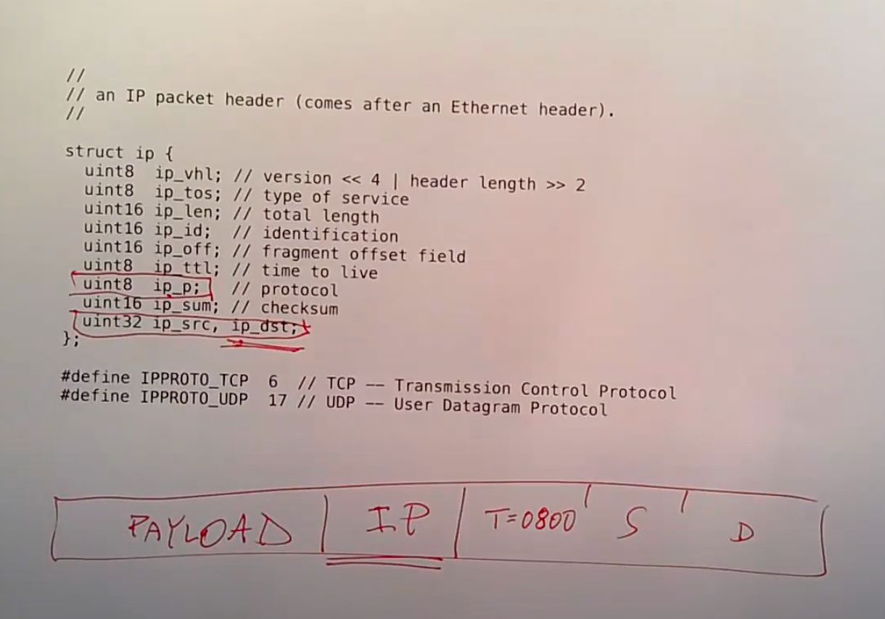
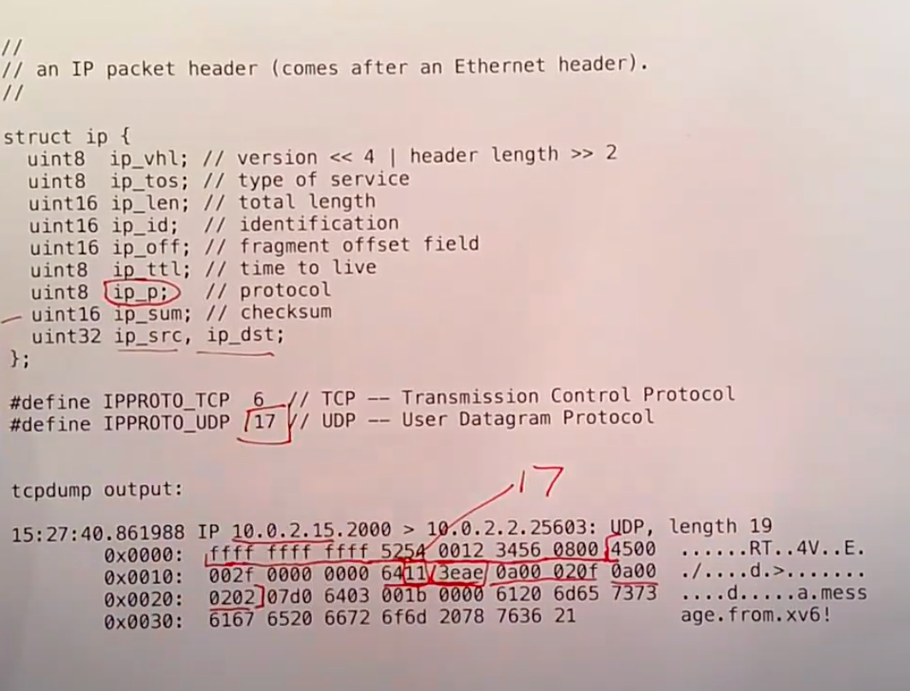

    - Ip header长度是20字节
    - 17 => udp
    - 3eae => checksum
    - 0x0a000202 -> 10.0.2.2 (destination)
    - 0x0a00020f -> 10.0.2.15 (source)

# UDP
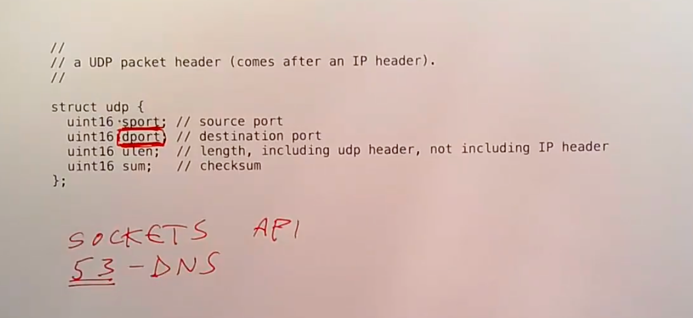
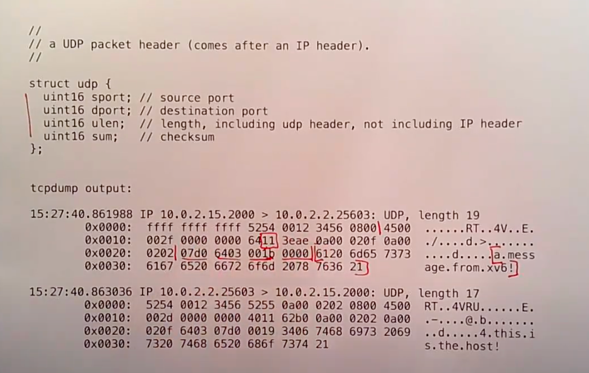
Port number
sockets api => system call, 根据port number, 返回文件描述符
常见端口
- 53, dns server的端口
- 80, 443

Network Stack

- MBUF: message buffer

Buffer
- nic (nic里也有buffer，但很小) -> interrupt -> buffer queue
- IP Thread，处理queue中的buffer -> udp -> ...
- 这个主机也可以是一个路由，将收到的数据转发，router中会run一个linux，有完整的网络栈协议实现

- 并发
- 中断优先级 大于 线程调度

以前：NIC将packet放在自己的buffer里，然后driver通过loop去拉nic里的packet
目前：E1000 NIC，直接推模式，NIC直接往host memory里写

DMA (Direct memory access ring) ring of packet pointer
NIC会记住目前使用的Ring entry，通过指针往实际内存里写
入流量和出流量都可以有一个对应的buffer ring
更先进的NIC，同样有Ring Buffer，但可能有更多的queue，如果一个物理机上有很多虚拟机在跑，那么这个特性就很有用；同时可能会做一些TCP处理 (TCP offload)

Livelock

- screend 类似防火墙，丢弃某些不需要的包
- 上升：性能未到瓶颈，收的多发的多
- 下降：中断过多，无法处理（需要内存从nic中拿数据），无法处理的网络包没有及时丢弃，而是不断的产生了中断，最终，所有的cpu时间都用于处理Livelock，无法处理网络请求
- 中断引发后，缓存如果已经到了最大长度，此时后来的包就会无法写入缓存而丢失
- 这个下降的过程叫做interrupt livelock
- 这个现象很普遍，主要存在于两个优先级不同的调度中，资源抢占的情况，比如DMA耗尽了RAM，那么CPU就无法使用RAM

解决：
1. 中断发生后，中断处理函数唤醒Network thread，同时终止NIC进一步的中断
2. Network thread有一个loop，去拉NIC中的数据，如果没有包了，再打开中断