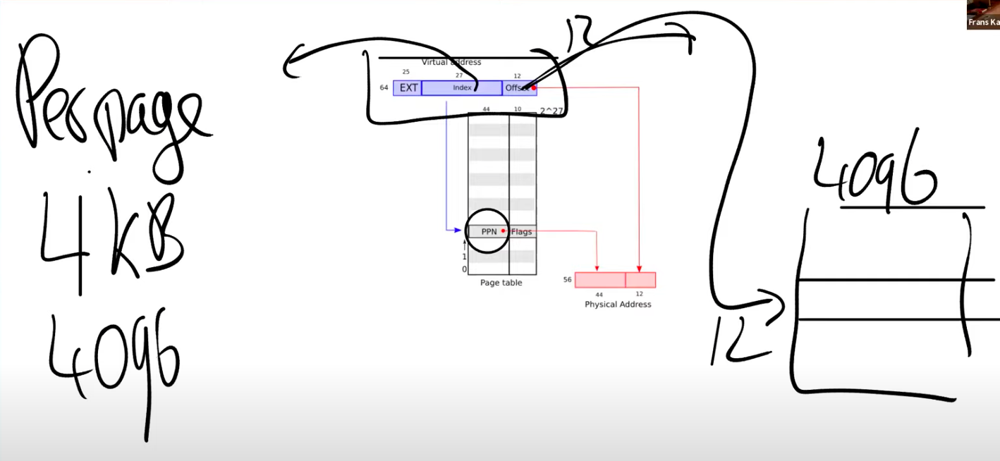
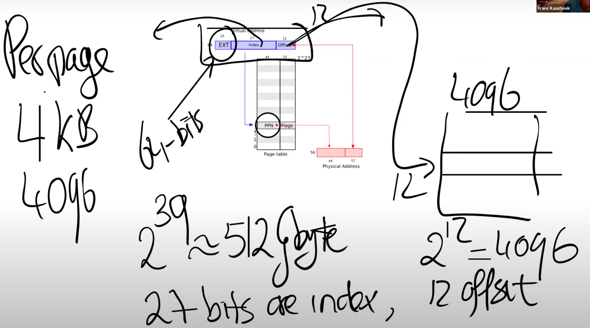
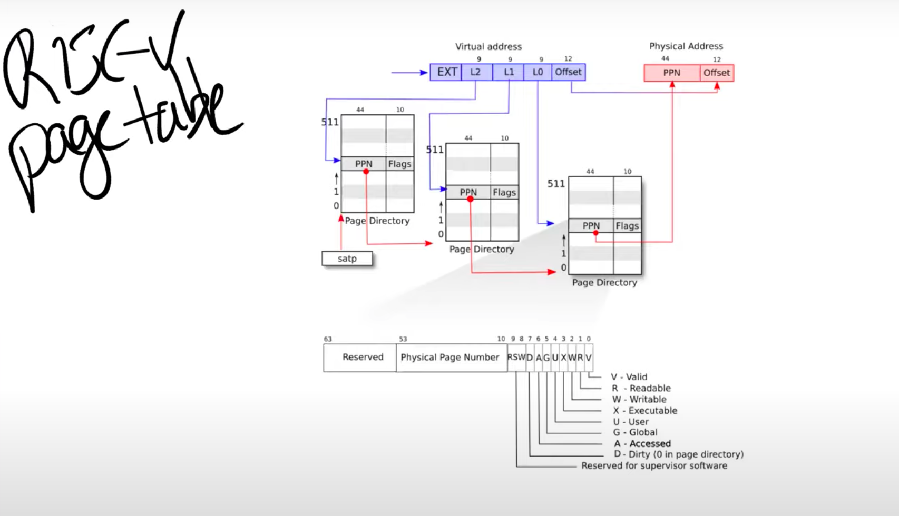
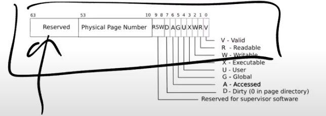

# 地址空间（Address Spaces）
给包括内核在内的所有程序专属的地址空间
# 页表（Page Table）
1. 当操作系统将CPU从一个应用程序切换到另一个应用程序时，同时也需要切换SATP寄存器中的内容，从而指向新的进程保存在物理内存中的地址对应表单
2. 不可能是一个虚拟内存地址对应page table中的一个条目  index+offset 

3 层化是为了减少索引的存储
3.CPU从一个应用程序切换到另一个应用程序时，同时也需要切换SATP寄存器中
exp+index+offset 
2^27+4096B = 2^27*4KB =2^29KB 
# 页表缓存（Translation Lookaside Buffer）
每次都查三级 很费事
存虚拟地址到物理地址
