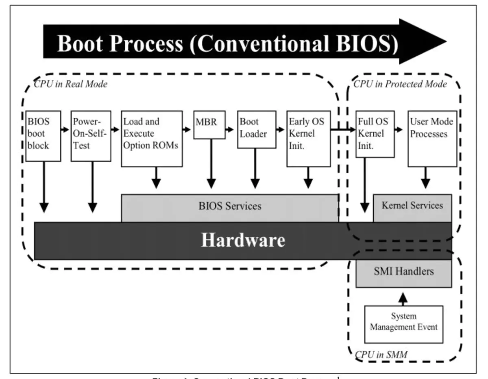
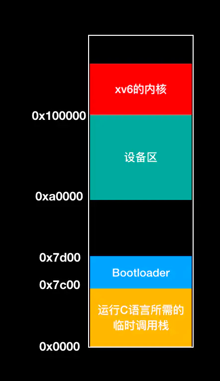
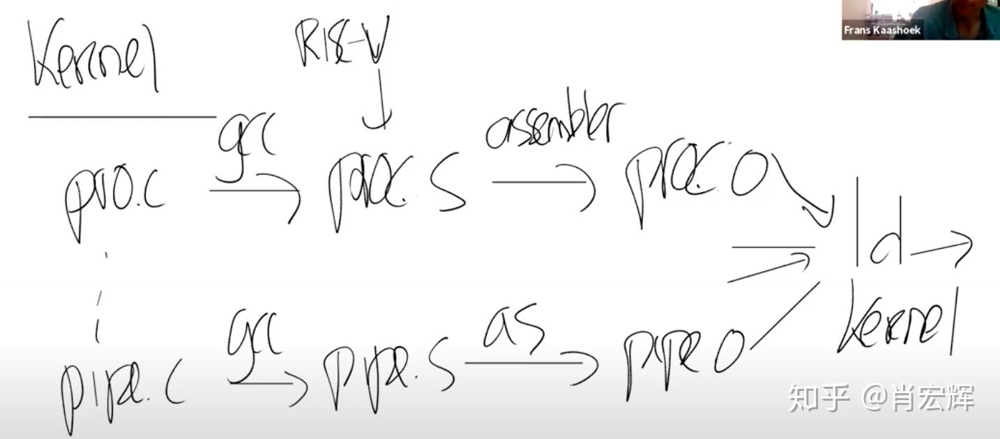

# xv6 是怎么启动的
. 代码：https://github.com/mit-pdos/xv6-public

## BIOS
. 总结，BIOS是存在主板ROM的汇编可执行程序，开机后CPU第一个执行的代码，负责自检，将OS引导程序【bootloader】加载，控制权移交，然后32realmode 到product model
. BIOS 是开机后，cpu第一个要执行的可执行程序，带cpu去识别加载于主板的（如硬盘、显卡、声卡以及各种接口），读取存储器OS程序【bootloader】
. 传统BIOS：开机—>BIOS初始化—>BIOS自检—>引导操作系统—>进入
. BIOS(basic input output system) 程序。BIOS 存放在非易失存储器(Non-volatile memory，缩写为NVRAM)中, 一般是rom （read only memory）
. BIOS 的作用是在启动时进行硬件的准备工作，接着把控制权交给操作系统.
. BIOS 会把控制权交给从引导扇区（用于引导的磁盘的第一个512字节的数据区）加载的代码。
. 引导扇区中包含引导加载器(负责内核加载到内存中)。BIOS 会把引导扇区加载到内存 0x7c00 处，接着（通过设置寄存器 %ip）跳转至该地址。引导加载器开始执行后，处理器处于【real mode】模式下。处理器设置保护模式【product model】，并从磁盘中把 xv6 内核载入到内存中，然后将控制权交给内核。
. 16位实模式直接能访问的内存只有1MB,前640K称为基本内存，后面384K内存留给开机必要硬件和各类BIOS本身使用
. CPU的地址线的个数也从原来的20根变为现在的32根，所以可以访问的内存空间也从1MB变为现在4GB
https://zhuanlan.zhihu.com/p/54108702 https://zhuanlan.zhihu.com/p/89058949 https://zhuanlan.zhihu.com/p/42309472 https://www.cnblogs.com/johnnyflute/p/3564894.html

## bootloader
https://www.jianshu.com/p/db88ea840e66
. 在xv6中，bootloader是什么东西？
. 就是一个由16位和32位汇编混合编写而成的bootasm.S，和一个由 C 写成的bootmain.c。
1. 第一步，做收尾工作，real mode to protected mode
2. 打开A20开关
3. 从实模式切换到保护模式 加载全局符号表GDT,
4. 运行bootmain.c代码

  
## bootmain

1. 首先，在bootasm.S中，系统必须初始化CPU的运行状态。具体地说，需要将x86 CPU从启动时默认的Intel 8088 16位实模式切换到80386之后的32位保护模式；然后设置初始的GDT(详细解释参见https://wiki.osdev.org/Global_Descriptor_Table)，将虚拟地址直接按值映射到物理地址；最后，调用bootmain.c中的bootmain()函数。

2. bootmain()函数的主要任务是将内核的ELF文件从硬盘中加载进内存，并将控制权转交给内核程序。具体地说，此函数首先将ELF文件的前4096个字节（也就是第一个内存页）从磁盘里加载进来，然后根据ELF文件头里记录的文件大小和不同的程序头信息，将完整的ELF文件加载到内存中。然后根据ELF文件里记录的入口点，将控制权转交给XV6系统。

3. entry.S的主要任务是设置页表，让分页硬件能够正常运行，然后跳转到main.c的main()函数处，开始整个操作系统的运行。

4. main()函数首先初始化了与内存管理、进程管理、中断控制、文件管理相关的各种模块，然后启动第一个叫做initcode的用户进程。至此，整个XV6系统启动完毕

# xv6-lab怎么启动的
1。 地址0x80000000是一个被QEMU认可的地址。也就是说如果你想使用QEMU，那么第一个指令地址必须是它
2。 编译所有的。c文件 生成O，并链接在一起生成内核文件kernel.ld，
3.  drive：传递的是虚拟机使用的磁盘驱动，这里传入的是fs.img文件

1. kernel/kernel.ld ( OS bootloader)确保entry.S的程序位于0x80000000， qemu -kernel 会从这里加载 entry.s[]
2.kernel/entry.S CPU会跳到0x80000000
3.kernel/start.c 开始进入 加载 main.c
# user 和kernel 怎么交互
1. 用户态调用 
- user/user.h 写了系统调用声明【system call】
- 进入usys.S执行汇编指令：将对应的系统调用号（system call number）置于寄存器a7中，
- 并执行ecall指令进行系统调用，其中函数参数存在a0~a5这6个寄存器中。ecall指令将触发软中断，cpu会暂停对用户程序的执行，转而执行内核的中断处理逻辑，陷入（trap）内核态。

2. 上下文切换

- 中断处理在kernel/trampoline.S中，首先进行上下文的切换，将user进程在寄存器中的数据save到内存中（保护现场），
- 并restore（恢复）kernel的寄存器数据。内核中会维护一个进程数组（最多容纳64个进程），存储每个进程的状态信息，proc结构体定义在proc.h，这也是xv6对PCB（Process Control Block）的实现。
- 用户程序的寄存器数据将被暂时保存到proc->trapframe结构中。

3. 内核态执行

- 完成进程切换后，调用trap.c/usertrap()，接着进入syscall.c/syscall()，在该方法中根据system call number拿到数组中的函数指针，执行系统调用函数。
- 函数参数从用户进程的trapframe结构中获取(a0~a5)，函数执行的结果则存储于trapframe的a0字段中。
- 完成调用后同样需要进程切换，先save内核寄存器到trapframe->kernel_*，再将trapframe中暂存的user进程数据restore到寄存器，重新回到用户空间，cpu从中断处继续执行，从寄存器a0中拿到函数返回值。

至此，系统调用完成，共经历了两次进程上下文切换：用户进程 -> 内核进程 -> 用户进程，同时伴随着两次CPU工作状态的切换：用户态 -> 内核态 -> 用户态。