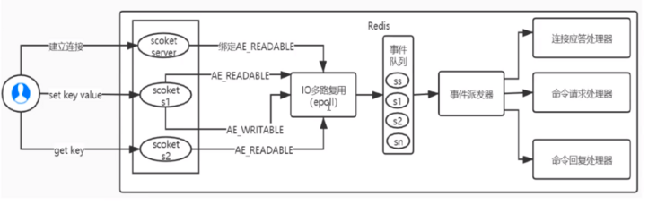
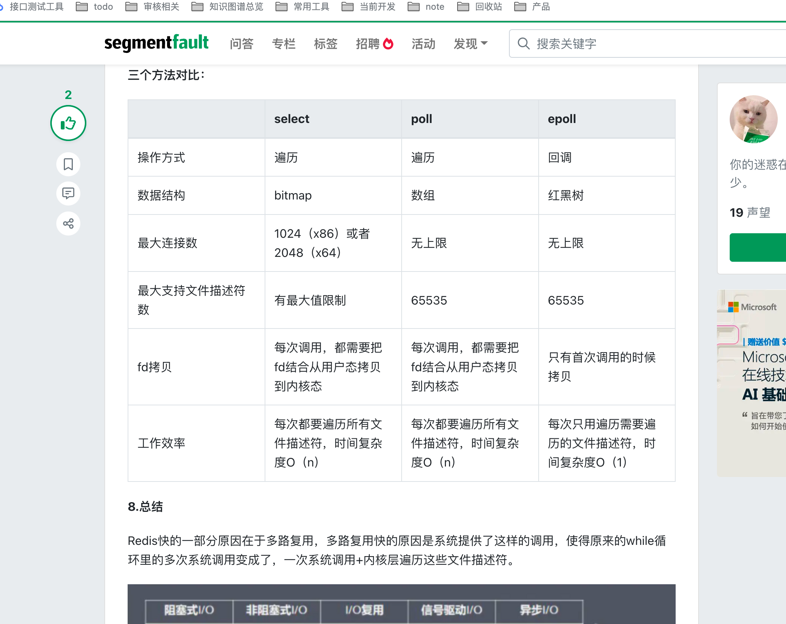
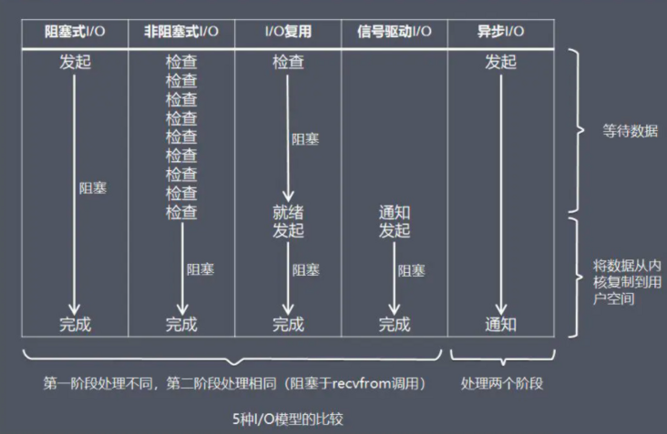
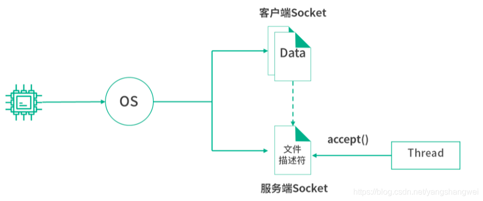
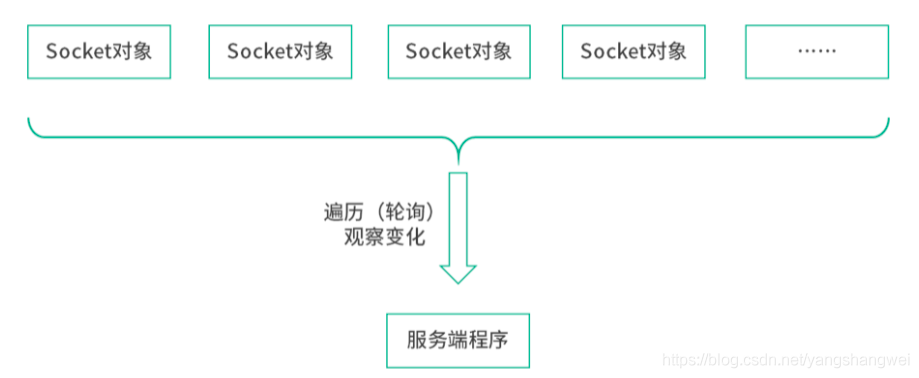
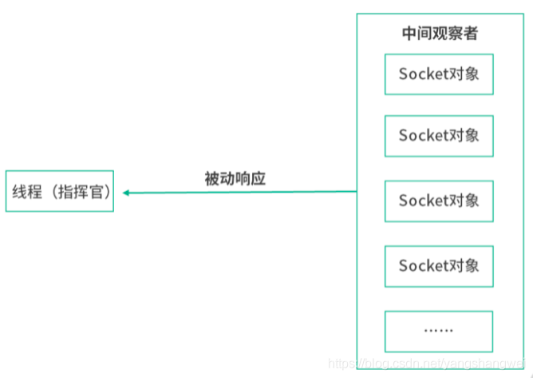
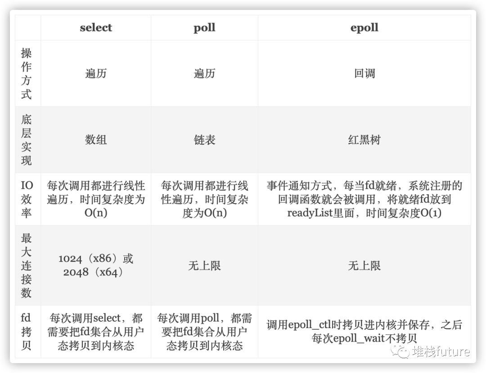

[TOC]
https://www.cnblogs.com/xiaoxi/p/6517544.html
- String: 字符串
- Hash: 散列
- List: 列表
- Set: 集合
- Sorted Set: 有序集合
# 五大类型
## string 类型
## list 类型
## hash类型
  我们可以将Redis中的Hash类型看成具有String Key和String Value的map容器。所以该类型非常适合于存储值对象的信息。如Username、Password和Age等。如果Hash中包含很少的字段，那么该类型的数据也将仅占用很少的磁盘空间。每一个Hash可以存储4294967295个键值对。
## set数据类型
一、概述

 在Redis中，我们可以将Set类型看作为没有排序的字符集合，和List类型一样，我们也可以在该类型的数据值上执行添加、删除或判断某一元素是否存在等操作。需要说明的是，这些操作的时间复杂度为O(1)，即常量时间内完成次操作。Set可包含的最大元素数量是4294967295。
  和List类型不同的是，++==Set集合中不允许出现重复的元素==++，这一点和C++标准库中的set容器是完全相同的。换句话说，如果多次添加相同元素，Set中将仅保留该元素的一份拷贝。和List类型相比，Set类型在功能上还存在着一个非常重要的特性，即在服务器端完成多个Sets之间的聚合计算操作，如unions、intersections和differences。由于这些操作均在服务端完成，因此效率极高，而且也节省了大量的网络IO开销

## sort set 
一、概述：

    Sorted Set（有序集合）和Set类型极为相似，它们都是字符串的集合，都不允许重复的成员出现在一个Set中。它们之间的主要差别是Sorted Set中的每一个成员都会有一个分数(score)与之关联，Redis正是通过分数来为集合中的成员进行从小到大的排序。然而需要额外指出的是，尽管Sorted Set中的成员必须是唯一的，但是分数(score)却是可以重复的。
    在Sorted Set中添加、删除或更新一个成员都是非常快速的操作，其时间复杂度为集合中成员数量的对数。由于Sorted Set中的成员在集合中的位置是有序的，因此，即便是访问位于集合中部的成员也仍然是非常高效的。事实上，Redis所具有的这一特征在很多其它类型的数据库中是很难实现的，换句话说，在该点上要想达到和Redis同样的高效，在其它数据库中进行建模是非常困难的。

# redis使用场景
https://www.cnblogs.com/xiaoxi/p/7007695.html
## 一、Redis常用数据类型

Redis最为常用的数据类型主要有以下五种：

String
Hash
List
Set
Sorted set
在具体描述这几种数据类型之前，我们先通过一张图了解下Redis内部内存管理中是如何描述这些不同数据类型的：

首先Redis内部使用一个redisObject对象来表示所有的key和value，redisObject最主要的信息如上图所示：type代表一个value对象具体是何种数据类型，encoding是不同数据类型在redis内部的存储方式，比如：type=string代表value存储的是一个普通字符串，那么对应的encoding可以是raw或者是int，如果是int则代表实际redis内部是按数值型类存储和表示这个字符串的，当然前提是这个字符串本身可以用数值表示，比如:"123" "456"这样的字符串。

这里需要特殊说明一下vm字段，只有打开了Redis的虚拟内存功能，此字段才会真正的分配内存，该功能默认是关闭状态的。通过上图我们可以发现Redis使用redisObject来表示所有的key/value数据是比较浪费内存的，当然这些内存管理成本的付出主要也是为了给Redis不同数据类型提供一个统一的管理接口，实际作者也提供了多种方法帮助我们尽量节省内存使用，我们随后会具体讨论。

## 二、各种数据类型应用和实现方式

下面我们先来逐一的分析下这五种数据类型的使用和内部实现方式：

### 1、String

String 数据结构是简单的key-value类型，value其实不仅是String，也可以是数字。

常用命令：get、set、incr、decr、mget等。

应用场景：String是最常用的一种数据类型，普通的key/ value 存储都可以归为此类，即可以完全实现目前 Memcached 的功能，并且效率更高。还可以享受Redis的定时持久化，操作日志及 Replication等功能。除了提供与 Memcached 一样的get、set、incr、decr 等操作外，Redis还提供了下面一些操作： 

获取字符串长度
往字符串append内容
设置和获取字符串的某一段内容
设置及获取字符串的某一位（bit）
批量设置一系列字符串的内容
==使用场景：常规key-value缓存应用。常规计数: 微博数, 粉丝数。==

实现方式：String在redis内部存储默认就是一个字符串，被redisObject所引用，当遇到incr,decr等操作时会转成数值型进行计算，此时redisObject的encoding字段为int。

### 2.hashMap
这里同时需要注意，Redis提供了接口(hgetall)可以直接取到全部的属性数据，但是如果内部Map的成员很多，那么涉及到遍历整个内部Map的操作，由于Redis单线程模型的缘故，这个遍历操作可能会比较耗时，而另其它客户端的请求完全不响应，这点需要格外注意。

使用场景：==存储部分变更数据，如用户信息等。==

实现方式：

   上面已经说到Redis Hash对应Value内部实际就是一个HashMap，实际这里会有2种不同实现，这个Hash的成员比较少时Redis为了节省内存会采用类似一维数组的方式来紧凑存储，而不会采用真正的HashMap结构，对应的value redisObject的encoding为zipmap，当成员数量增大时会自动转成真正的HashMap，此时encoding为ht。
###    3、List

常用命令：lpush,rpush,lpop,rpop,lrange等。

应用场景：

Redis list的应用场景非常多，也是Redis最重要的数据结构之一，比如twitter的关注列表，粉丝列表等都可以用Redis的list结构来实现。

List 就是链表，相信略有数据结构知识的人都应该能理解其结构。使用List结构，我们可以轻松地实现最新消息排行等功能。List的另一个应用就是消息队列，
可以利用List的PUSH操作，将任务存在List中，然后工作线程再用POP操作将任务取出进行执行。Redis还提供了操作List中某一段的api，你可以直接查询，删除List中某一段的元素。

实现方式：

Redis list的实现为一个双向链表，即可以支持反向查找和遍历，更方便操作，不过带来了部分额外的内存开销，Redis内部的很多实现，包括发送缓冲队列等也都是用的这个数据结构。

Redis的list是每个子元素都是String类型的双向链表，可以通过push和pop操作从列表的头部或者尾部添加或者删除元素，这样List即可以作为栈，也可以作为队列。 

使用场景：
消息队列系统
使用list可以构建队列系统，使用sorted set甚至可以构建有优先级的队列系统。

比如：将Redis用作日志收集器

实际上还是一个队列，多个端点将日志信息写入Redis，然后一个worker统一将所有日志写到磁盘。

取最新N个数据的操作
记录前N个最新登陆的用户Id列表，超出的范围可以从数据库中获得。

复制代码
//把当前登录人添加到链表里
ret = r.lpush("login:last_login_times", uid)

//保持链表只有N位
ret = redis.ltrim("login:last_login_times", 0, N-1)

//获得前N个最新登陆的用户Id列表
last_login_list = r.lrange("login:last_login_times", 0, N-1)
复制代码
比如sina微博：

 在Redis中我们的最新微博ID使用了常驻缓存，这是一直更新的。但是我们做了限制不能超过5000个ID，因此我们的获取ID函数会一直询问Redis。只有在start/count参数超出了这个范围的时候，才需要去访问数据库。

我们的系统不会像传统方式那样“刷新”缓存，Redis实例中的信息永远是一致的。SQL数据库（或是硬盘上的其他类型数据库）只是在用户需要获取“很远”的数据时才会被触发，而主页或第一个评论页是不会麻烦到硬盘上的数据库了
## 4、Set

常用命令：

sadd,spop,smembers,sunion 等。

应用场景：

 Redis set对外提供的功能与list类似是一个列表的功能，==特殊之处在于set是可以自动排重的，当你需要存储一个列表数据，又不希望出现重复数据时，set是一个很好的选择，并且set提供了判断某个成员是否在一个set集合内的重要接口，这个也是list所不能提供==。

Set 就是一个集合，集合的概念就是一堆不重复值的组合。利用Redis提供的Set数据结构，可以存储一些集合性的数据。

案例：

在微博应用中，可以将一个用户所有的关注人存在一个集合中，将其所有粉丝存在一个集合。Redis还为集合提供了求交集、并集、差集等操作，可以非常方便的实现如共同关注、共同喜好、二度好友等功能，对上面的所有集合操作，你还可以使用不同的命令选择将结果返回给客户端还是存集到一个新的集合中。

==Set是集合，是String类型的无序集合，set是通过hashtable实现的，概念和数学中个的集合基本类似，可以交集，并集，差集等等，set中的元素是没有顺序的。==

实现方式： 

==set 的内部实现是一个 value永远为null的HashMap，实际就是通过计算hash的方式来快速排重的，这也是set能提供判断一个成员是否在集合内的原因。==

使用场景：
获取某段时间所有数据去重值
这个使用Redis的set数据结构最合适了，只需要不断地将数据往set中扔就行了，set意为集合，所以会自动排重。

## 5、Sorted Set

常用命令：

zadd,zrange,zrem,zcard等

使用场景：

Redis sorted set的使用场景与set类似，区别是set不是自动有序的，而sorted set可以通过用户额外提供一个优先级(score)的参数来为成员排序，并且是插入有序的，即自动排序。当你需要==一个有序的并且不重复的集合列表==，那么可以选择sorted set数据结构，比如twitter 的public timeline可以以发表时间作为score来存储，这样获取时就是自动按时间排好序的。

==和Set相比，Sorted Set增加了一个权重参数score，使得集合中的元素能够按score进行有序排列，比如一个存储全班同学成绩的Sorted== Set，其集合value可以是同学的学号，而score就可以是其考试得分，这样在数据插入集合的时候，就已经进行了天然的排序。另外还可以用Sorted Set来做带权重的队列，比如普通消息的score为1，重要消息的score为2，然后工作线程可以选择按score的倒序来获取工作任务。让重要的任务优先执行。

实现方式：

Redis sorted set的内部使用HashMap和跳跃表(SkipList)来保证数据的存储和有序，HashMap里放的是成员到score的映射，而跳跃表里存放的是所有的成员，排序依据是HashMap里存的score,使用跳跃表的结构可以获得比较高的查找效率，并且在实现上比较简单。

# redis的使用优缺点
## redis为什么快
### 速度快，完全基于内存；
理解这个内存和磁盘的区别 服务器 断电丢失

### redis 网络IO/ 值读写单线程 单线程模型避免了不必要的上下文切换及竞争条件；
1. redis 只有网络IO和值读写单线程 持久化存储模块、集群支撑是多线程的。
2. redis因为是内存读写不是磁盘读写，I/O存储没有 只有存储I/O
   1. 所以多线程为了提升CPU计算而并发减少存储I/O的时间，redis不需要，而且多线程并发锁加上下文切换更占用空间
3. redis为了提高网络 I/O 没有用多线程 而是 I/O多路复用技术 但是也无法 无法发挥多核 CPU 性能
### epoll 的 非阻塞 I/O 多路复用机制

简单来说，就是我们的 redis-client 在操作的时候，会产生具有不同事件类型的 Socket。

在服务端，有一段 I/O 多路复用程序，将其置入队列之中。然后，文件事件分派器，依次去队列中取，转发到不同的事件处理器中。
需要说明的是，这个 I/O 多路复用机制，Redis 还提供了 select、epoll、evport、kqueue 等多路复用函数库，大家可以自行去了解。

https://cloud.tencent.com/developer/article/1862671

1. 因此，服务端监听端口的本质，是将服务端 Socket 文件和端口绑定，这个操作也称为 bind。有时候我们不仅仅绑定端口，还需要绑定 IP 地址。这是因为有时候我们只想允许指定 IP 访问我们的服务端程序。
2. 服务端可以将这个 Socket 对象加入一个容器（集合），通过定期遍历所有的客户端 Socket 对象，查看背后 Socket 文件的状态，从而确定是否有新的数据从客户端传输过来。
3. 但是主动轮训 负载过重 所以做响应式 
4. 一个线程可以通过读取服务端 Socket 文件中的内容拿到所有的客户端 Socket。这样一个线程就可以负责响应所有客户端的 I/O，这个技术称为 I/O 多路复用。
5. 为什么用红黑树？ 
   1. 关于为什么要红黑树， 再仔细解释一下。考虑到中间观察者最核心的诉求有两个。 
   2. 第一个核心诉求，是让线程可以注册自己关心的消息类型。 比如线程对文件描述符 =123 的 Socket 文件读写都感兴趣，会去中间观察者处注册。当 FD=123 的 Socket 发生读写时，中间观察者负责通知线程，这是一个响应式的模型。 
   3. 第二个核心诉求，是当 FD=123 的 Socket 发生变化（读写等）时，能够快速地判断是哪个线程需要知道这个消息 
   4. 所以，中间观察者需要一个快速能插入（注册过程）、查询（通知过程）一个整数的数据结构，这个整数就是 Socket 的文件描述符。综合来看，能够解决这个问题的数据结构中，跳表和二叉搜索树都是不错的选择。 
   5. 因此，在 Linux 的 epoll 模型中，选择了红黑树。红黑树是二叉搜索树的一种，红与黑是红黑树的实现者才关心的内容，对于我们使用者来说不用关心颜色，Java 中的 TreeMap 底层就是红黑树
   6. ，红黑是用非严格的平衡来换取增删节点时候旋转次数的降低，任何不平衡都会在三次旋转之内解决；而AVL树是严格平衡树，在增加或者删除节点的时候，根据不同情况，旋转的次数比红黑树要多。所以红黑树的插入效率更高。
   7. 为什么采用红黑树呢？因为和epoll的工作机制有关。epoll在添加一个socket或者删除一个socket或者修改一个socket的时候，它需要查询速度更快，操作效率最高，因此需要一个更加优秀的数据结构能够管理这些socket。 
   8. 我们想到的比如链表，数组，二叉搜索树，B+树等都无法满足要求， 
      1. 因为链表在查询，删除的时候毫无疑问时间复杂度是O(n)；
      2. 数组查询很快，但是删除和新增时间复杂度是O(n)；
      3. 二叉搜索树虽然查询效率是lgn，但是如果不是平衡的，那么就会退化为线性查找，复杂度直接来到O(n)； 
      4. +树是平衡多路查找树，主要是通过降低树的高度来存储上亿级别的数据，但是它的应用场景是内存放不下的时候能够用最少的IO访问次数从磁盘获取数据。比如数据库聚簇索引，成百上千万的数据内存无法满足查找就需要到内存查找，而因为B+树层高很低，只需要几次磁盘IO就能获取数据到内存，所以在这种磁盘到内存访问上B+树更适合。

## redis能做什么
1. 缓存，毫无疑问这是Redis当今最为人熟知的使用场景。再提升服务器性能方面非常有效；
 
1. 排行榜，如果使用传统的关系型数据库来做这个事儿，非常的麻烦，而利用Redis的SortSet数据结构能够非常方便搞定；

1. 计算器/限速器，利用Redis中原子性的自增操作，我们可以统计类似用户点赞数、用户访问数等，这类操作如果用MySQL，频繁的读写会带来相当大的压力；限速器比较典型的使用场景是限制某个用户访问某个API的频率，常用的有抢购时，防止用户疯狂点击带来不必要的压力；
注：限速器也是对请求限流的一种实现方式。
 
1. 好友关系，利用集合的一些命令，比如求交集、并集、差集等。可以方便搞定一些共同好友、共同爱好之类的功能；

1. 简单消息队列，除了Redis自身的发布/订阅模式，我们也可以利用List来实现一个队列机制，比如：到货通知、邮件发送之类的需求，不需要高可靠，但是会带来非常大的DB压力，完全可以用List来完成异步解耦；

1. Session共享，默认Session是保存在服务器的文件中，即当前服务器，如果是集群服务，同一个用户过来可能落在不同机器上，这就会导致用户频繁登陆；采用Redis保存Session后，无论用户落在那台机器上都能够获取到对应的Session信息。

1. 注：对于基于Redis实现分布式session 笔者会在以后文章接入说明

## redis存在什么问题
Redis不能做什么
Redis感觉能干的事情特别多，但它不是万能的，合适的地方用它事半功倍。如果滥用可能导致系统的不稳定、成本增高等问题。

比如，用Redis去保存用户的基本信息，虽然它能够支持持久化，但是它的持久化方案并不能保证数据绝对的落地，并且还可能带来Redis性能下降，因为持久化太过频繁会增大Redis服务的压力。

简单总结就是数据量太大、数据访问频率非常低的业务都不适合使用Redis。

数据太大会增加成本，访问频率太低，保存在内存中纯属浪费资源。如果不担心浪费资源，那请忽略。
## redis 大key 热key 问题
### Redis 和数据库双写一致性问题
分布式常见问题，还可以再分为最终一致性和强一致性；
另外，我们所做的方案从根本上来说，只能说降低不一致发生的概率，无法完全避免。因此，有强一致性要求的数据，不能放缓存。

回答：首先，采取正确更新策略，先更新数据库，再删缓存。其次，因为可能存在删除缓存失败的问题，提供一个补偿措施即可，例如利用消息队列。

### 如何应对缓存穿透和缓存雪崩问题
#### 缓存穿透
即黑客故意去请求缓存中不存在的数据，导致所有的请求都怼到数据库上，从而数据库连接异常。
1. 利用互斥锁，缓存失效的时候，先去获得锁，得到锁了，再去请求数据库。没得到锁，则休眠一段时间重试。
1. 采用异步更新策略，无论 Key 是否取到值，都直接返回。Value 值中维护一个缓存失效时间，缓存如果过期，异步起一个线程去读数据库，更新缓存。需要做缓存预热(项目启动前，先加载缓存)操作。
1. 提供一个能迅速判断请求是否有效的拦截机制，比如，利用布隆过滤器，内部维护一系列合法有效的 Key。迅速判断出，请求所携带的 Key 是否合法有效。如果不合法，则直接返回。
缓存雪崩，即缓存同一时间大面积的失效，这个时候又来了一波请求，结果请求都怼到数据库上，从而导致数据库连接异常。

#### 缓存雪崩
即缓存同一时间大面积的失效，这个时候又来了一波请求，结果请求都怼到数据库上，从而导致数据库连接异常。

缓存雪崩解决方案：

1. 给缓存的失效时间，加上一个随机值，避免集体失效。
1. 
1. 使用互斥锁，但是该方案吞吐量明显下降了。
1. 
1. 双缓存。我们有两个缓存，缓存 A 和缓存 B。缓存 A 的失效时间为 20 分钟，缓存 B 不设失效时间。自己做缓存预热操作。

然后细分以下几个小点：从缓存 A 读数据库，有则直接返回；A 没有数据，直接从 B 读数据，直接返回，并且异步启动一个更新线程，更新线程同时更新缓存 A 和缓存 B。
### 如何解决 Redis 的并发竞争 Key 问题
## 总结Redis特性
### 速度快

数据存放在内存中；单线程模式，避免了线程上下文切换及多线程竞争访问

；c语言实现，更容易接近系统api；
采用epoll非阻塞IO，不在网络上浪费时间；

###  支持多种数据类型

支持8种数据类型：String、Hash、List、Set、 SortSet、Bitmaps、HyperLogLog、GEO；

###  功能丰富

丰富的API，如可设置键过期，存在即设置（这可以用来解决分布式锁问题），基于发布订阅可实现简单的消息队列，通过Lua创建新命令，具有原子性，管道（pipeline）功能，解决网络开销；

###  服务器简单

开源代码优雅，容易阅读源码，采用单线程模型，避免并发问题，redis自己实现了多路复用；

###  客户端语言版本多

如Java、Php、Go

### 支持多种持久化方式

RDB和AOP，这两种持久化深入分析请看：https://blog.csdn.net/u014229282/article/details/81121214

### 支持集群部署

### 支持主从复制，高可用集群，内部集群方式与Memcache做集群实现不一样的机制。
