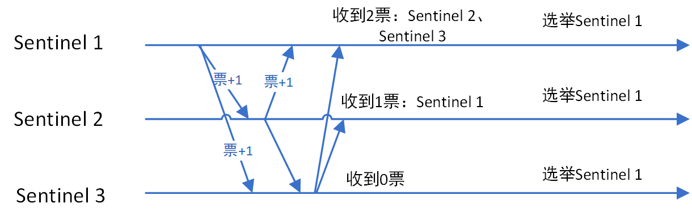
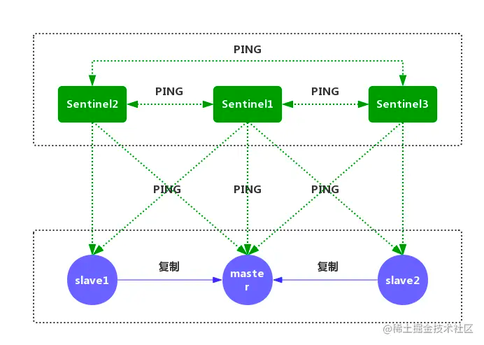
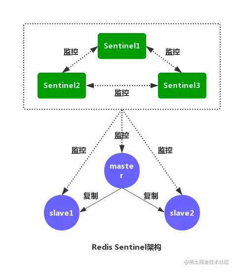

Sentinel

 　　哨兵策略是redis高可用的解决方案（一个或者多个哨兵实例组成的哨兵系统），可以监视多个主服务器。

    在Server1 掉线后：

　
　
　
　升级Server2 为新的主服务器：
　
　
　　 (1)故障转移

监测到主服务器下线，选举主服务器下的一个从服务器升级为主服务器.
通知其他从服务器，更新主服务器地址.
监视下线服务器，并将下线的服务器升级为从服务器.

# redis哨兵模式选举
1. 故障节点主观下线 节点没有返回pong
2. 故障节点客观下线 让其他哨兵也判断
3. sentinel集群选举Leader 
   1. 当一个Sentinel节点确认redis集群的主节点主观下线后，会请求其他Sentinel节点要求将自己选举为Leader。被请求的Sentinel节点如果没有同意过其他Sentinel节点的选举请求，则同意该请求(选举票数+1)，否则不同意。
   2. 如果一个Sentinel节点获得的选举票数达到Leader最低票数(quorum和Sentinel节点数/2+1的最大值)，则该Sentinel节点选举为Leader；否则重新进行选举。
4. Sentinel Leader决定新主节点

