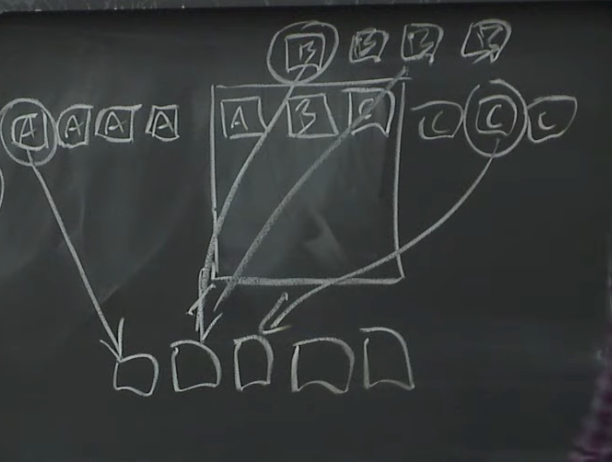

# Aurora 诞生的背景
1. 亚马逊卖云服务 根据qps动态扩缩容
2. web服务无状态 可以支持动态插拔 但是db有状态 插拔数据丢失
3. 定期快照也ok但是会丢失两次快照之间的数据
4. EBS。EBS全称是Elastic Block Store。利用CRAQ互为副本 + 快照 可以动态扩缩容
# 故障可恢复事务（Crash Recoverable + Transaction）
1. Aurora 参考了mqsql
2. 预写式日志（Write-Ahead Log，简称为WAL）保证了故障恢复 redo/undo日志
3.  RDS是第一次尝试将数据库在多个AZ之间做复制 主从复制
# aurora 更新点
1. rds是copy所有请求 aurora只发送log条目 因为data少所以快
2. aurora的Quorum不等所有副本写完 取6个钟最快的四个即可

# Fault-Tolerant Goals 容错目标
1. Aurora期望能够容忍暂时的慢副本
2. 一个副本挂了之后 快速生成新的副本（Fast Re-replication）
# Quorum
1. quorum 思想概述
2. N个副本 写请求至少要被W个副本确认 W< N
3. 读请求至少要被R个副本确认
4. quorum 要求 R加上W必须大于N（ 至少满足R + W = N + 1 ）即Read Quorum必须至少与Write Quorum有一个服务器是重合的
5. read怎么知道r个数据里哪个是对的 用version 版本号最高的数据
6. Quorum可以动态调节W R更好支持读写请求
# log条目
1. 写更新 该记录不被读之前 保持旧page 和一系列log
2. Aurora 写入的是log 读去的是page
# 数据分片 Protection Group
1. Aurora 六个副本 一个副本有两三个磁盘 数据一摸一样 怎么扩容呢
2. 多组六个副本 一个组就是protection Group【PG】
3. 一个Log有唯一的一个PG 
4. 故障恢复
   1. 一个副本挂了 不仅是某个pg对应的数据10G没了， 而是副本几TB中， 其他数百个Aurorta的实例数据库没了，对应的就是10TB的服务骑数量
   2. 所以恢复不仅要恢复某个pg的10G数据 还要恢复服务器上的10TB数据 10GB/s 也得8000s 太长了
   3. 若下图不同的PG 只有一个副本在一个存储器上， 其他的都互不交叉 所以某个副本坏了 只需要直接替换即可

# Aurora的只读数据库 Read Only DataBase
1. 读写分离
2. 只读数据库不能读到未commit的数据
3. 数据库会定时rebalance 中间状态数据不争取 只读读的是page 是非法数据
4. （Mini-Transaction）和VDL/VCL。  原子性向只读数据库展示，也就是要么全展示，要么不展示。这就是微事务（Mini-Transaction）和VDL。
