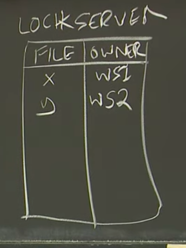
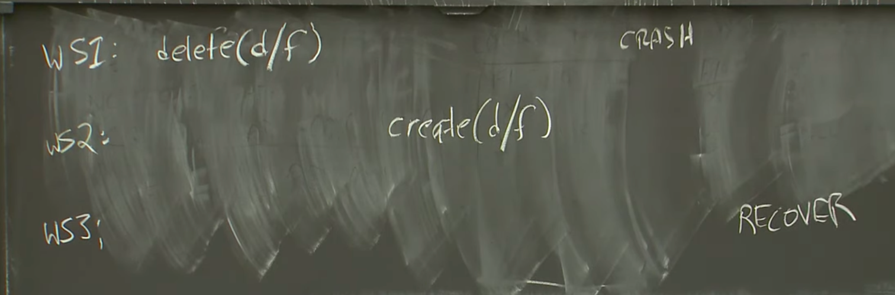

# Frangipani （NFS，Network File System） 分布式文件系统
1. U1 2 3 是用户 F是文件系统 Petal是共享虚拟磁盘服务里
2. F里搞了诸多缓存 Petal是真正存储 带来了问题
3. 问题
   1. 1 U1F里更新文件 U2 在petal里看不到
   2. U1 U2 同时修改一个文件
   3. U1 F里存了大量缓存 崩了 petal无法存储容灾
   4. 

4. 解决上述三个问题的方法
# Frangipani的锁服务（Lock Server）
1. 加锁记得谁持有锁
# 缓存一致性（Cache Coherence）
1. 可以主动发送revoke询问释放锁
# 原子性（Atomicity）
# Frangipani Log 故障恢复
1. Frangipani与其他的系统一样，需要通过预写式日志（Write-Ahead Log，WAL，见10.2）实现故障可恢复的事务（Crash Recoverable Transaction）。
2. ，每个工作站的独立的Log，存放在公共的共享存储中，这是一种非常有意思，并且反常的设计。 
3. 特色就是 WAL不存本地 存共享存储
4. 当工作站从锁服务器收到了一个Revoke消息，要自己释放某个锁，它需要执行好几个步骤。
   首先，工作站需要将内存中还没有写入到Petal的Log条目写入到Petal中。
   之后，再将被Revoke的Lock所保护的数据写入到Petal。
   最后，向锁服务器发送Release消息。

# 11.7 故障恢复（Crash Recovery）
1. 当工作站持有锁，并且故障了会发生什么。
2. 场景
   1. 么工作站正在向Petal写入Log，所以这个时候工作站必然还没有向Petal写入任何文件或者目录。 
   2. 要么工作站正在向Petal写入修改的文件，所以这个时候工作站必然已经写入了完整的Log。
3. 推演：
   1. 需要锁的其他工作站发出revoke请求 故障的工作站无法响应 收不到release信息
   2. 所以用租约 租约到期故障工作站没心跳 就是崩了 锁服务器会告诉其他工作站 读取他的log 确保操作完成
4. 场景细分：
   1. 工作站WS1在向Petal写入任何信息之前就故障了 本地缓存没有到log 所以白搭
   2. 工作站WS1向Petal写了部分Log条目  只管log
   3. 工作站WS1在写入Log之后，并且在写入块数据的过程中崩溃了。
5. 更复杂的场景
   1. S1 S2 分别创建删除同名文件 S1 释放锁的时候崩了 S3执行恢复 执行恢复的不是S2而是S1的文件
      1. 的，通过对每一份存储在Petal文件系统数据增加一个版本号，同时将版本号与Log中描述的更新关联起来
      2. 这样就能解决覆盖问题
   2. S3恢复期间 其他S还在读取持有锁 S2持有D锁 S3需要读写D
      1. 不可行是获取所有的锁 在执行log 但是停电加锁信息会丢失
      2. S3可以直接从petal读数据
         1. S1故障要么没有释放了锁 其他s不可能获得锁
         2. S1释放了锁 释放之前LOg已经写回了petal petal中的log版本号大于其他s的所有 可以无脑更新数据
 
   2. 
