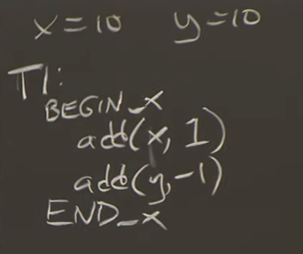

# 并发控制 Concurrency Control
银行转钱的伪代码

乐观锁和悲观锁看使用场景和频率
## 悲观并发控制（Pessimistic Concurrency Control）
1. 只要其他事务持有锁 就等待 为了正确性牺牲性能
### 两阶段锁 Two-Phase-Locking
1. 第一个阶段获取锁，第二个阶段是在事务结束前一直持有锁。

2. 我们将会假设，有一个计算机会用来管理事务，它被称为事务协调者（Transaction Coordinator）。
3. 事务协调者会向服务器S1发消息说，请对X加1，向服务器S2发消息说，请对Y减1。
4. 每个持有数据的服务器会维护一个锁的表单，用来记录锁被哪个事务所持有。所以对于事务，需要有事务ID（Transaction ID），简称为TID。
5. 执行Put的参与者仍然能执行Put。TC为了确保这一点，会向所有的参与者发送Prepare消息。
6. 如果有没ready的 TC会abort这个锁
7. 总结起来就是 tc_prepare-> server_reply->tc_choose->tc_commit->server_lock->server_ack

### 两阶段的故障恢复
1. sb断电故障重启
   1. sb在回复tc-prepare消息前崩溃了 自行abort没问题
   2. sb在回复yes prepare之后崩了，b收不到commit消息但是还说的i做个commit准备 持久化快找到到log， 重启
      1. 如果B在发送完Yes之后崩溃了，当它重启恢复时，通过查看自己的Log，它可以发现自己正在一个事务的中间，并且对一个事务的Prepare消息回复了Yes。Log里有Commit需要做的所有的修改，和事务持有的所有的锁。之后，当B最终收到了Commit而不是Abort，通过读取Log，B就知道如何完成它在事务中的那部分工作。
   3. sB可能在收到Commit之后崩溃了
      1. sb已经完成事务了， TC没有收到ack tc会再次 commit
      2. sb收到两次commit怎么办？ sb找不到事务的 会默认ack 
   4. tc崩
      1. tc在发送commit之前崩
         1. server在log看到事务没收到commit会问tc tc不认识就可以abort了
      2. tc在发送comit之后崩
         1. commit之前tc需要持久化到log
         2. tc收到Yes/No投票将结果和事务ID写入磁盘 然后cimmit
         3. 崩之后 靠log那些执行一半 那些commit了 那些abort了；对于执行一半的事务会重试 s会收到重复commit
   5. tc在prepare 丢包后 可以自行abort
   6. 如果B收到了Prepare消息，并回复了Yes，在等待了10秒钟或者10分钟之后还没有收到Commit消息，它能单方面的决定Abort事务吗？不行  得无限等待就是Block
   7. Bolck很重 
## 乐观并发控制（Optimistic Concurrency Control）
1. 不看其他事务在读写你的事务 直接执行读写操作 事务的最后你检查有没有干扰 没有就完成了 有的话就重试
2. 不用承担锁的性能损失 如果有改动 你要取消当前事务并重试 
# 原子提交 Atomic Commit
# 故障恢复
# ACID
1. Atomic【ALL or Nothing】原子
2. Consistent[一致性] 
3. Isolated 隔离性 事务不能看到彼此中间的状态
4. Durable 持久化

# 总结 
阶段提交有着极差的名声。其中一个原因是，因为有多轮消息的存在，它非常的慢。在上面的图中，各个组成部分之间着大量的交互。另一个原因是，这里有大量的写磁盘操作
