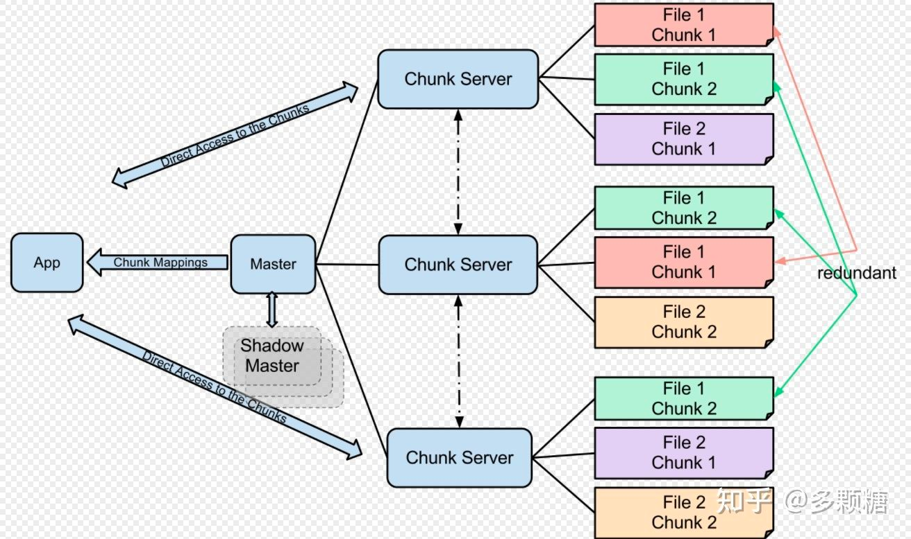
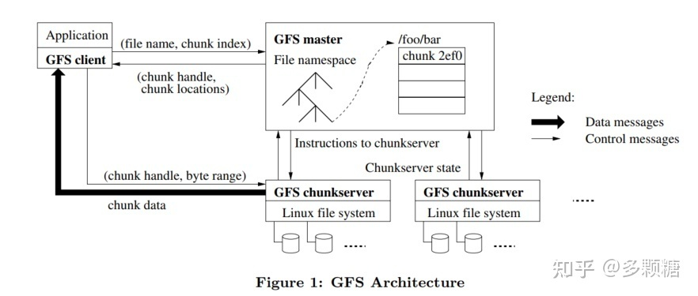
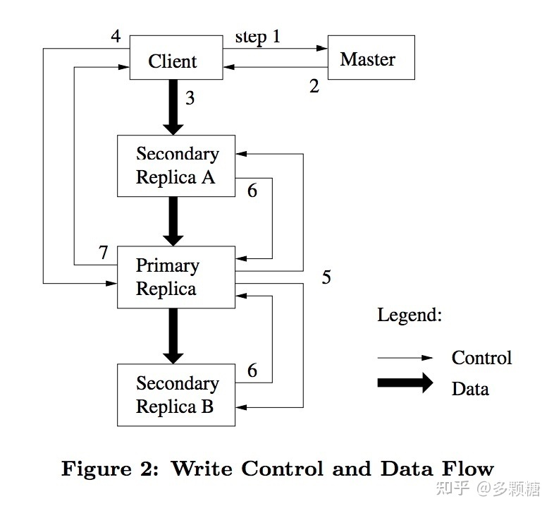

# GFS [google file system]
## 并行性能、容错、复制和一致性
1. fault tolerance 容错
2. 复制（replication） 2-3 副本
3. 复制出错 不一致的问题（inconsistency—
4. 容错引入多副本 多副本导致一致性
## 背景
- goole面临的网页存储膨胀
- 单机的故障频发， 所以分布式的认定 单机故障应该是常态  所以出现多副本容错

## 思路
1. master chunk_sever chunk
2。一个chunk有多个副本 存在不同的chunk sever上
3。master存关于chunk的metadata 

## 读写
### 读流程
1. 读 client 从master得到文件id和offset和对应的chunk server id 然后直接与chunksever 建立连接读取
可以有效降低链接
2. client 将 文件名+offset 转为文件名+ chunk index，向 master 发起请求；
3. master 在内存中的 metadata 查询对应 chunk 所在的 chunk handle + chunk locations 并返回给 client；
4. client 将 master 返回给它的信息缓存起来，用文件名 + chunk index 作为 key；(注意：client 只缓存 metadata，不缓存 chunk 数据)
5. client 会选择网络上最近的 chunkserver 通信(Google 的数据中心中，IP 地址是连续的，所以可以从 IP 地址差异判断网络位置的远近)，并通过 chunk handle + chunk locations 来读取数据；

### 租约写流程 
1. 请求不可能都通过master写入， master给拥有chunk的任意chunk_server授权1min为primary 其他为second

## 写流程
1. client 向 master 询问 Primary 和 Secondary。如果没有 chunkserver 持有租约，master 选择一个授予租约
2. master 返回 Primary 和 Secondary 的信息，client 缓存这些信息，只有当 Primary 不可达或者租约过期才再次联系 master；
3. client 将追加的记录发送到每一个 chunkserver(不仅仅是Primary)，chunkserver 先将数据写到 LRU 缓存中(不是硬盘！)；
4. 一旦 client 确认每个 chunkserver 都收到数据，client 向 Primary 发送写请求，
5. Primary 可能会收到多个连续的写请求，会先将这些操作的顺序写入本地；
6. Primary 做完写请求后，将写请求和顺序转发给所有的 Secondary，让他们以同样的顺序写数据； Secondary 完成后应答 Primary；
7. Primary 应答 client 成功或失败。如果出现失败，client 会重试，但在重试整个写之前，会先重复步骤 3-7

## 数据的check_num

