# 脑裂 split-brain 
## GFS得出的结论是啥
1. master还是流量访问的瓶颈
2. 通过chunkserver和client读写
3. 容易出现脑裂
## GFS 和mapreduce都是多副本 单节点 单节点本身就是故障
GFS的master VM的 test-and-set
## 什么是脑裂
1. 假设test-and-set是个多副本的有两个s1 s2服务端
2. 有两个client 假设c1和c2分别向s1 s1请求primary权限
3. s1 s2通信断了， c1 c2都认为自己是主机 primary 发生了脑裂
4. 如果等到两个s1 s2都返回，难度比单机还难，还不如用一个单机
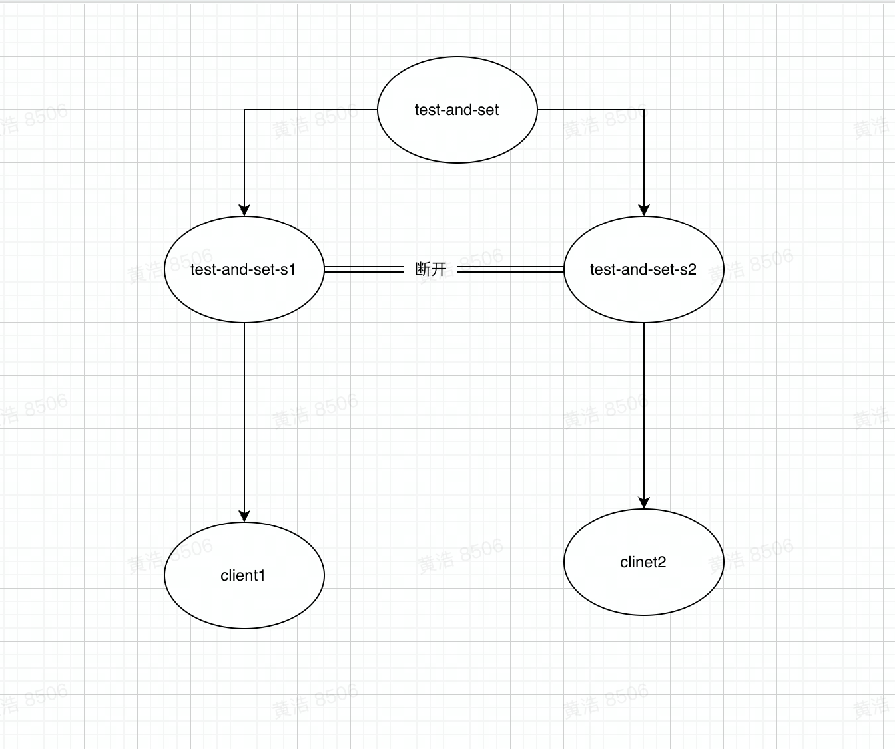
### 最初解决脑裂的方法
1. 构建不可能出现故障的网络
2. 默认等s1 s2两个都返回，如果没有给运维打电话手动操作，把人当成了决策器，那么人还是单点
    上面的两个方法显然很蠢
# 过半票决【majority vote】Paxos和Raft/ViewStamped Replication（VSR）都是 
1. 当出现如下所示 副本之间的sever s1 s2 s3 链接断掉了
2. 形成了两个网络分区 因为无法联系
3. 在这里面选sever占比最多的分区s2+s3 > s1 当leader 即可解决
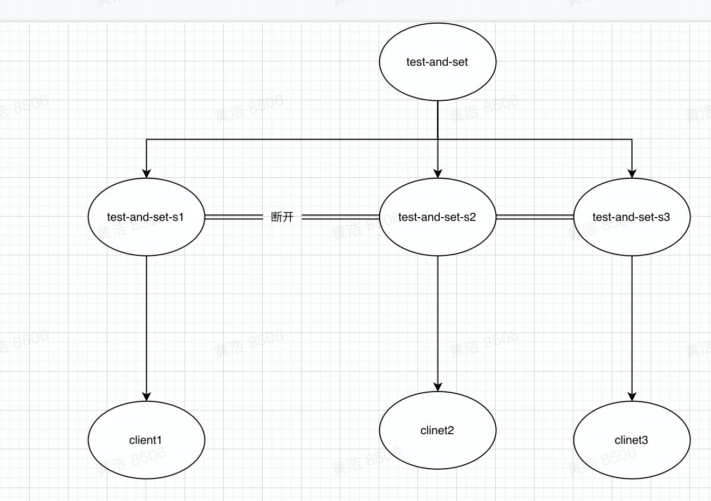
## 基本推论
1. 只要多副本是奇数个， 有且仅有一个分区拥有过半数的服务器，这个一半指的是所有的，不是指开机的，坏了的也算
2. 如果系统有 2 * F + 1 个服务器，那么系统最多可以接受F个服务器出现故障，仍然可以正常工作。
3. 任意两组过半服务器，至少有一个服务器是重叠的
4. 如果一个操作都需要半数以上同意，那么那么每一个操作对应的过半服务器，必然至少包含一个服务器存在于上一个操作的过半服务器中
5. raft_leader
   1. 当一个Raft Leader竞选成功，那么这个Leader必然凑够了过半服务器的选票，而这组过半服务器中，必然与旧Leader的过半服务器有重叠。
   2. 所以，新的Leader必然知道旧Leader使用的任期号（term number）有一个机器知道，而旧Leader的过半服务器中的每一个必然都知道旧Leader的任期号。
   3. 类似的，任何旧Leader提交的操作，必然存在于过半的Raft服务器中，而任何新Leader的过半服务器中，必然有至少一个服务器包含了旧Leader的所有操作
# raft 
## 正常情况下交互
1. 有c1 c2两个client s1 s2 s3三个多副本， 但是对c1 c2 屏蔽细节 算作单个节点
2. s1上分lib层和应用层
3. c1发起put。get请求，发到各个sever告知raft层，写入log，完成时通知leader，只要leader确保过半sever写入即可返回写入完成 并支持get
4. 当pit在leader被提交后， 每个副本s 会把log提交到应用层，然后完全一致
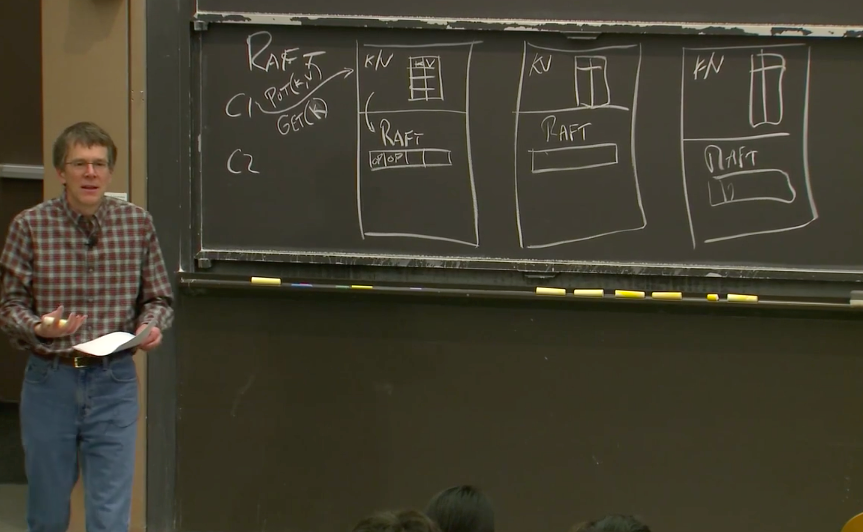
## Raft log的详细交互
1. client 发起一个put请求
2. s1作为ld收到请求后，发送添加日志【AppendEntries】到s2 s3 等待相应 在三副本里只需要等一个返回就ok了
3. 超过一半s2 返回写入成功， s1-ld提交返回给client
4. 同时告诉没返回的 一半，s1-ld提交返回了
   1. 有两种告诉， 高频次的话在下一次 发送添加日志【AppendEntries】加上上一次的结果 省一次响应
   2. 低频次，单独告诉s3 已经commit
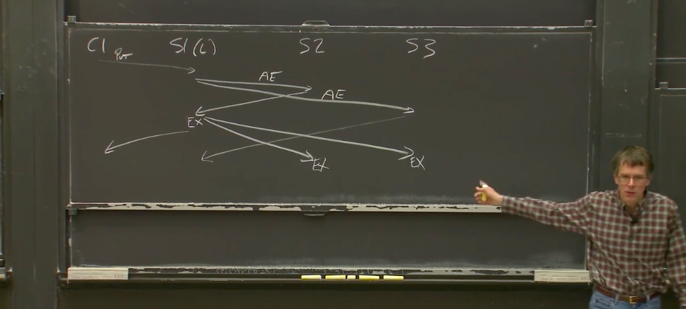
## Raft log的作用
1. 有十个clinet请求，leader需要序列化成操作日志， 确保所有server执行的都一样， 这样才能快照都一样
2. 非ld的follower在没确保ld是否commit的情况下，只有先缓存log
3. leader的log需要重传
4. log可以被sever故障用来故障恢复
## QA 
1. 假设ld吞吐大于 follower 能无限堆积么 
   1. 不可以 follwer 达到内存后，后申请内存，而且ld的速度可以调节
2. 当follower 恢复时无法知道log执行到哪一步，所以不执行
3. 当ld和follower同时都故障，恢复后
   1. 先进行票选新ld
   2. 新ld在发送心跳 AppendEntries 搞清楚执行到哪一步
   3. 新ld确认过半服务器执行的log位置，这个就是整个系统的执行位置
   4. 或者ld迫使所有副本log跟自己一直， 然后重新执行log
   5. 这个从头执行有点低效
## 应用层和raft lib 交互
1. kv应用层发了start【command】给raft lib
2. 一点时间以后 raft lib会告诉kv start执行完毕commit了【包括log的位置index】， 不一定是最近的一次start请求
   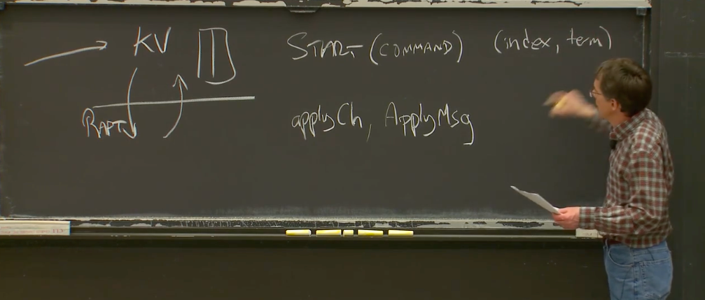
# Leader Election 选举
## Raft 比Poxas 的好处
Raft一直都有leader， poxas需要两轮 第一轮选leader 第二轮确认请求
## 基本信息
1. Followers[非leader节点] 只知道当前任期号【term number】
2. 一个任期号最多只有一个leader
3. 每个节点有一个选举定时器【Election Timer】在定时器耗尽之前没收到ld的消息， 该节点认为ld已下线 该节点并开始一次选举
4. 节点开始一次选举
   1. 节点增加一个任期号 term number，该节点想成为leader
   2. 该节点发出请求投票 （RequestVote）RPC 发给所有Raft节点 N-1个，节点讯选举总把票投给自己
   3. 前任ld可能没有挂心跳断了，也会导致选举，且认为自己还是leader，出现网络分区，旧ld在自己分区运行，新ld在进行新的选举
5. 旧ld为啥不会产生badcase
   1. 因为他的分区一定小于一半，凑不齐一半 只能从client接受请求，但是无法返回请求
6. raft的badcase
   1. raft ld的单边故障， 可以心跳给其他节点 但是收不到请求，让其他节点误认为正常 解决办法 加一个ack
7. 选举为啥能成
   1. 一个任期只能有一个ld
   2. 想当选ld必须获得过半服务的投票
   3. 每个节点一个任期内只能投一票 所以不可能有两个节点在一个任期内同时获得过半投票 即过半原则只有一个胜出
   4. 过半原则代表一些节点故障了 但健康节点只要过半就能赢得选举，如果超过一半，无法选出ld 
8. 其他节点是怎么知道新ld选举成功了
   1. 当节点赢得了选举，且知道自己是新ld，raft要求心跳广播给其他节点
   2. 规定除了ld 其他节点无法发出AppendEntries消息
   3. 任一节点会收到ld的AppendEntries 带有任期号的消息
# 选举定时器 Election Timer
## 基本背景
1. 任何一条AppendEntries消息都会重置所有Raft节点的选举定时器
2. ld 可以持续的合理的速率发送AppendEntries 阻止新的选举
3. 分割选票（Split Vote）候选人同时参加选举 都选自己 对别人反对， 无法产生新ld 怎么解决？
   1. 不能完全避免， 但是给每个节点的定时器不同的超时时间
   2. 选举定时器的超时时间需要至少大于Leader的心跳间隔 不能没收到就触发选举
   3. 超时时间的最大越大， 恢复的时间越长，决定了旧ld挂了新ld的产出时间 主要看故障频率
   4. 不同节点的选举定时器的超时时间差（S2和S3之间）必须要足够长，使得第一个开始选举的节点能够完成一轮选举。这里至少需要大于发送一条RPC所需要的往返（Round-Trip）时间。

# 日志恢复 log
   
## 新ld怎么整理 节点的不一致log
如下图 只要过半的槽位 10 11 会被保留 12 13 会被丢弃， 3 4 5代表的是任期
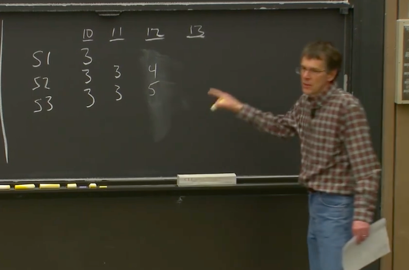
## 恢复步骤
1. S3被选为任期6的ld AppendEntries 两条， 有两个follower prevLogIndex=12是上一个槽位 prevLogTerm是5 任期
2. 对于S2 的prevLogIndex=12槽位 任期是4 显然拒绝 返回false给ldS3 S1 12 没有任何Log也拒绝
3. S3把 prevLogIndex=11 询问s2 是3 
   1. 显然跟s2 对上了  S2会接受这个消息。Raft论文中的图2规定，如果接受一个AppendEntries消息，那么需要首先删除本地相应的Log（如果有的话），再用AppendEntries中的内容替代本地Log。
   2. 但是S1的11槽位还是空 返回false S3 prevLogIndex=10 类似探测机制
4. 探测到了每个s的nextindex， 备份机制来探测Followers的Log中，第一个与Leader的Log相同的位置。在获得位置之后，Leader会给Follower发送从这个位置开始的，剩余的全部Log。经过这个过程，所有节点的Log都可以和Leader保持一致。
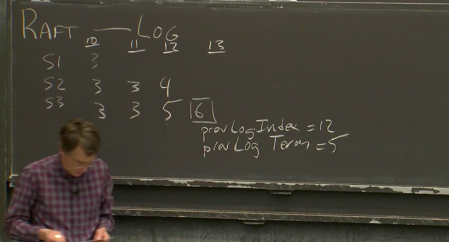
## 快速恢复
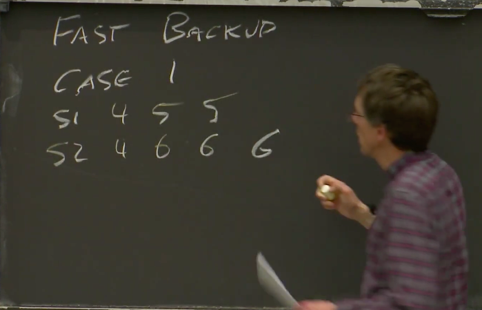
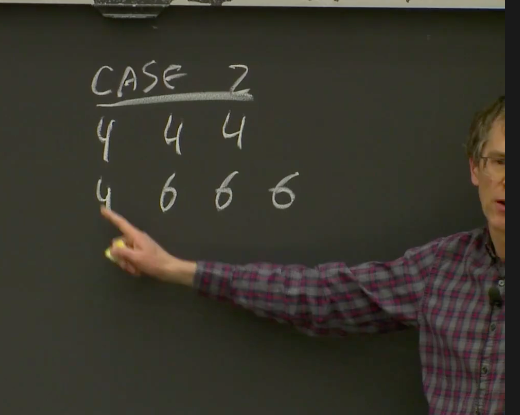
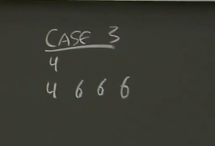
## 日志快照 Log Snapshot
1. 核心在于 x先后被改成 1 2 3 4 8 9 在某一时间点 x是固定的 记一个 状态即可 不用记6个updateLog 记快照即可
2. 如果我们有一个点的快照，那么我们可以安全的将那个点之前的Log丢弃。（在key-value数据库的例子中）快照本质上就是key-value表单
3. 
# 选举约束
1. 不是所有的节点都可以成为ld
2. 证明 假设只选取最长日志log的节点到ld 作为投票规则 有啥问题
   1. 下图虽s1 最长日志 但是 s2 s3 组成过半服务 就应该是任期8 
## 选举的限制要求
1. 在处理别节点发来的RequestVote RPC时，需要做一些检查才能投出赞成票。节点只能向满足下面条件之一的候选人投出赞成票
   1. 候选人最后一条Log条目的任期号大于本地最后一条Log条目的任期号
   2. 或候选人最后一条Log条目的任期号等于本地最后一条Log条目的任期号，且候选人的Log记录长度大于等于本地Log记录的长度   
   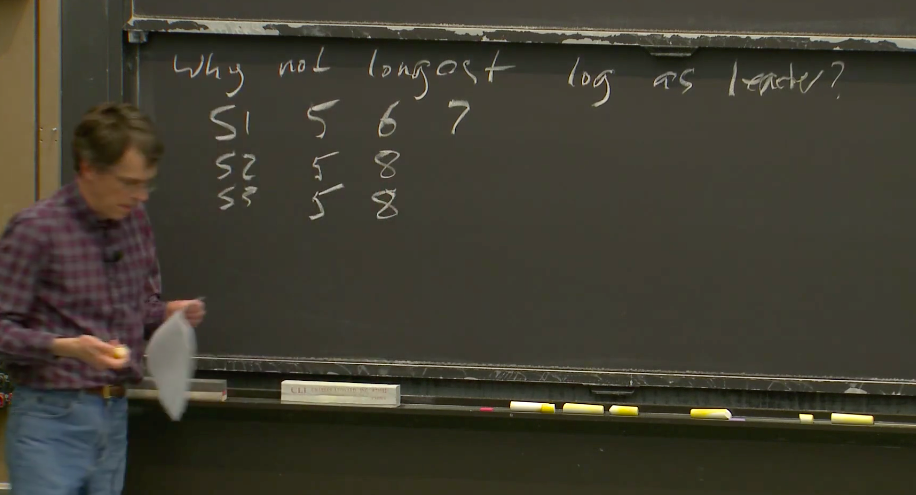
# 持久化 persistence
三个需要持久化存储的 分别是Log、currentTerm、votedFor
1. log用于恢复
2. currentTerm和votedFor都是用来确保每个任期只有最多一个Leader
3. voteFor记得自己投票给谁了 否则故障会引起两次投票
4. currentTerm保存已经被使用过的任期号。 
5. 每次你添加一个Log条目，更新currentTerm或者更新votedFor，你或许都需要持久化存储这些数据。

