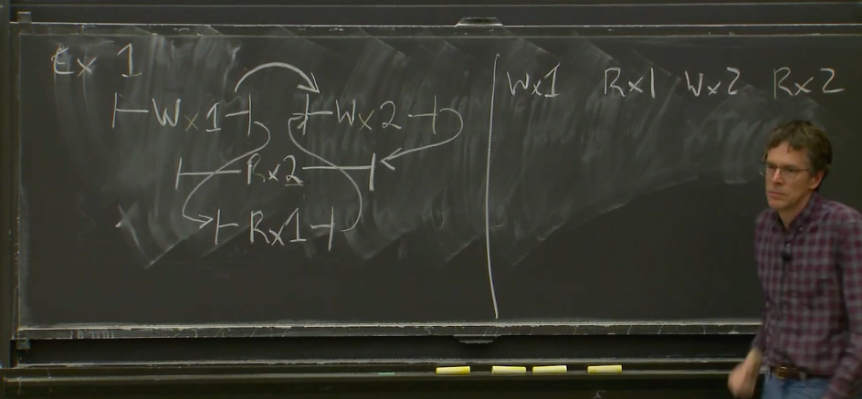
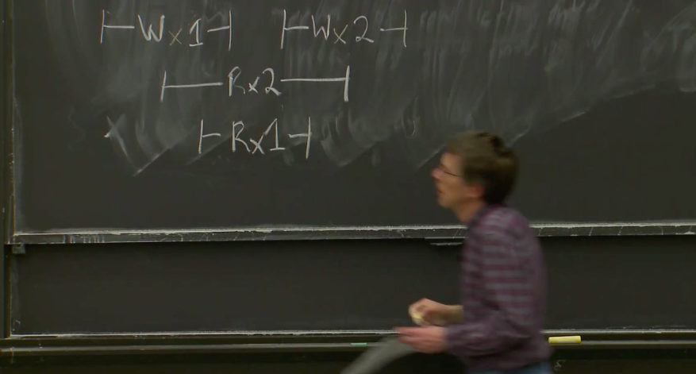
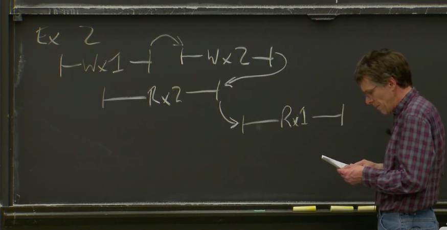
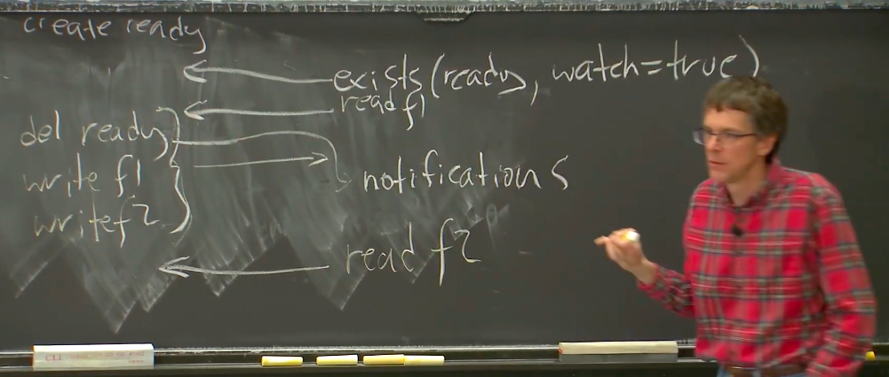

# 线性一致 LinearizeAbility
对一个时间段内 分别写write x=1 x=2 注意同时有read 读x 我觉得图画错了
1. 两个限制条件： 
   1. 如果一个操作在另一个操作开始前就结束了，那么这个操作必须在执行历史中出现在另一个操作前面。 
   2. 执行历史中，读操作，必须在相应的key的写操作之后。
时序上就是 W1 R1 W2 R2

反例 成环了

# Zookeeper  通用的协调服务（General-Purpose Coordination Service
1. 为了分担zookeeper的ld读压力 分散到每个副本上面
2. 但是副本的数据怎么保证是最新的么 该副本不在多半服务器里
3. Zookeeper如果只有写请求时，是线性一致性的；如果从读和写的角度来说是顺序一致性的。
4. zookeeper 只会写一致性 按请求时间
5. 第二个读请求不允许看到之前的状态，第二个读请求至少要看到第一个读请求的状态。这是一个极其重要的事实，我们会用它来实现正确的Zookeeper应用程序
6. 每个Log条目都会被Leader打上zxid的标签，这些标签就是Log对应的条目号。任何时候一个副本回复一个客户端的读请求，首先这个读请求是在Log的某个特定点执行的，其次回复里面会带上zxid，对应的就是Log中执行点的前一条Log条目号。
# SYNC 同步操作
1. 果我需要读最新的数据，我需要发送一个sync请求，之后再发送读请求。这个读请求可以保证看到sync对应的状态，所以可以合理的认为是最新的。
2. 在发送读请求时，我（客户端）告诉副本，在看到我上一次sync请求之前，不要返回我的读请求。
# 读配置场景

1. 客户端会发送exists请求来查询，Ready file是否存在。但是实际上，客户端不仅会查询Ready file是否存在，还会建立一个针对这个Ready file的watch。
2. 副本或者zookeeper 在如果删除ready file的通知会在任何读请求之前返回
3. 客户端在完成读所有的配置之前，如果对配置有了新的更改，Zookeeper可以保证客户端在收到删除Ready file的通知之前，看到的都是配置更新前的数据（也就是，客户端读取配置读了一半，如果收到了Ready file删除的通知，就可以放弃这次读，再重试读了）。
