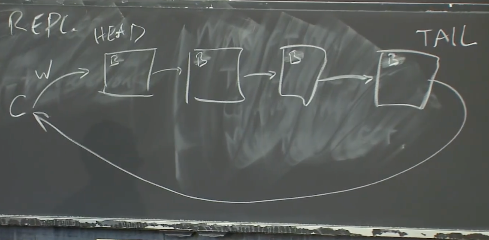

# Chain Replication
1. 写请求从head到tail  成功了下一个 tail commit
2. 读从tail 开始 tail直接表名 当前状态
3. 跟zookeeper相似 副本分担读压力 
4. 无故障的情况下简直完美
5. 如果 链中断了呢

# CRAQ（Chain Replication with Apportioned Queries）
1. Chain Replication 故障分析
2. 如果是head故障 下一个就可以成为header
   1. 正在处理的请求 已经发的不管 会到后面 没到的 客户端没收到消息自动重试
3. 如果tail故障 前一个节点成为tail tail知道的前节点都知道
4. 中间故障呢？
   1. 需要做的就是将故障节点从链中移除
   2. 或许有一些写请求被故障节点接收了，但是还没有被故障节点之后的节点接收
   3. 所以，当我们将其从链中移除时，故障节点的前一个节点或许需要重发最近的一些写请求给它的新后继节点。这是恢复中间节点流程的简单版本

## 对比raft
1. raft 读写都在leader CRAQ在头尾 分担流量
2. CRAQ单位时间能处理更多请求
3. CRAQ故障恢复端
4. CRAQ写响应时间长
## CRAQ的脑裂
1. head 和head+1断链
2. head 认为自己是头尾 head+1及后面是真正正常 形成两个网络分区
3. 外部的权威（External Authority）来决定谁是活的，  为Configuration Manager。
# Configuration Manager。
1. Configuration Manager的工作就是监测节点存活性，一旦Configuration Manager认为一个节点挂了，它会生成并送出一个新的配置 定义head和tail
2. 如何使得一个服务是容错的，不否认自己，同时当有网络分区时不会出现脑裂呢？答案是，Configuration Manager通常会基于Raft或者Paxos
3. 
