http://www.woshipm.com/pd/4223123.html
https://zhuanlan.zhihu.com/p/58160982
# 核心在于把内容推荐给用户
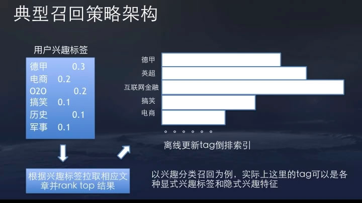
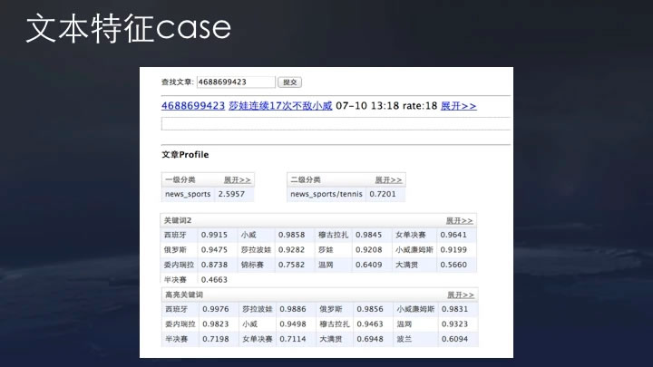
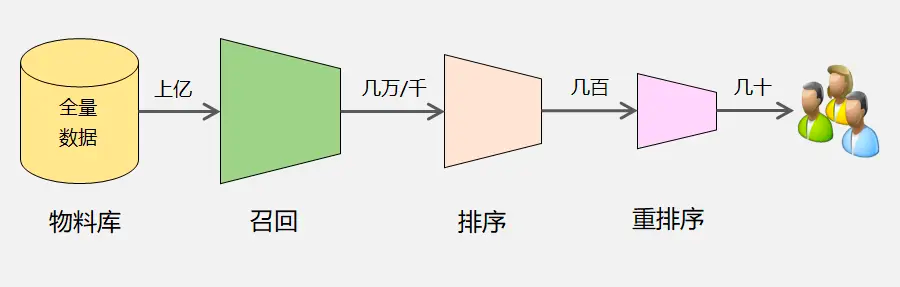
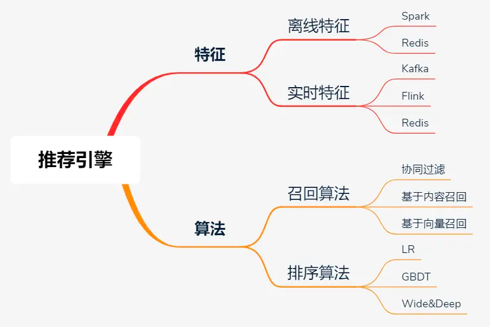
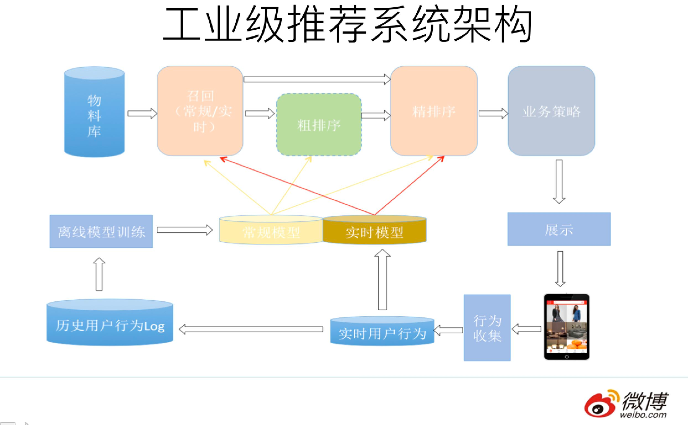
#推荐架构的发展
推荐架构发展历程
- 只有召回，排序是人拍的规则：UserCF，ItemCF时代
- 排序改成模型：GBDT，LR时代
- 排序模型改成Online Training
- 排序模型进步：FM，FFM，Wide&Deep，DeepModel
- 召回改成向量化召回
# 协同过滤【CF】
## UserCF
## ItemCF
物品 a 和物品 b 同时被用户 A，B，C 购买了，那么物品 a 和 物品 b 被认为是相似的，因为它们的共现次数很高。
认为物品ab相似，用户d买了a就推b
### 如何找相似
三维坐标 夹脚越小越相似
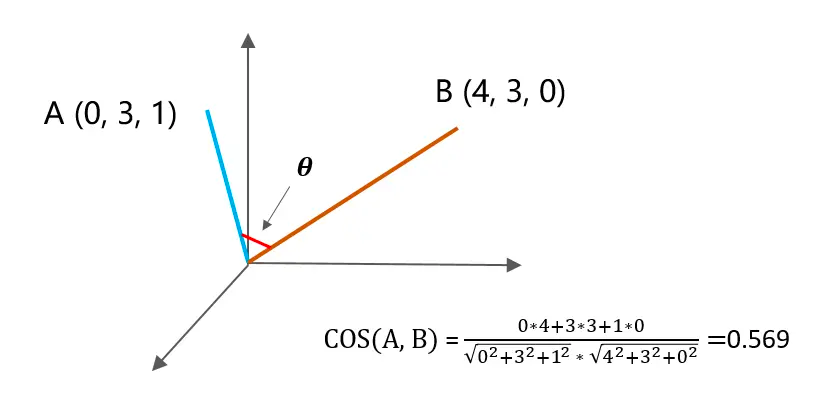 实际上是多维的
### Item-CF的算法流程
1. 整理物品的共现矩阵
2. 计算物品的相似度矩阵
3. 推荐物品
- 所谓共现，即：两个物品被同一个用户喜欢了。比如物品 a 和 b，由于他们同时被用户 A、B、C 喜欢，所以 a 和 b 的共现次数是3
- N(u) 表示喜欢物品 u 的用户数，N(v) 表示喜欢物品 v 的用户数，两者的交集表示同时喜欢物品 u 和物品 v 的用户数。
- Puj 表示用户 u 对物品 j 的感兴趣程度，值越大，越值得被推荐。N(u) 表示用户 u 感兴趣的物品集合，S(j,N) 表示和物品 j 最相似的前 N 个物品，Wij 表示物品 i 和物品 j 的相似度，Rui表示用户 u 对物品 i 的兴趣度。
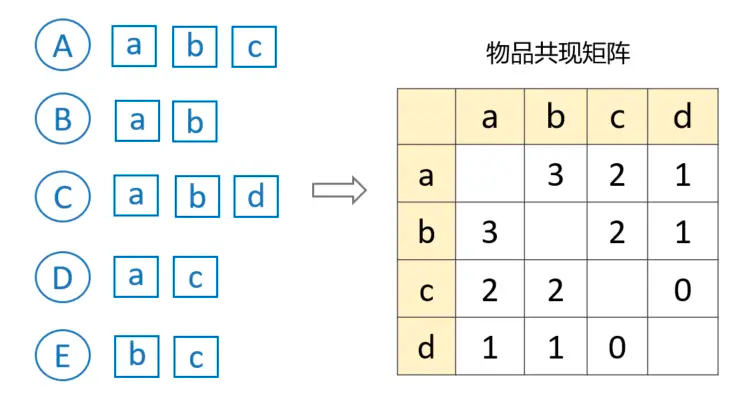

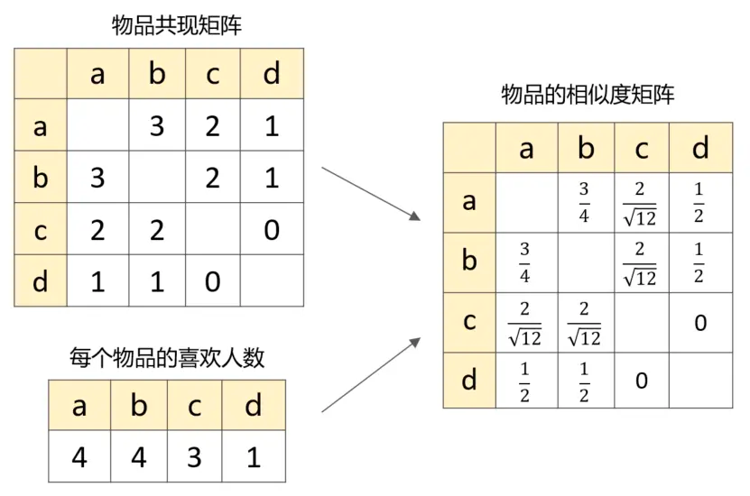
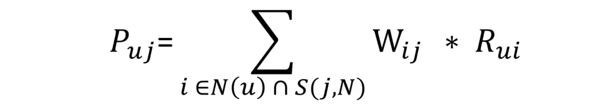

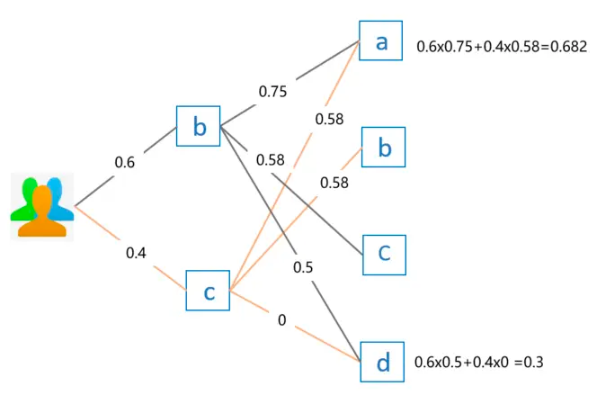
# 橘子视频的过滤
1. 预估当前用户对下个视频的概率
   1. 把用户和视频生成高维空间一个点 Ua Ub Va Vb
   2. 用户对视频的行为调进或者调远
   3. 选距离最近的一个
2. 基于交互的概率，计算综合满意度
   1. Score = 0.4 点击+ 0.5分享+0.6评论 ...
   2. 不同指标有不同倾向
      1. 新闻评论多
      2. 优质作者关注多
      3. 美女点赞多
      4. 骗交互的case 标题党
3. 基于综合满意度 计算视频组合
   1. 同类不能推太多，不然会腻
   2. 相似视频也会冗余
   3. 涨粉速度VS粉丝价值
      1. a关注了唐人街，潜在是冰蛋的粉丝， 如果打开app，给a推唐人街，失去了冰蛋的粉丝的涨粉，但是唐人街的粉丝阅读率会高
      2. 头条更倾向于涨粉， B站和快手和公众号粉丝价值
   4. 信息茧房的反探索
   5. 强插实验提高流量天花板
      1. 怎么判读是推荐不好还是内容不好 一用户视频涨粉100
      2. 10%DAU强插该内容 * 10 就是最终涨粉， 如果最终涨粉100W，就是没推好，如果涨粉100，内容不限
      3. 
      
# 现代推荐
## 推荐基本架构
1. 召回
   1. 千万选3000， 模型简单速度快
   2. 召回的指标
      1. 预期召回的/实际召回的/用户点击的
   3. 多路召回。召回策略
      1. 热门召回；
      2. 兴趣标签召回；
      3. 基于业务策略召回：掉量召回、冷启动召回；
      4. 基于内容的协同过滤（itemCF）：推荐用户历史偏好内容的相似内容；
      5. 基于用户的协同过滤（userCF）：推荐相似用户喜欢的内容给当前用户；
      6. 向量化召回（Embedding Based）：利用深度学习网络生成Embedding，进行快速的Embedding最近邻计算。多路召回中的信息都可以作为附加信息融合进最终的Embedding向量中，即Embedding召回相当于多考虑了多路召回的多种策略；
   4. 召回问题转化的检索问题
      1. 对每一个用户请求，通过构造得到用户，根据用户通过ANN的方式检索出相似的N个视频
      2. 预先存入视频建立索引，线上请求查找
      3. 双塔结构 用户和doc独立
2. 粗排
   1. 3k选360
   2. 相较于召回更强调排序 相较于精排更强调性能
3. 精排
   1. 360选6
   2. predict
      1. 1. 抽取特征；
      2. 模型预估获取各模型预估分；
      3. Dump feature+action 至Kafka；
      4. 融合模型分数；
   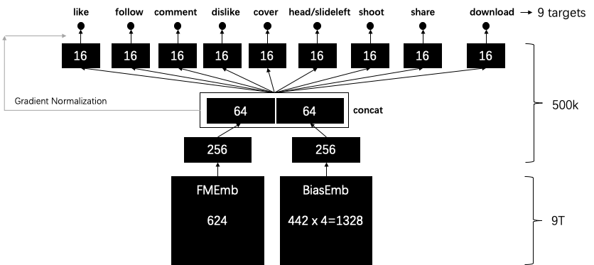
4. ReRanker
   1. 产生一个融合分数
   2. 重排保持多样性
   3. 策略
      1. 冷启动boost加减推荐分
      2. 打散规则 癌症不能连着出

# 推荐的杂谈
