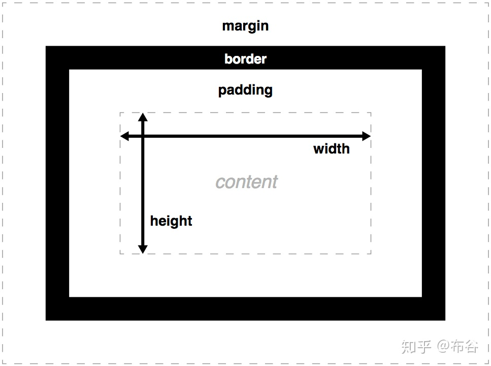

# CSS是层叠样式表
# css 作用
用来美化、布局。以HTML为基础，提供了丰富的功能，如设置字体颜色、大小、样式、背景颜色，以及页面排版等等。
# css 语法
    选择器{属性1:属性值1;属性2:属性值2;···属性n:属性值n;}
# 引入CSS的方法
## 行内式
    也叫内联样式，是直接写在标记名后面的。基本语法如下：
    <标记名 style =“属性1:属性值1;属性2:属性值2;···属性n:属性值n;”>/</标记名>
## 内嵌式
写在head头部标签中，并且使用style标记定义，基本语法如下:

    <head>
       
    </head>
## 链入式
      <head>
          <link herf="CSS文件路径"type="text/css" rel="stylesheet">
      </head>  
# CSS选择器
## 1)、基础选择器
### 标签选择器： html标记名作为选择器。基本语法如下：
标记名{属性1:属性值1;属性2:属性值2;···属性n:属性值n;}
### 类选择器： class选择器。使用 .类名 进行标识，基本语法如下：
.类名{属性1:属性值1;属性2:属性值2;···属性n:属性值n;}
### id选择器： 使用 #id名称 进行标识，基本语法如下：
idname{属性1:属性值1;属性2:属性值2;···属性n:属性值n;]
## 2)、后代选择器
后代选择器用来选择元素或者元素组的后代，把外层标记写前面，内层标记写后面，中间需要加上空格。
例如：.box p soan {属性1:属性值1;属性2:属性值2;···属性n:属性值n;}
## 3)、并集选择器
任何形式的选择器都可以作为并集选择器的一部分，中间需要用逗号隔开。
例如：
h1,h2,p,.classNmae{属性1:属性值1;属性2:属性值2;···属性n:属性值n;]
## 4)、交集选择器
也称作标签指定式选择器，在A选择器中选中的B选择器，中间用.连接，没有空格。
例如：
p.box{属性1:属性值1;属性2:属性值2;···属性n:属性值n;]
表示选择p标签中的class="box"这个类
## 5)、通配符选择器
通配符用*表示，能匹配页面中所有元素，作用范围最广。
例如：
*{margin:0;padding:0}
# 文本的样式属性
## 字体样式属性
    1)、font-size：字号大小
    属性值了可以使用相对长度单位em，推荐使用像素单位px。
    2)、font-weight: 字体粗细
    属性值默认normal，可以设置加粗bold,更粗bolder，或者100,200···
    3)、font-family:字体
    属性值通常可以设置为黑体、微软雅黑、宋体···
    4)、font-style:字体风格
    属性值默认为normal，可以设置xieti 样式italic,或者oblique。
    5)、font:
    复合属性，font:font-style font-weight font-size/line-height font-family
    前两个属性可以省略或者调换位置，后面的两个都不可以。
## 文本样式属性
    1)、line-height：行间距
    单位通常使用px,em或者百分比。1）如果是子标签是男标签，行高可以撑起子标签的高度 。2）如果是子标签是女标签，行高不能撑起子标签的高度
    2)、text-align: 文本对齐方式
    属性值默认left左对齐，可以设置为center居中，也可设置right右对齐。
    3)、text-decoration:修饰线
    属性值默认是none，可以设置下划线underline，删除线line-through，上划线不常用。
    4)、text-indent:首行缩进
    属性值可以为不停单位的数值，em字符宽度的倍数，或者相对浏览器的百分比，允许使用负值。
    5)、color:文本颜色
    属性值可以是十六进制表示颜色，或者英文单词，或者用rgb表示。
## CSS的高级特性
### CSS的层叠性
多种CSS样式可以叠加，例如内联式定义p字号大小12px,链入式定义p颜色为红色，那么p标签的字体就是12px,红色。
### CSS的继承性
子标签继承祖先的属性，例如字体样式和文本样式属性。
### CSS的优先级
自己写的样式 > 继承过来的样式 ; id> > class > 标记 ;行内 > 内嵌；行内 > 链入；内嵌和链入比较权重，权重相同就近。
# 盒子模型

## 1.内容区域：width 和 height
2. 对于男盒子来说，表示内容区域
3. 对于女盒子，width和height不起作用
注意点：
- 不设置有默认值，宽度默认值是auto，对于块级元素来说，auto表示尽可能大，对于行内元素来说，auto表示尽可能小。
- 设置高度，男盒子的高度是内容的高度，也就是说高度是由内容撑起来的，对于女盒子来说，也是由内容撑起来的，但是和font-size也有关系。
- 宽度和高度可以设置百分比，是父元素的百分比的，一般情况下在移动端开发时用的多一点

    内容（width, height）
    内边距（ padding）
    边框（ border）
    外边距（ margin）

##  2.内填充区域： padding
用来设置内填充，也叫补白 表示内容区域和边框之间的距离
四个方向： 用的也比较多的
        padding-top: 
        padding-right:
        padding-bottom:
        padding-left:
    
    padding后面也可以跟一个值，二个值，三个值，四个值：
        一个值：padding:10px  四个方向的padding都是10px
        二个值：padding:10px 20px;   上下是10px  左右是20px
        三个值：padding:10px 20px 30px;   上是10px  左右是20px  下是30px
        四个值：padding:10px 20px 30px 40px;   上 右 下 左
    
    注意点：
    1）有些标签是有默认的padding  如ul  ol... 等  一刀切  *{ padding:0; }
    2）对于行内元素来说，padding在垂直方向上不影响行高，效果上看似是有padding，但是padding不是真正的padding，或者说对于一个女盒子来说，padding在垂直方向上无效。
    3）对于块级元素来说，上下padding可以撑起男盒子的高度。
## 3.边框： border
边框的粗细 border-widht 边框的样式 border-style 边框的颜色 border-color; 一般情况下，不会单独设置 border是一个复合属性.
注意点：
    1）border:1px solid red;  border后面的属性是没有顺序的，但是一般都是先写border-width,然后是border-style，最后是border-color。
    2）粗细大部分情况下单位都是px  你也可以使用单词  使用单词时  在不同的浏览器下代表粗细是不一样的
    3）边框的样式也非常多 用的非常多的有这几个：solid 实线   dotted 点画线  dashed 虚线  none 没有线  ..... 
    4）边框的颜色设置  单词  用的最多还是16进制  也可以使用rgb函数
    5）也可以单独设置某一个方向上的border  border-top:1px solid red; 用的也比较多
## 4、外填充区域：margin
## 5、背景： background

# display
块级元素：div p ul li
行内元素：a span input
# 选择器

    <html>
      <head>
        
      </head>
      <body>
        我是高度100的蓝色span
        我是高度100的绿色span
      </body>
    </html>
#  定位
    定位使用position属性，它的值有三种：
    relative相对定位，相对于自身的位置
    absolute绝对定位，向上查找上级元素，第一个有position属性的元素（有点绕，待会细讲）
    fixed固定定位，相对于浏览器窗口
    .green {
        position: relative;
        left: -30px;
        background-color: #009a61;
    }
# css的三大特性
## 继承性
给父元素设置一些属性，子元素也可以使用，这个我们就称之为继承性。
1.并不是所有的属性都可以继承, 只有以color/font-/text-/line-开头的属性才可以继承
2.在CSS的继承中不仅仅是儿子可以继承, 只要是后代都可以继承
3.继承性中的特殊性
   3.1 a标签的文字颜色和下划线是不能继承的
   3.2 h标签的文字大小是不能继承的
## 层叠性
层叠性就是CSS处理冲突的一种能力。层叠性只有在多个选择器选中 同一个标签, 然后又设置了相同的属性, 才会发生层叠性。
在相同优先级的的情况下 下面的样式元素会将上面的层叠掉。

## 优先级
    !important>行内样式>id选择器>类选择器>标签选择器>通配符>继承 
     1、继承样式的权重为0。即在嵌套结构中，不管父元素样式的权重多大，被子元素继承时，他的权重都为0，也就是说子元素定义的样式会覆盖继承来的样式。
     2、行内样式优先。应用style属性的元素，其行内样式的权重非常高，可以理解为远大于100。
     3、权重相同时，CSS遵循就近原则。也就是说靠近元素的样式具有最大的优先级，或者说排在最后的样式优先级最大。
     4、CSS定义了一个!important命令，该命令被赋予最大的优先级。也就是说不管权重如何以及样式位置的远近，!important都具有最大优先级。   
