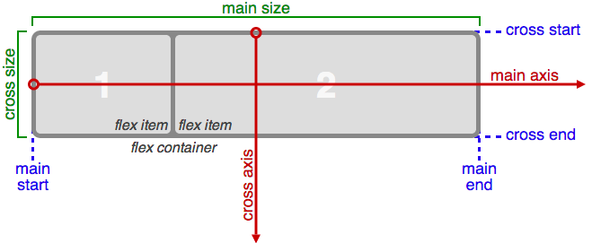
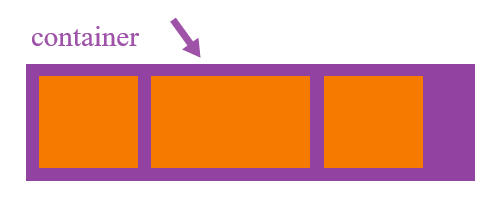
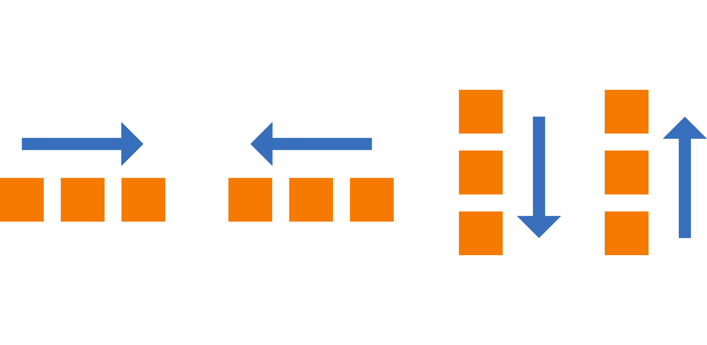

# display:flex 布局
Flex是Flexible Box的缩写，意为"弹性布局"
元素在子元素的大小未知或动态变化情况下仍然能够分配好子元素之间的间隙
Flex布局的主要思想是使父元素能够调节子元素的高度、宽度和排布的顺序，从而能够最好地适应可用布局空间
# flex的六个属性


在flex布局中，子元素要么按照主轴也就是main axis（从main-start到main-end）排布，要么按照交叉轴，也就是cross axis(从cross-start到cross-end)排布。

下面介绍几个概念：

    main axis: Flex 父元素的主轴是指子元素布局的主要方向轴，注意主轴不一定是水平的，它由属性flex-direction来确定主轴是水平还是垂直的（后面会介绍）。
    main-start|main-end: 分别表示主轴的开始和结束，子元素在父元素中会沿着主轴从main-start到main-end排布。
    main size: 单个项目占据主轴的长度大小。
    cross axis: 交叉轴，与主轴垂直。
    cross-start|cross-end: 分别表示交叉轴的开始和结束。子元素在交叉轴的排布从cross-start开始到cross-end。
    cross size: 子元素在交叉轴方向上的大小。
    ## 1: flex-direction:row; 
沿水平主轴让元素从左向右排列
# 属性介绍
属性分作用于父元素的属性和作用于子元素的属性两部分介绍。 
## 父元素属性
### display
用来定义父元素是一个 flex布局容器。如果设置为flex则父元素为块状元素，设置为inline-flex父元素呈现为行内元素。
``` 
   .container {
      display: flex; /* or inline-flex */
    }
```
### flex-direction

```
.container {
  flex-direction: row | row-reverse | column | column-reverse;
}
```
      display: flex|inline-flex;
      flex-direction: row | row-reverse | column | column-reverse;
      flex-wrap: nowrap | wrap | wrap-reverse;
      flex-flow: <‘flex-direction’> || <‘flex-wrap’>;
      justify-content: flex-start | flex-end | center | space-between | space-around;
      align-items: flex-start | flex-end | center | baseline | stretch;
      align-content: flex-start | flex-end | center | space-between | space-around | stretch;
## 子元素属性
## 1. flex-direction 容器内元素的排列方向(默认横向排列)
 
## 2: flex-direction:column; 
让元素沿垂直主轴从上到下垂直排列
 
 
## 3: flex-direction:row-reverse;
沿水平主轴让元素从右向左排列
 
## 4: flex-wrap 
容器内元素的换行(默认不换行)
1：flex-wrap: nowrap; 
(默认)元素不换行,比如：一个div宽度100%，设置此属性，2个div宽度就自动变成各50%；
2：flex-wrap: wrap;
 元素换行,比如：一个div宽度100%，设置此属性，第二个div就在第二行了； 
## 5: justify-content 元素在主轴（页面）上的排列
1：justify-content : center;元素在主轴（页面）上居中排列

