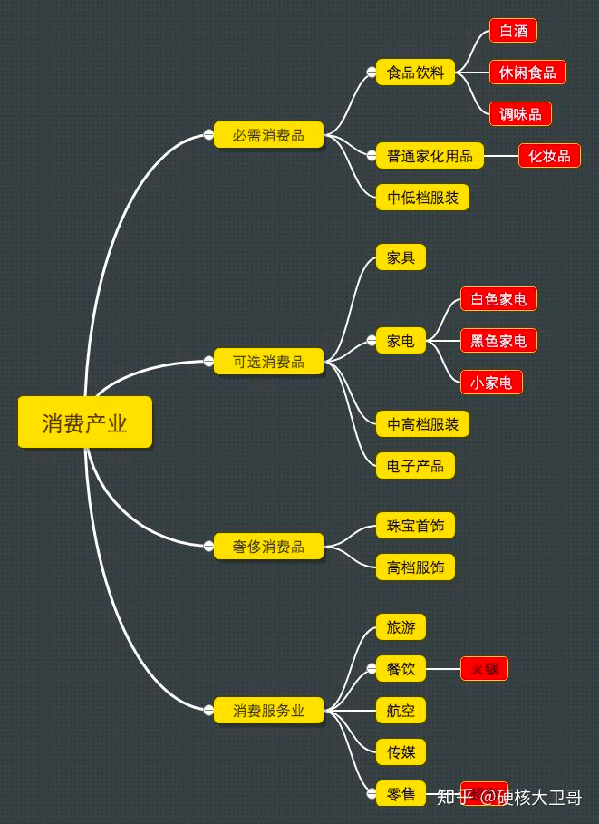
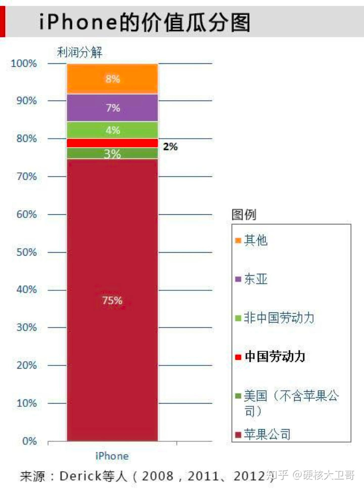
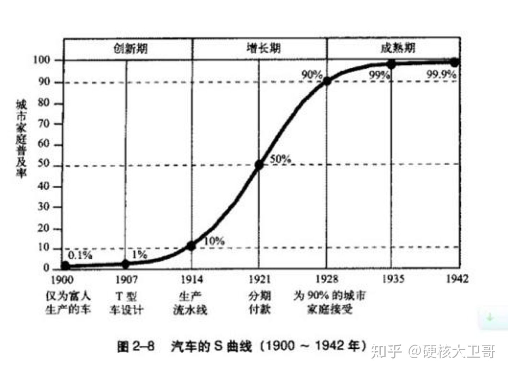

# 
## 1 看懂行业
### 1.什么是好行业
- 市场需求要足够大，而且能长久。【吃穿住行，生老病死】
- 市场需求快速增长，甚至是爆发式增长 
- 消费，医药和科技。
  
### 2.分析价值链
上游研发，中游制造和流通，下游品牌和营销，构成了一条完整产业链。
价值链就是产业链上的利益分配。
说白了就是，这行业的钱都被谁赚走了？谁议价能力更大？谁又在干苦力？

### 3、行业的竞争格局
 门槛高、产品标准化、网络效应强的行业，集中度往往更高，比如重工业，比如互联网。
 
 门槛低、产品个性化的行业，集中度就低很多，比如餐饮，比如家教，比如理发。   
### 4、行业发展趋势
  
很多投资人常用的套路，就是对比国外成熟市场和我国当前的普及率，从而判断行业的发展阶段。
## 2 看懂护城河
### 1）无形资产
- 品牌
- 专利技术
- 授权。

#### 2）转换成本     
用惯了iphone，换成安卓总有些不适应。
#### 3）成本优势
  很多工业品来说，固定投资不大会变化，而规模越大，分摊的边际成本就越低，也就越能压垮对手。   
## 3 预测未来业绩增长
### 单价
### 销量
行业本身增长带来的份额，以及公司从其他竞争对手那夺取的份额。
### 成本
渠道变革，精细化管理，研发关键技术，都能降低成本。
## 4 确定公司估值
市盈率（P/E）：市值/净利润的比值，price/earning。

市净率（P/B）：市值/净资产的比值，Price/Book Value
## 风险排雷
### 财报造假
### 过高的毛利率
### 虚假交易，左手倒右手。
### 大存大贷
### 商誉过高

