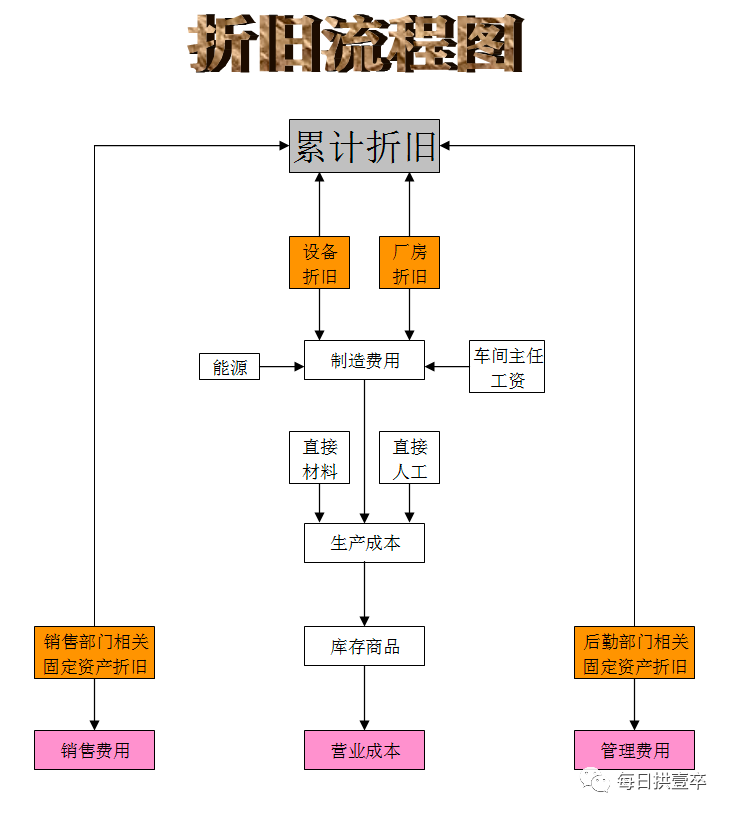
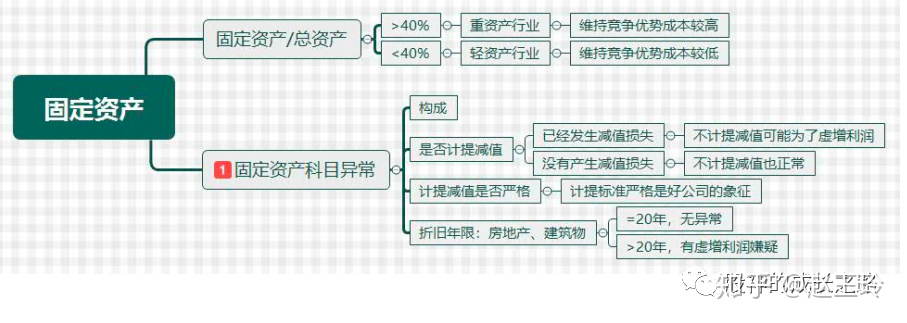
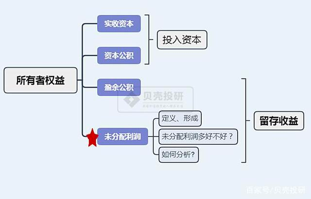
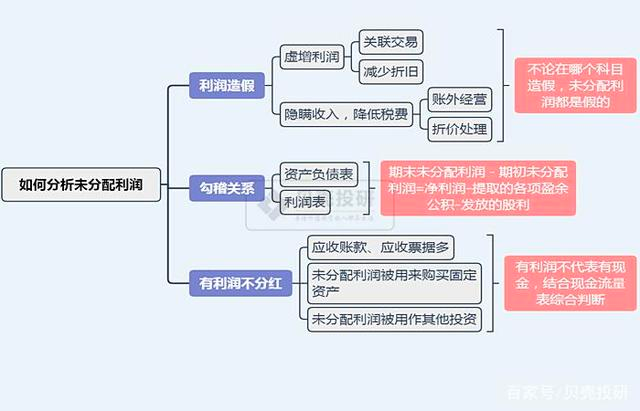

# 判断是否估值过高

# 中报
## 营业收入
## 归属于上市公司股东的净利润
A对B公司有50%股份，A报表 就是 A+B*50% = 利润 
## 归属于上市公司股东的扣除非经常性损益的净利润
扣除非经常性损益 是指扣除跟公司主营业务不相关的利润，比如京东的卖房子钱
## 经营活动产生的现金流量净额
经营活动现金净流量为负数+ 投资活动现金净流量为负数+ 筹资活动现金净流量为正数时，【资金来源只有举债、融资等】表明该企业处于产品初创期/扩张期 衰退期
## 基本每股收益
当期净利润除以当期在外发行的普通股的加权平均来确定，可以反应出来目前股本结构下的盈利能力。赚100块有100股 每股盈利就是1元
## 稀释每股收益
摊薄每股收益是把一些潜在有可能转化成上市公司股权的股票的加权平均股数都算进来了，比如可转股债，认股权证等。因为他们在未来有可能换成股票从而摊薄上市公司每股收益。个人觉得在A股财报看基本，每股港股财报看摊薄，

## 净资产收益率

年初（2018年）有净资产100万，018年年末算账的时候，公司净利润为30万，净资产（所有者权益合计）共250

## 加权平均净资产收益率
整个企业整个时间段里的净资产变化情况对净利润的影响。
计算公式：ROE = P/（E0 + NP÷2 + Ei×Mi÷M0 - Ej×Mj÷M0 ）
(P)为报告期利润;
(E0)为期初净资产;
(NP)为报告期净利润;
(Ej)为报告期回购或现金分红等减少净资产;
(Ei)为报告期发行新股或债转股等新增净资产;
(Mi)为新增净资产下一月份起至报告期期末
(M0)为报告期月份数;

## 归属于上市公司股东的净资产
资产=负债+归母股东权益+少数股东权益。
总资产是合并报表的全部资产，净资产要考虑扣除负债，
归属于上市公司股东的净资产还要考虑净资产扣除少数股权东权益部分的净资产。
# 怎么看财报 https://www.zhihu.com/question/19645090
## 财务报告主要由 5 部分组成：资产负债表、利润表、现金流量表、所有者权益变动表和财务报表附注，即四表一注。
## 一:财报目录 
## 二:季报:中报:年报的区别
一季报（4月份之内发布）
中报（半年报，8月份之内发布）
三季报（10月份之内发布）
年报（4月份之内发布）
有的企业赚钱跟季度有关系
## 三:资产负债表 资产=负债+所有者权益
资产负债表是一张平衡表        
资产就是企业把钱用来买了一些什么东西，资产可以理解为可以把你赚钱的家伙。

### 资产
#### 流动资产
现金——存货——应收账款——现金 最好变现的  流动资产本身也是在经营过程中不断转化的
##### 货币资金
货币资金少于短期负债太多，或者明明有很多货币资金但却借了很多有利息，高利息的负债，这都是不健康或者不正常的表现
如果货币资金远远小于短期负债就可能出现偿债危机，公司如果有很多钱却还是借高息负债，这很可能资金被其他人挪用，或者虚构资金
##### 交易性金融资产 股票基金债券
买这些的费用是需要在当前净利润里面扣除的
##### 应收票据及应收账款 长期应收款
应收账款没有票据好用，就是白条，公司为了财报好看，一次性亏个大的，账款可以收不回来的 了让利润好看，给很多信誉度不好的企业货，
长期应收款 比如挖掘机付款
##### 预付款项
代表议价能力 注意一些奇怪的预付款项 专利啥的做假账  不能太多太长
##### 其他应收款
跟主营业务无关的应收款项 不宜太多，容易做假账     
##### 存货!!!
太多不好 半成品也算存货
1. 存货多 销售低积压 借债 不好
2. 产品被淘汰了  会跌价
3. 农业不好统计 不新鲜  药业 冷冻保存  
4. 在软件服务行业，“存货”是好东西，通常都会在年底前转换为收入，跟传统制造或商业流通行业的存货概念完全不同 或者无法验收的存货
##### 其他流动资产
容易藏污纳垢 需要去附注看
#### 非流动资产 一年左右无法变现的资产
##### 可供出售的金融资产
没到期不计入的金融资产【现在没有了？】
##### 持有至到期投资
 到了日期固定收回金额的非衍生金融资产
                
##### 长期应收款
企业融资租赁产生的，递延方式分期收的款项
##### 长期股权投资
通过投资取得被投资方的股份，一般来说都是长期持有的。
要看投资了什么 涉及资产转移 侵吞上市资金 
##### 固定资产!!! 财务造假最好的科目为“在建工程”、“固定资产”等非流动性资产科目

固定资产占总资产的比率大于40%是重资产行业，维持竞争优势成本较高，风险较大；
固定资产占总资产比率小于40%属于轻资产行业，维持竞争优势成本较低，风险较小。
用于公司营收的资产 房子/机械 
敢于折旧才是发展的好公司 会影响利润  固定资产越来越多才好 增长慢公司不发展
有的靠变卖固定资产创造利润的 警惕
##### 在建工程!!!  财务造假最好的科目为“在建工程”、“固定资产”等非流动性资产科目
所谓“计提”,就是把当期应该计入成本或费用,但尚未支付的费用,计算出来列入费用
建好了马上变为固定资产的  有的搞花样 长时间不转 虚构工程大比例计提
在建工程不算固定资产 不折旧不影响利润
###### 在建工程难点
无法估值 可以转为固定资产一笔带过 好操作 可以通过固定资产折旧乃至某年计提大额固定资产减值的方式把虚增部分分摊掉
###### 在建工程分析要点
1、关注大额在建工程施工进度
2、关注在建工程结转固定资产的时点控制
3、关注在建工程与其生产经营规模和发展规划是否相匹配
##### 生产性生物资产
比如说一些企业靠养猪，养动物赚钱，这些就是生物资产，也包括林业也是
##### 无形资产!!!
各种虚拟的著作权 专利权 无法估值  不排除公司做大资产的嫌疑 
##### 商誉
公司值1个亿 两个亿买 1个亿就是商誉  无法估值 暗雷
##### 长期待摊费用
电脑修好了可以用一年 已经花出去的费用，但是可以持续一年的功效。 警惕长期待摊费用做资产 报表好看
##### 递延所得税资产
说公司花出去的钱税务局不认可，特别多的招待费，折旧，减值，罚款，捐赠等，还有一些广告费，坏账准备，修理费等
##### 其他非流动资产
不好归类 不宜太大
### 负债 就是企业借了多少钱
#### 流动负债 一年以下还款
##### 短期借款 一年以下还款
##### 应付账款 多是好事 别人敢赊账
##### 预收款项 多是好事提前收钱
##### 专项应付款

这个是政府投入的款项，不需要还的，属于政府白送的钱，只要按照政府的指定用途来使用即可
#### 非流动负债 一年以上还款
##### 长期借款 利息高  短期借款是周转 长期是真的缺钱
##### 其他非流动负债 可以看是啥 重要

### 所有者权益/股东权益 有多少钱是属于股东的钱
#### 实收资本/股本
#### 资本公积
ab合伙各十万开包子铺，盈利很多，c想加入出十万占股权33%，不肯能，包子铺价值90万，c出资30万，占33%，实收资本10万+资本公积20万
就是股东投入的超过股本的部分，不是由利润形成的，发行价高于实收资本的就放在这里面，资本公积可以用来送股/转增股
转增股 创始人10股 一股10元，转增股20股 每股5元 价值没变
资本公积作用
降低股价 增强流动性
#### 库存股 公司自己持有自己的股票就是库存股
#### 盈余公积
司赚了利润就要分配，先是弥补之前的亏钱，然后税后利润的10%变成盈余公积，再然后就是股东提取任意的盈余公积
计划经济的产物 不能把利润都分完
司是用自己名义来做事，出了事就破产了事，而股东只是公司成立的时候出了一笔钱，其他的就甩给董事去管理了，
如果股东一直薅羊毛，把公司所有利润都拿走揣腰包，公司要扩大规模，没有自己的资金，
就只能借款，一旦破产，对其他人损失很大。白话一点就是公司被股东薅成了葛大爷，
这种情况既不利于公司发展，也不利于稳定税收，更不利于社会稳定。

#### 未分配利润
 股东提取完盈余公积之后剩下来的就是未分配的利润，这个也是股东自己决定怎么用，未分配利润高不一定就证明企业真的很有分红

也不是越多越好 票据等不能变现的 也属于 
1。利润造假
2。资产负债表里的期末未分配利润－期初未分配利润=利润表的净利润-提取的各项盈余公积-发放的股利（这个勾稽关系针对母公司报表）
3。有利润不分红

#### 少数股东权益
少数股东权益就是少数股权，就是母公司以外的其他投资者在子公司中的权益
有些公司利润都被少数股东拿着
#### 归属于母公司的所有者权益 =母公司个表的所有者权益+子公司净利润或净亏损*母公司持股份额
合并报表净资产=合并报表归属于母公司所有者权益+合并报表少数股东权益。
### 资产负债表分析
资产负债表的最大功能就是评判资产质量的好坏。
## 四:利润表。投资者最关注的一张表
### 营业收入
不好算 预估行 长期 看企业人品 马路上有人告诉贵公司一年后要买你的产品 也算营业收入
### 营业总成本
##### 营业成本 合理控制能打价格战
##### 营业税金及附加 
消费税，城市维护建设税，教育税，资源税等。
##### 销售费用
    销售和服务产生的费用，广告费，促销费，保险费，运输费，装卸费，销售人员工资都是。
    因为企业的销售需要大量的销售费用来堆砌，而不是靠产品的竞争力来销售，这样的企业不是很容易赚钱

#####  管理费用
    企业管理支出的费用就是管理费用，比如管理人员的工资和福利
    变动警惕高管变动 坏账 反馈管理有问题
##### 研发费用 合理的双刃剑 过快容易被替代
##### 财务费用
    企业为了经营筹集资金而花的钱，比如借钱需要的利息。
##### 资产减值损失！！！ 最容易造假利润 
计提的资产减值损失有股权，固定资产，无形资产，商誉，存货，坏账，可供出售金融资产，持有至到期投资
很多企业造假的主要方法，就是不计提，或者少量计提
##### 公允价值变动损益收益
这个就是交易性金融资产和投资性房地产的问题，当时买的金融资产或者房产，现在升值或者贬值
### 营业利润   
     营业利润＝营业收入－营业成本－营业税金及附加－管理费用－财务费用－销售费用－资产减值损失－公允价值变动损失（+收益）+投资收益（-损失）
     营业收入＝主营业务收入+其他业务收入；
     营业成本＝主营业务成本+其他业务成本；
##### 净利润
营业利润加上营业外收入再减去营业外支出再减所得税，剩下的就是净利润。
利润表的质量要看现金流量表，没有现金流入的净利润是很虚的
## 现金流量表。关系企业存亡
资产负债表——利润表——现金流量表，一家优秀的企业必须拥有充沛的现金，优质的利润空间，优秀的资产 
现金流量表的收付实现制解析：
现金流量表是收付实现制，而利润表和资产负债表都是权责发生制。
看见的利润表和资产负债表都可能有水分，都可能提前被美化，很多利润被提前装进来，很多资产被提前确认 可以证伪资产负债表和利润表

### 经营方面——经营活动现金流
### 投资方面——投资活动现金流
投资活动现金流大幅流入，要看是投资收益，还是变卖资产，还是收回之前的投资，只要不是大量变卖资产，其他的都是正常的资金流动
### 筹款方面——筹资活动现金流
筹资活动现金流就是借钱和还钱，支付股息，发债券，融资都会影响筹资活动现金流。
最重要的是看负债的程度，成本。如果成本太高，利息太高的负债，就不是很健康。
### 现金流量表综合分析：
    经营现金净流+ 投资现金净流+ 融资现金净流+  不合常理 不缺钱为啥要融资 企业隐藏了经营的真实情况，企业是缺钱的，要不就是有人在转移上市公司的现金，极少数可能是企业在准备搞一笔大投资
    经营现金净流+ 投资现金净流+ 融资现金净流-  企业在还债 是在变卖家产还是正常的经营现金还债？ 
    经营现金净流+ 投资现金净流- 融资现金净流+  企业扩张期 注意负债
    经营现金净流+ 投资现金净流- 融资现金净流- 最健康的 既在赚钱也在还债还可以投资
    经营现金净流- 投资现金净流+ 融资现金净流+ 经营不赚钱 还在还债 投资现金流到底是怎么来的，如果是变卖家产 快倒闭了
    经营现金净流- 投资现金净流+ 融资现金净流- 既不赚钱也在还债 只有变卖家产
    经营现金净流- 投资现金净流- 融资现金净流+ 财务极不健康 还在融资扩张 以贷养贷
    经营现金净流- 投资现金净流- 融资现金净流- 极其恐怖 不赚钱 在扩张 融资困难
### 所有者权益变动表分析
    企业的股东权益有多少增加或者减少，盈余还有多少，分红多少
    股本变化（比如增发，并购，上市，重组）
    资本公积累积情况（资本公积除了可以填补亏损以为不得使用，不能分红，只能转增股份）
    盈余公积的变化（公司历练累积下来的纯利润）
    未分配利润变化（积累下来没有分配给股东的利润）
出企业是否是一个优质企业
比如公司的收益分配政策
股利发放政策
回购政策
## 七:财务报表附注分析[最详细的说明] 财务报表是一部电影，附注就是影评
## 企业立体能力分析
### 1.企业的偿债能力分析 主要体现在一年左右可以变现的资产+经营现金流 体现偿债能力
#### 短期偿债能力 
    流动比率（可以反映企业短期的偿债能力）=流动资产÷流动负债x100% 流动比率在2左右都不错 有些重资产也ok
    速动比率（排除存货后的比率）=（流动资产-存货）÷流动负债
    现金净流量与流动负债比率=经营现金流÷流动负债
#### 长期偿债能力   
    资产负债率是一个重要的长期偿债能力数据
    资产负债率=负债总额÷资产总额x100%
    通常把45%的负债率看做是一个界限，太低就说明企业不够激进，太高说明有一定风险。
       产权比率（也就是股东权益和负债总额的比率）=负债总额÷股东权益x100%
       股东权益就是净资产 

### 2.企业的营运能力（管理层能力效率）分析
    现金——原材料——生产——存货——销售是一环
    销售——销售过程——客户——付款——现金是一环
    企业——付款——供应商——采购——原材料是一环
    销售过程——应收账款——存货——现金——应付账款——采购
    
现金——原材料——存货——应收账款——现金
营运能力的最高境界就是让现金在最短时间内变成更多的现金。
####  应收账款周转率
 应收账款周转率（反映应收账款的周转情况）=（营业收入）销售收入÷平均应收账款x100%
#### 存货周转率
成本基础的存货周转率=营业成本÷存货平均余额x100%
收入基础的存货周转率=营业收入÷存货平均余额x100%
#### 流动资产周转率
流动资产周转率=（主营业务收入）销售收入÷流动资产x100%
越大证明流动资产的质量好，可以带来很多的收入，
#### 固定资产周转率
固定资产周转率=销售收入（营业收入）÷固定资产x100%
## 3. 企业的盈利能力分析
    营业利润率=（营业收入-营业成本-三费）÷营业收入 有的看似很多 减去之后很少
    毛利率=（营业收入-营业成本）÷营业收入x100% 最好能持续在30%以上 【毛利率是企业获利能力的重要判断数据，并且还是企业产品竞争力的体现】
    净利率=净利润÷营业收入x100%  
    成本费用利润率=利润总额÷成本费用x100% [不能只烧钱不赚钱]
    营业成本率=营业成本÷营业收入
    销售费用率=销售费用÷营业收入
    净资产收益率ROE=净利润÷净资产（所有权权益|股东权益）x100% 
### 要不就是产品利润巨大，要不就是资产周转极快，要不就是杠杆撬动 
    净利润÷销售收入（就是产品的净利润率）
    销售收入÷平均总资产（就是总资产周转率）
    平均总资产÷净资产（就是杠杆系数）
    产品利润赚钱的，你就需要关注产品的利润
    靠周转率赚钱的就要防止后面周转率下降 
    玩杠杆的要注意杠杆的成本和风险
## 4.企业的成长性分析 
    一家优质的企业一定要保持净资产，总资产，营业收入，营业利润的稳定增长
    营业收入增长率=（本期营业收入-上期营业收入）÷上期营业收入
    营业利润增长率=（本期营业利润-上期营业利润）÷上期营业利润
    总资产增长率=（本期总资产-上期总资产）÷上期总资产
    净资产增长率=（本期净资产-上期净资产）÷上期净资产
         
## 十二:财务报表综合分析。
    看5-15年的财务报表
    深入看透一家企业的年报，还要对比其他相同企业和该企业的数据，一家优秀的企业应该要拥有超越同行的财务数据
    不同的企业，不同的情况下，财务数据有异动是非常正常的事情
    经济环境比较复杂，财务数据不太好看也是非常正常的情况。
    不同行业的企业财务数据有差别是一定的，不同行业的财务数据放在一起比较，这是没有意义的。
    物价是一个很容易被遗忘的重要影响因素   
## 十三:合并报表 合并母子公司 我们肯定要以合并报表的数据为主。
                  
## 十四:识别虚假财务报表。
    首先必须告诉大家财务造假并不容易识别！
    审计给出了标准无保留意见，那么就是真的财务报表
### 各种审计意见解读：
    标准无保留意见，就是对所提供的财务报表核对相关帐务后没有意见，也可以说是这份报表客观的表述了企业的财务情况。
    附带说明的无保留意见，就是说其实有问题，但是问题没有那么严重。
    保留意见，就是对企业所提供的财务报表的某一部分有不同看法，里面有做假情况。
    无法出具意见，就是已经发现了做假问题。
    否定意见，就是对企业所提供的财务报表有完全不同的看法，此报表不能客观反映企业财务情况。 
    拒绝表示意见，就是注册会计师对此财务报表与相对应的帐务无法发表意见。
### 其他各种财务造假的迹象：
    企业很有钱，还在借钱
    还没有做好的企业前提确认了收入，也会到底虚构一笔收入
    刻意减少员工工资来提高利润
    卖资产来获得一次性大额收入，要不就是一次性计提费用，导致一年的财务特别差
    刻意减少员工工资来提高利润
    利用重组来洗清之前的猫腻
    计提、减值、跌价，折旧不充分
    一次性大额计提做财务洗澡
    企业的产品无法准确计量和估计，比如农林牧渔和生物类资产 
    应收账款莫名其妙大增
    大客户退货或者离开
    存货莫名其妙大增  
    长期待摊费用大增  
    企业承诺了很高很难完成的业绩目标
    企业大买无形资产  
    在建工程总是不转为固定资产   
    关联交易混乱  
    财务报表突然延期
    公司正在接受政府监管部门的调查 
    会计政策莫名其妙改变
    业绩预测非常不准确
    非常异常的影响业绩的突发事件
    营业外收入大增，又说不清
    销售费用和管理费用出现大幅波动 
    企业借钱的利息特别高
    业的突然投资一些之前没有在董事会提过的投资
    企业突然换会计师事务所
    他应付款也是经常用来隐藏利润的科目，经常用来调节利润，
### 报表造假的深度思考 
企业的财务报表和企业的行业地位不匹配，行业特点不匹配，产品竞争力不匹配，
监管层的询问函：
财务常识非常重要：
#### 财务做假是需要动机的
最上层的动机就是品德问题，一家企业没有品德，那么财务做假是肯定的。
中层就是经营问题，公司的经营是否有问题？行业是否有问题？产品是否有问题？这些很可能会倒逼一些企业不得不做假。
下层就是资金链问题，

     

   
## 十五:上市公司财务报表的获取方法。